Integração contínua (CI) e entrega contínua (CD) são termos bastante utilizados em equipes ágeis e de alta performance. São termos fundamentais na cultura e no dia a dia de uma equipe DevOps. Demonstrarei como podemos criar uma eficiente pipeline para Terraform com o Gitlab.

<!--more-->

## Integração Contínua (CI) e Entrega Contínua (CD) ##

**M**uito se fala em **Integração Contínua** (*Continuous Integration - CI*) e **Entrega Contínua** (*Continuous Delivery - CD*) em equipes ágeis e de alta performance e que seguem uma filosofia ágil ou DevOps.

**R**esumidamente, são metodologias que buscam a utilização de processos e ferramentas específicas com o intuito de realizar uma entrega rápida de novas versões de software ou mesmo infraestrutura, porque não?

**S**upondo que sua equipe de desenvolvimento de software segue alguns passos em seu ciclo diário de desenvolvimento de código até a entrega final da aplicação ou deployment, você poderia ter um ciclo similar ao seguinte:

1.  Submeter o código atualizado para um repositório Git;
2.  Compilação ou build do código;
3.  Rodar alguns testes neste código em um ambiente qualquer para validação das alterações realizadas;
4.  Execução de alguns testes de segurança com uma ferramenta terceira em cima de seu código;
5.  Realizar a entrega ou deployment do código em si.

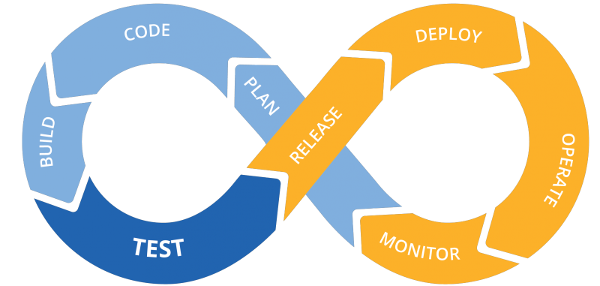

**A** ideia de se ter um ciclo de Integração contínua e entrega contínua surge justamente para automatizar e acelerar este processo.

**A**s chamadas **pipelines** são justamente uma forma de automatizar estes passos através de uma ou mais ferramentas de forma que um processo antes demorado e executado manualmente por uma ou mais pessoas agora passa a ser executado automaticamente e de forma contínua, preferivelmente diversas vezes ao dia ou conforme a equipe for disponibilizando novas versões do código.

## Gitlab ##


**G**itLab é uma ferramenta que busca ser uma espécie de "tudo em um" quando o assunto são ciclos de desenvolvimento ágeis. Basicamente é uma ferramenta web para o ciclo de vida de projetos DevOps que, embora originalmente fosse bem mais limitada, atuando apenas como uma opcão para repositórios Git, hoje é uma ferramenta robusta e engloba diversas soluções como repositórios, tarefas/tickets, wiki, pipelines CI/CD, etc.

**E**mbora tenha sido originalmente desenvolvida em Ruby, alguns de seus componentes foram re-escritos em Go.

**P**ermitindo o controle e gerenciamento de todo o seu ciclo de desenvolvimento de forma colaborativa, GitLab é considerado o primeiro Unicórnio da Ucrânia, ou seja, uma startup avaliada em mais de 1 bilhão de dólares.

**A**lém de grandes empresas e organizações como Alibaba, Trivago, Ticketmaster, Cloud Native Foundation, AVG, Siemens, Avast, BlackBerry, Broadcom, Capgemini, Citrix, EA Sports, Ericsoon, Expedia, Nasa, Nasdaq, Governo do Canadá, Interpol, Telus, Nutanix, RedHat, SanDisk, Sony, Trend Micro, Uber, Verizon e muitas outras, o GitLab também é muito popular entre projetos de software livre ou mesmo profissionais independentes e estudantes.

**S**im, existem diversas outras soluções para criação de pipelines CI/CD, como Jenkins, Circle CI, Bitbucket, etc. Mas, como mencionei mais acima, o GitLab trás muito mais do que apenas a ferramenta de pipelines.

**O**utro fator que me faz adorar este projeto é a possibilidade de utilizá-lo gratuitamente sem qualquer necessidade de instalação ou configuração. Ao contrário do Jenkins, eu não preciso instalar uma VM para ser meu servidor Jenkins para as pipelines. GitLab está disponível online e de forma gratuita para pequenos projetos, incluindo a utilização gratuita de *workers* que são os "trabalhadores", digamos assim. São containers criados e destruidos automaticamente durante as execuções de suas pipelines.

**S**em mais enrolação... vamos ao que interessa.

## Terraform? ##

**O** objetivo deste post não é ensinar Terraform, portanto não adentraremos a fundo nisto.

**C**aso você não possua alguma familiaridade com Terraform, sugiro que pause esta leitura e volte um pouco. Recomendo a leitura de meus posts anteriores antes de seguir com este:

-   [Infraestrutura como Código com Terraform](/posts/infraestrutura-como-codigo-com-terraform/)
-   [Introdução ao Terraform](/posts/introducao-ao-terraform/)
-   [Terraform: Variáveis e Outputs](/posts/terraform-variaveis-e-outputs/)
-   [Terraform: Criando uma infraestrutura no Google Cloud](/posts/terraform-criando-uma-infraestrutura-no/)
-   [Terraform Modules: Porquê E Como Trabalhar Com Módulos No Terraform - PARTE 1](/posts/terraform-modules-porque-e-comop1/)
-   [Terraform Modules: Porquê E Como Trabalhar Com Módulos No Terraform - PARTE 2](/posts/terraform-modules-porque-e-como/)

## Nosso projeto ##

### Assumindo que... ###

**P**ara este post estou assumindo que você já atende aos seguintes pré-requisitos:

1.  Já possui alguma familiaridade com o Terraform (conforme citei acima);
2.  Já possui o git instalado e também possui alguma familiaridade com o mesmo;
3.  Já possui uma conta AWS caso queira utilizar exatamente este código que utilizarei ou que possua familiaridade suficiente com o Terraform para criar  seu próprio código sem utilizar o AWS como *provider*;
4.  Além de possuir uma conta AWS, estou assumindo que você já configurou seu ambiente exportando as variáveis de ambiente de sua chave e senha do AWS para que seu Terraform consiga se comunicar com sua conta AWS (Se também não faz ideia de o que é ou como isto é feito, volte um pouco: [Terraform Modules: Porquê E Como Trabalhar Com Módulos No Terraform - PARTE 1](/posts/terraform-modules-porque-e-comop1/))

### Criando um repositório para nosso código ###

**O** primeiro passo é criar uma conta gratuita em [Gitlab.com](https://www.gitlab.com).

**A**o criar sua conta, um email lhe será enviado para confirmação de endereço. Valide seu email clicando no link que lhe será enviado.

**Q**uando logamos pela primeira vez em nossa conta do GitLab, veremos algo similar à seguinte tela.

**C**lique em *Create a project* ou Criar um projeto.

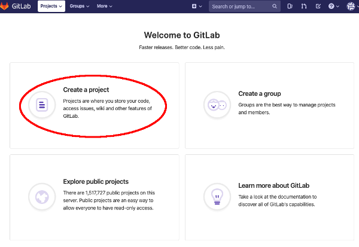

**N**a tela seguinte, crie o seu projeto com o nome e descrição que preferir, similar ao exemplo a seguir:


**E**mbora você possa escolher entre privado ou público, sugiro que defina seu repositório como privado inicialmente, apenas para evitar algum erro. Se você ainda não possui familiaridade com o Terraform e com o GitLab, não queremos correr o risco de deixar senhas ou dados confidenciais (como chaves do AWS) em seu código publicamente acessível, certo?!

**A**o preencher tudo e clicar em *Create project* ou Criar projeto você será levado para a seguinte tela:

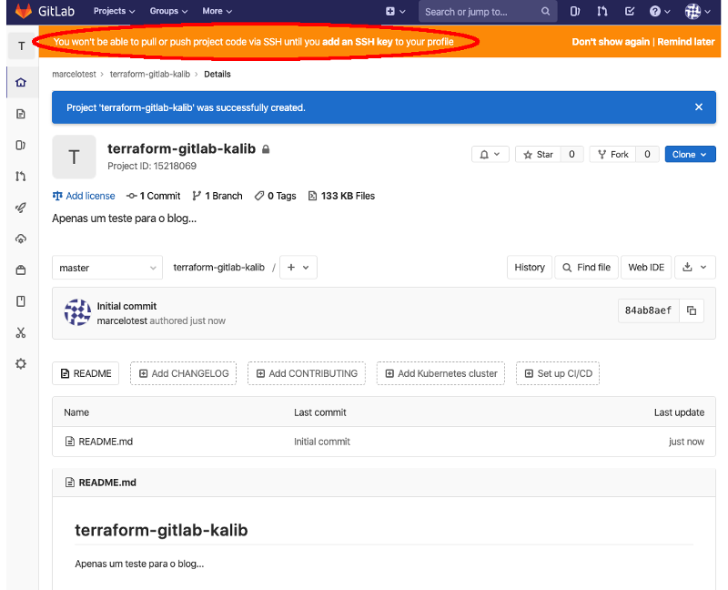

**O** alerta que o GitLab nos dá acima é justamente nos informando que ainda não possuímos uma **chave ssh** cadastrada em nossa conta. A chave é utilizada para que possamos interagir com nosso repositório de forma segura, via ssh. Começaremos então resolvendo esta "pendência". Você pode fazê-lo de duas formas:

1- Clicando diretamente no alerta, em **add an SSH key* (adicionar uma chave ssh);

2.1- Clicando no menu principal de sua conta, no canto superior direito, conforme imagem abaixo;

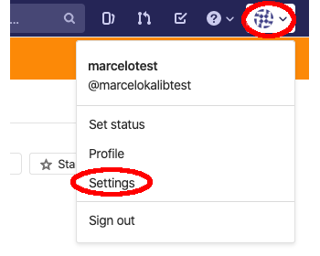

2.2- No menu lateral esquerdo, clique em *SSH Keys* (Chaves SSH);

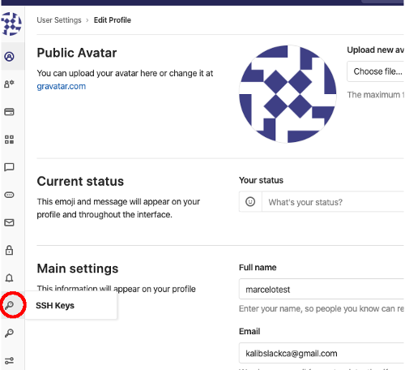

**S**eguindo qualquer um dos módulos acima, você cairá na página de chaves ssh. Cole a sua chave ssh e dê um nome ou apelido para ela, conforme exemplo abaixo (Utilize sua chave pública, não a privada):


**A**pós preencher, clique em *Add key* (Adicionar chave).

**C**om sua chave devidamente adicionada, podemos testar se está tudo funcionando de forma simples, clonando nosso repositório.

**E**m um terminal qualquer, navegue até um diretório de sua preferência e clone o seu repositório: (Estou assumindo que você já possua o git instalado)

**C**lique no botão *Clone* no canto superior direito da página principal de seu projeto e copie o comando *SSH* que lhe será apresentado. Em seguida utilize este comando para clonar seu repositório:

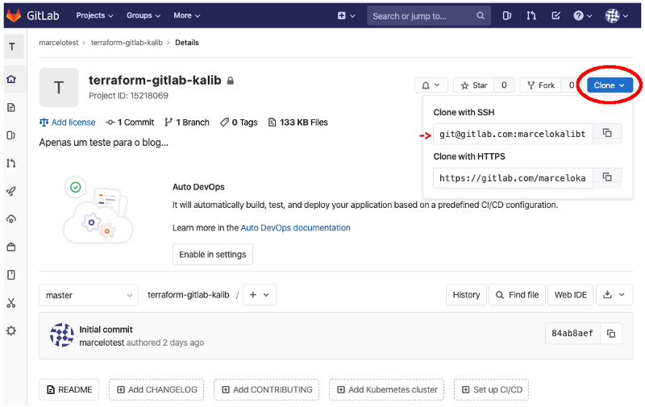

**C**lone com: (Substituindo o endereço pelo que lhe foi informado no Gitlab, conforme imagem acima)

```bash
$ git clone git@gitlab.com:marcelokalibtest/terraform-gitlab-kalib.git
```

**S**e tudo funcionou como o esperado, você deverá agora ter um diretório com o nome do seu repositório e poderá ver que o único arquivo nele até então é o arquivo de documentação padrão *README.md*.

**A**gora que temos nossa conta no Gitlab funcionando com nossa chave SSH e nosso repositório clonado localmente, nosso próximo passo será criar de fato algum código em nosso repositorio local para que possamos em seguida enviá-lo para o Gitlab.

**C**onforme dito anteriormente, o foco deste post não é, em hipótese alguma, ensinar Terraform. Para isto citei no início deste post alguns links para posts anteriores.

**U**tilizaremos aqui um código extremamente simplista  visto que nosso objetivo aqui é apenas conhecer melhor como podemos utilizar pipelines para nossa infraestrutura. Mas, uma vez que você entenda o conceito e a técnica, o procedimento seria o mesmo, independente de quão complexo seja o código de sua infraestrutura.

**E**m seu repositório local, crie o arquivo *main.tf* com o seguinte conteúdo:

```bash
# Criando uma instância EC2
provider "aws" {
  region = "ca-central-1"
}

data "aws_ami" "ubuntu" {
  most_recent = true

  filter {
    name   = "name"
    values = ["ubuntu/images/hvm-ssd/ubuntu-trusty-14.04-amd64-server-*"]
  }

  filter {
    name   = "virtualization-type"
    values = ["hvm"]
  }

  owners = ["099720109477"] # Canonical
}

resource "aws_instance" "web" {
  ami           = data.aws_ami.ubuntu.id
  instance_type = "t2.micro"

  tags = {
    Name = "HelloWorld"
  }
}
```

**E**m seguida, criaremos o arquivo *.gitignore* para que possamos fazer com que nossos arquivos de configuração e estado do Terraform não sejam enviados para o Gitlab. O arquivo deverá conter uma única linha: (Sim, precisamos ter um "." no início do nome do arquivo.)

```bash
.terraform
```

**C**om nosso código Terraform concluído, chegou a hora de iniciarmos nossa pipeline.

**A**ntes de definirmos o código de nossa pipeline, vamos criar duas variáveis de ambiente em nosso projeto no Gitlab. Na página principal de seu projeto no Gitlab, clique no botão de engrenagem (*Settings* ou Configurações) no menu da lateral esquerda, em seguida clique em *CI / CD*, conforme imagem abaixo:

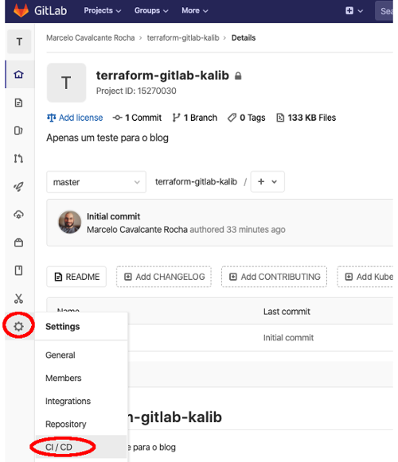

**N**a janela de configurações *CI  CD*, expanda o menu *Variables* (Variáveis) onde podemos definir nossas variáveis de ambiente. Inclua duas variáveis, sendo elas:

-   AWS_SECRET_ACCESS_KEY
-   AWS_ACCESS_KEY_ID

**P**ara cada uma destas variáveis inclua o seu devido valor de acordo com as suas credenciais de acesso ao AWS, conforme exemplo na imagem abaixo. Em seguida, clique em *Save variables* (Salvar variáveis).

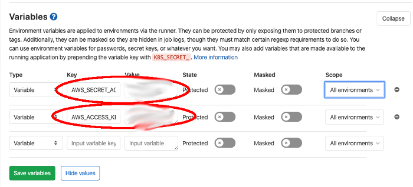

**E**stas variáveis serão utilizadas pelos *nodes*, ou *workers* criados pelo Gitlab para executar nossa pipeline.

**O** que acontecerá na verdade é que sempre que nossa pipeline for iniciada, o Gitlab criará um container, em sua própria infraestrutura/nuvem, e este container irá clonar nosso repositório para executar os passos de nossa pipeline. Este container terá as variáveis de ambiente que definirmos aqui. Assim como em nossa máquina local precisamos ter estas variáveis de ambiente para que possamos nos comunicar com o AWS via Terraform, o container que irá rodar nossa pipeline também precisará.

**U**ma vez que tenhamos nossas variáveis definidas, podemos voltar ao nosso código para iniciarmos a criação de nossa pipeline.

**P**rimeiramente, criaremos um arquivo chamado *.gitlab-ci.yml*. Sim, devemos ter um "." no início do nome do arquivo. Isto fará com que ele seja tratado como um arquivo oculto. Por padrão, o Gitlab reconhece a existência deste arquivo em seu repositório e o executará como sendo a definição de sua pipeline.

**C**omecemos incluindo o seguinte neste arquivo:

```yaml
image:
  name: hashicorp/terraform:light
  entrypoint:
    - '/usr/bin/env'
    - 'PATH=/usr/local/sbin:/usr/local/bin:/usr/sbin:/usr/bin:/sbin:/bin'
    - 'AWS_SECRET_ACCESS_KEY=${AWS_SECRET_ACCESS_KEY}'
    - 'AWS_ACCESS_KEY_ID=${AWS_ACCESS_KEY_ID}'

cache:
  paths:
    - .terraform

before_script:
  - terraform --version
  - terraform init

stages:
  - validar

validar:
  stage: validar
  script:
    - terraform validate
  only:
    - branches
```

**O** que temos neste código:

1.  image: aqui definimos as propriedade da imagem que será utilizada pelo Gitlab para criar o container que rodará nossa pipeline. Praticamente podemos utilizar qualquer imagem disponível para Docker, mas como apenas precisamos de um container capaz de executar o terraform, utilizaremos a imagem padrão do Terraform, fornecida pela Hashicorp. Além de indicarmos a imagem, indicamos aqui também as variáveis de ambiente que este container deverá possuir, e apontamos o valor das mesmas como sendo ${AWS_SECRET_ACCESS_KEY} e ${AWS_ACCESS_KEY_ID} como forma de indicarmos que o valor das mesmas deverá ser pego do próprio Gitlab, das configurações de nosso projeto, onde definimos nossos valores anteriormente;
2.  cache: a opção *cache* nos permite fazer cache de arquivos ou informações que possam ser re-utilizados em jobs seguintes de nossas pipelines, portanto utilizaremos aqui apenas o *path* .terraform como cache de nossa pipeline;
3.  before_script: com o *before_script* podemos definir algumas tarefas ou passos que devem ser executados antes do início dos passos convencionais de nossa pipeline. Por vezes pode ser útil ter alguns comandos aqui caso sejam utilizados comumente antes de cada passo da pipeline, por exemplo. Aqui queremos apenas validar a versão do terraform utilizada e garantir que o código terraform pode ser inicializado com *terraform init*;
4.  stages: estes são os estágios ou *stages* de nossa pipeline. Podemos ter diversos *stages* em uma mesma pipeline, como veremos em seguida, mas por enquanto nossa pipeline iniciará com apenas um *stage*, que será o de validar;
5.  validar: aqui estamos iniciando a criação do nosso primeiro *stage*, validar. Neste bloco indicamos a qual *stage* este código se refere, bem como o *script* ou comandos a serem executados neste *stage*. Além disso, podemos definir restrições para que este *stage* possa ser executado. Neste exemplo estamos utilizando a restrição *only* (apenas) para informar que sempre que se tratar de um branch que não seja o master, este *stage* será executado.

**J**á podemos testar este pedaço de nossa pipeline. No nosso projeto do Gitlab, clique no ícone de foguete na lateral esquerda e em seguida clique em *Pipelines*. Você não deverá ver nada nesta página, mas mantenha-a aberta.

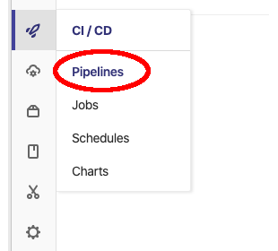

**D**e volta ao nosso terminal, criaremos um novo branch e faremos um commit e push de nosso código para o Gitlab em um novo branch:

```bash
$ git checkout -b codigo-inicial

$ git add .

$ git commit -m "Commit inicial de nosso código terraform."

$ git push origin codigo-inicial
```

**A**gora observe novamente a nossa página de pipelines do Gitlab. Perceba que uma pipeline será iniciada automaticamente após fazermos nosso *git push*:

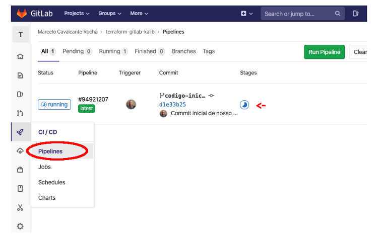

**A**té então nossa pipeline está apenas validando o início do projeto, portanto ela deve concluir em poucos segundos. Mas você pode ver o andamento da mesma clicando na pipeline em questão. Você será levado para a página da pipeline em questão e verá a lista dos *stages* da mesma. Neste caso, apenas temos um *stage* nesta pipeline (por enquanto). Clique no *stage* para ver a saída do mesmo:

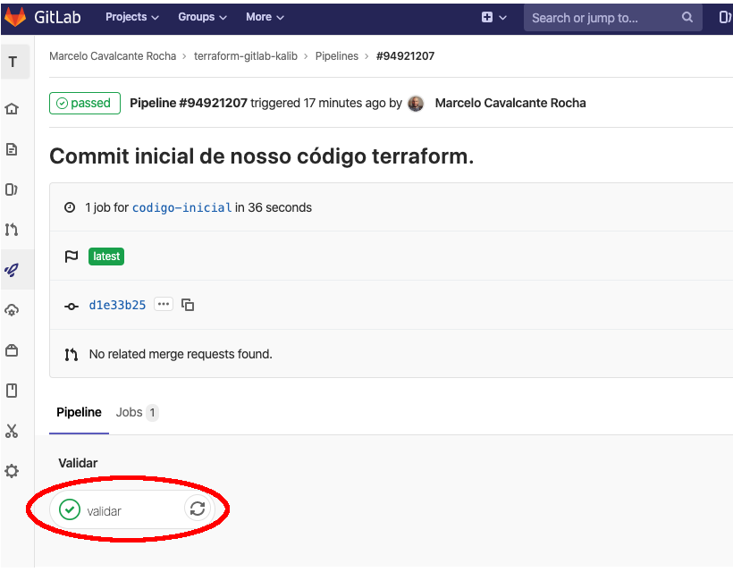

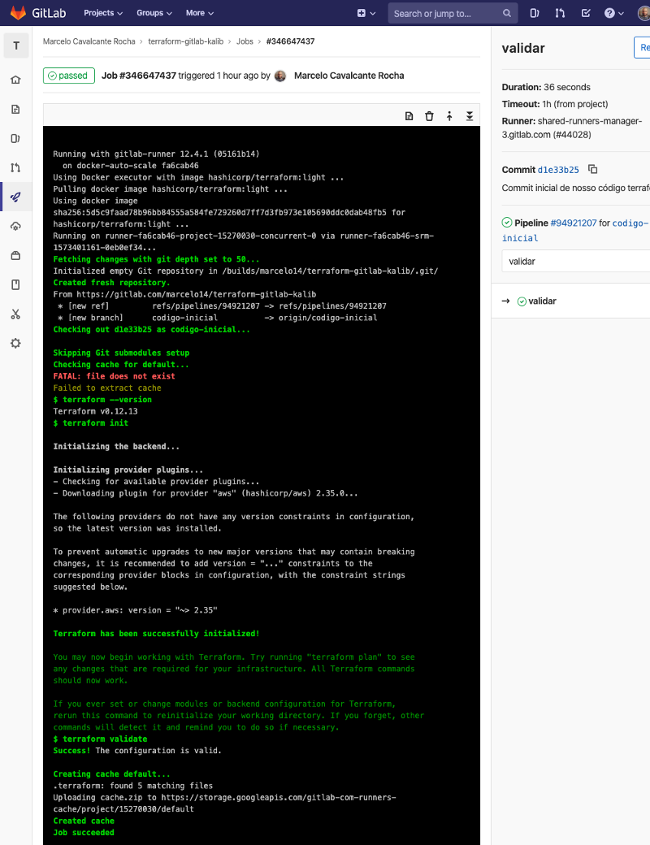

**P**odemos ver que nossa pipeline foi bem sucedida. Ignore o erro Fatal na imagem acima. Ele apenas não encontrou o arquivo que listamos que ele deveria utilizar para cache, mas isto era esperado pois esta é a primeira vez que rodamos nossa pipeline, portanto o arquivo ainda não existia em cache.

**A**gora que temos uma pipeline funcional, vamos incluir mais um *stage* em nossa pipeline, pois da forma que ela está agora, apenas validamos a versão do terraform no container que roda a pipeline e nos certificamos de que o init pode ser executado sem erros.

**D**e volta ao nosso arquivo *gitlab-ci.yml*, vamos incluir nosso segundo *stage*. O código agora ficará assim:

```yaml
image:
  name: hashicorp/terraform:light
  entrypoint:
    - '/usr/bin/env'
    - 'PATH=/usr/local/sbin:/usr/local/bin:/usr/sbin:/usr/bin:/sbin:/bin'
    - 'AWS_SECRET_ACCESS_KEY=${AWS_SECRET_ACCESS_KEY}'
    - 'AWS_ACCESS_KEY_ID=${AWS_ACCESS_KEY_ID}'

cache:
  paths:
    - .terraform

before_script:
  - terraform --version
  - terraform init

stages:
  - validar
  - plan

validar:
  stage: validar
  script:
    - terraform validate
  only:
    - branches

plan:
  stage: plan
  script:
    - terraform plan
  only:
    - merge_requests
```

**O** que alteramos:
1.  stages: Repare que no bloco de *stages* nós agora incluímos um novo *stage* que se chamará *plan* (em alusão ao comando terraform plan);
2.  plan: incluímos também um bloco para nosso segundo *stage*, o plan. Neste bloco indicamos que o nome do *stage* é *plan*, em seguida que o *script* a ser executado será simplesmente o comando *terraform plan*. Como condição ou restrição, informamos que este *stage* apenas será executado quando houver um *merge_request*. Merge request ou Pull request, é quando fazemos uma solicitação para que nosso branch seja unido (*merge*) ao master do projeto.

**E**m nossa página principal de pipelines no Gitlab, só devemos ter o resultado de uma execução, que foi bem sucedida, conforme imagem abaixo:

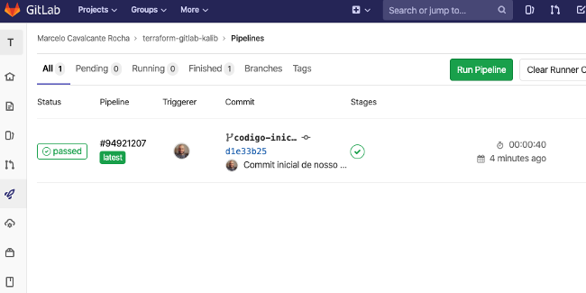

**C**om nosso código alterado, vamos fazer um novo commit e push para nosso branch:

```bash
$ git add .

$ git commit -m "Inserindo stage plan na pipeline."

$ git push origin codigo-inicial
```

**I**mediatamente poderemos ver que uma nova execução de nossa pipeline começou:

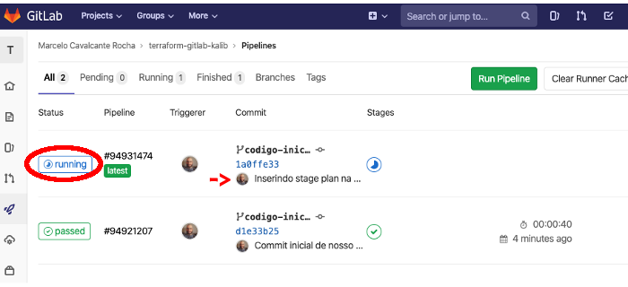

**S**e de fato clicarmos nesta pipeline que foi iniciada veremos que a mesma não executou o *stage* plan, afinal a nossa restrição dizia que o *plan* só deveria ser executado quando houvesse um Merge Request (ou Pull Request, como prefira chamar). É importante lembrar que isto não é uma regra, mas sim uma opção minha. Você poderia muito bem dizer que quer o plan executado a cada branch e não apenas quando houver um Merge Request. A opção aqui foi apenas ilustrativa, para que conheceçamos alguns recursos do Gitlab.

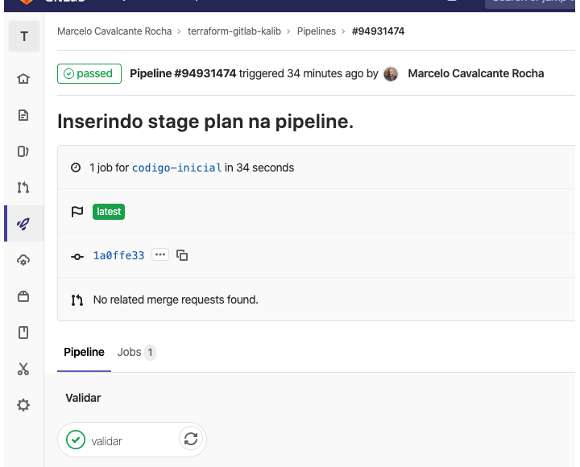

**C**omo podemos então testar nosso próximo stage? Simples, criando um Merge Request (ou Pull Request).

**S**e voltarmos ao nosso terminal onde acabamos de realizar nosso push, veremos que uma URL nos foi disponibilizada. Esta URL pode ser utilizada para criar um Merge Request (Pull Request):

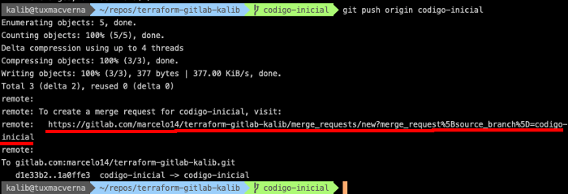

**C**opie e cole esta URL em seu navegador. Insira algum comentário (opcional) e em seguida clique em *Submit Merge request* (Submeter Merge Request):

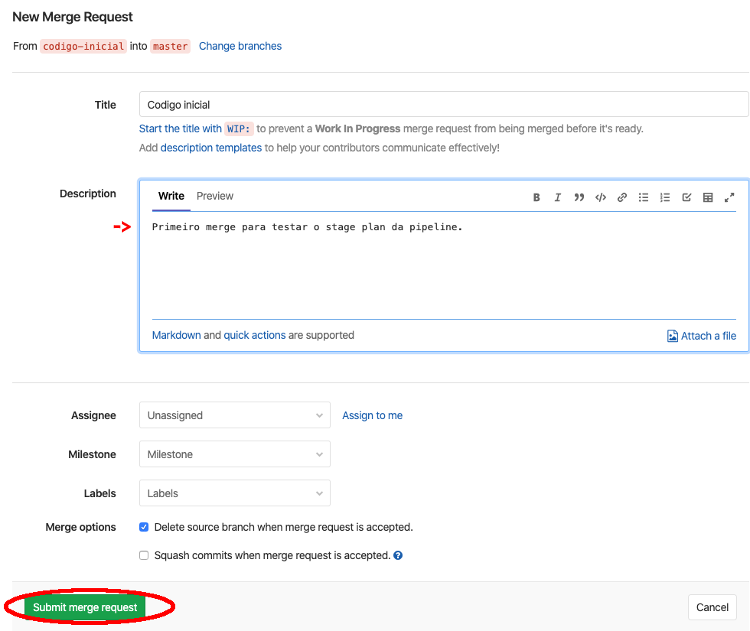

**R**epare que o Gitlab começou automaticamente a pipeline:

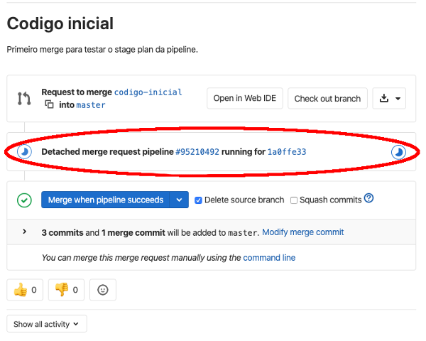

**S**e você clicar na pipeline, verá que desta vez o seu stage *plan* foi executado e, caso seu código esteja todo correto, o seu plan terá sido realizado com sucesso:

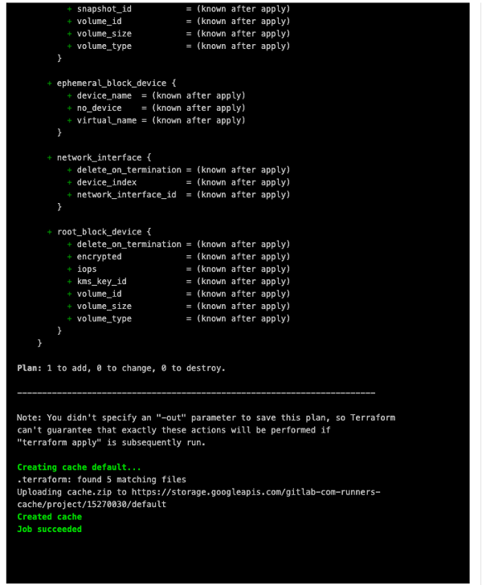

**E**m seu estado atual, nossa pipeline possui dois *stages*, sendo eles uma validação e o plan. O próximo *stage* será o de aplicar nosso código e fazer o deployment de nossa infraestrutura de fato.

**V**oltemos ao nosso arquivo *gitlab-ci.yml*. Insira o seguinte:

```yaml
image:
  name: hashicorp/terraform:light
  entrypoint:
    - '/usr/bin/env'
    - 'PATH=/usr/local/sbin:/usr/local/bin:/usr/sbin:/usr/bin:/sbin:/bin'
    - 'AWS_SECRET_ACCESS_KEY=${AWS_SECRET_ACCESS_KEY}'
    - 'AWS_ACCESS_KEY_ID=${AWS_ACCESS_KEY_ID}'

cache:
  paths:
    - .terraform

before_script:
  - terraform --version
  - terraform init

stages:
  - validar
  - plan
  - apply

validar:
  stage: validar
  script:
    - terraform validate
  only:
    - branches

plan:
  stage: plan
  script:
    - terraform plan
  only:
    - merge_requests

build:
  stage: plan
  script:
    - terraform plan
  only:
    - master

apply:
  stage: apply
  script:
    - terraform apply -auto-approve
  dependencies:
    - build
  only:
    - master
```

**O** que alteramos:
1.  stages: Repare que no bloco de *stages* nós agora incluímos um novo *stage* que se chamará *apply* (em alusão ao comando terraform apply);
2.  build: incluímos mais um passo ou tarefa em nossa pipeline chamado *build*. Este executará novamente um plan, porém desta vez será após o merge do código ser aceito, por isso temos a restrição *only* como sendo *master*. É importante perceber que desta vez teremos dois stages na pipeline que será executada após o merge do código;
3.  apply: mais um passo que será também executado apenas após o merge do código no *master*. Este executará o script *terraform apply*. Aqui temos o parâmetro *dependencies*, no qual indicamos que este passo apenas será executado se o passo anterior finalizar com sucesso.

**A**ntes de testarmos nosso código, vou logar em minha conta do AWS para constatar que não possuo nenhuma instância EC2 rodando:

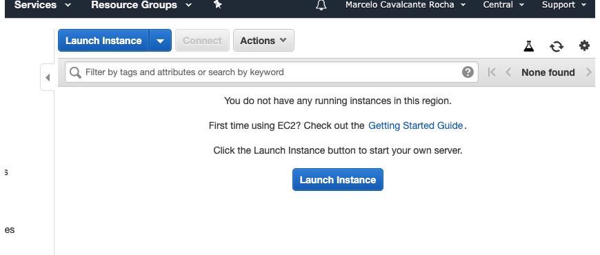

**A**gora que tenho a certeza de não possuir nenhuma instância rodando, é hora de testar nossa pipeline completa.

**D**e volta ao nosso terminal, faremos um novo commit no branch que criamos anteriormente, desta vez incluindo estas últimas alterações.

```bash
$ git checkout codigo-inicial

$ git add .

$ git commit -m "Finalizando a pipeline"

$ git push origin codigo-inicial
```

**C**omo podemos notar no Gitlab, na janela de pipelines, o stage de plan será executado devido ao nosso novo commit no branch.


**S**e não cometemos nenhum erro, nossa pipeline executará com sucesso.

**A**gora, de volta ao nosso Merge Request (Ou PR), vamos realizar o nosso merge de fato, para que possamos ver o nosso código ser aplicado em nossa conta do AWS. Na interface do Gitlab, clique no botão de Merge Requests que se encontra na lateral esquerda. Em seguida, clique no seu Merge Request que estará listado, conforme imagem a seguir:

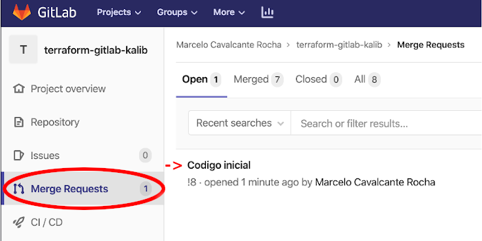

**R**epare que ele lista a pipeline que foi bem sucedida para este Merge Request e nos apresenta logo abaixo a opção de realizarmos o Merge. Clique em *Merge*.

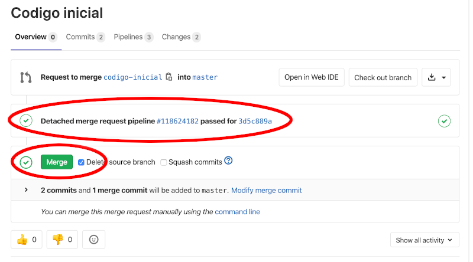

**R**epare que imediatamente após clicarmos em *Merge*, uma pipeline é iniciada automaticamente. Clique nela:

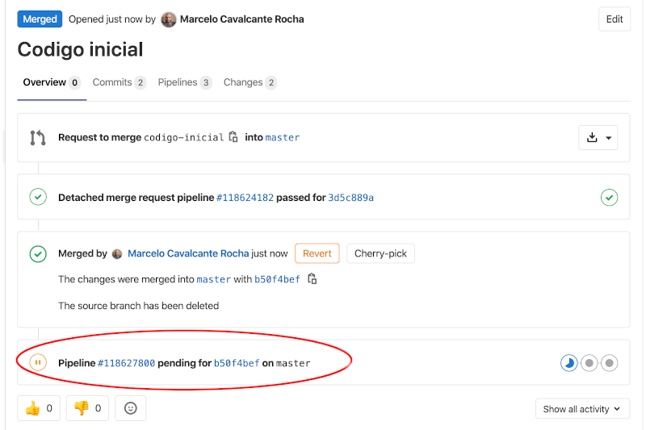

**C**omo podemos ver, esta é nossa pipeline final, a qual executa os 3 stages definidos: Validar, Plan e Apply.


**S**e clicarmos no stage *apply* poderemos ver a execução do nosso código sendo aplicado de fato para a criação de nossa infraestrutura no AWS:

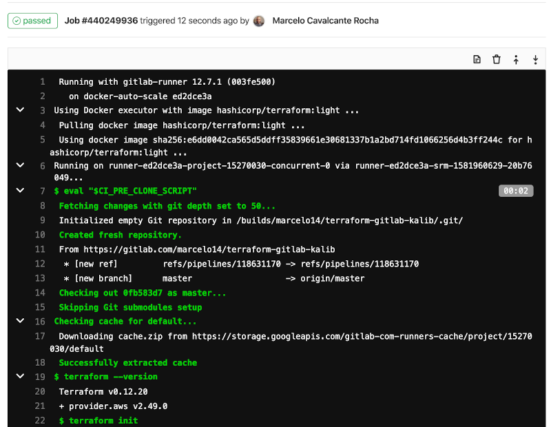


**A**o checarmos nossa conta do AWS, também podemos ver que nossa instância foi criada conforme especificado em nosso código.

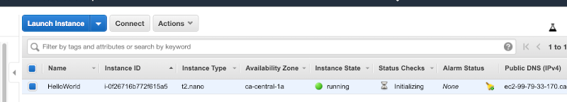

**C**onsiderações finais:

-  Apesar de esta infraestrutura ser extremamente simplista, criando apenas uma instância ou VM, o seu código poderia criar coisas muito mais complexas, como VPCs, subnets, múltiplas instâncias, clusters, lambda functions, security groups, etc. O objetivo deste artigo não era a criação de infraestrutura com terraform, mas sim a possibilidade e utilização de uma pipeline para sua infraestrutura;
-  Não esqueça sempre de deletar os recursos criados por você durante estes testes, para evitar desperdiçar dinheiro. Neste exemplo, lembre-se de destruir no AWS a instância criada.

**H**ave fun!
