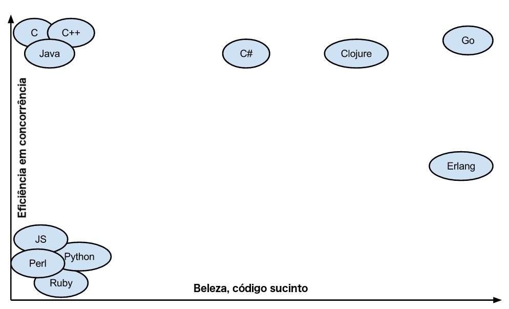
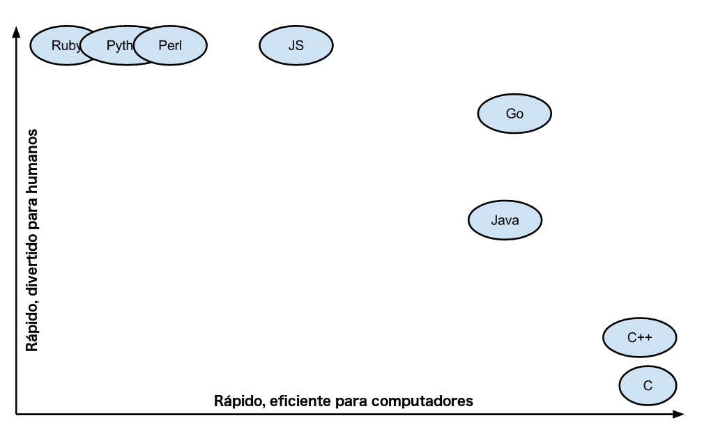
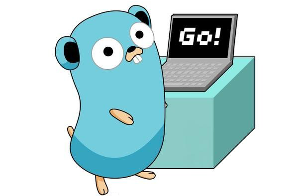

Go ou Golang, a linguagem de programação desenvolvida no Google com o intuito de ser uma linguagem que realmente fosse eficiente. Neste post explico um pouco das características do Go que me levaram a adotá-la como minha linguagem favorita.

<!--more-->

## Introdução

**Q**uem me conhece sabe que sempre tive uma certa queda pelo *Python*, e existem diversas razões óbvias para isso, visto que o Python possui uma sintaxe relativamente simples, elegante e é bastante eficiente, embora não possua a melhor performance. Apesar de todos os pontos positivos que me levaram a utilizar bastante Python, recentemente decidi me aventurar com *Go* ou *Golang*, como prefira chamar. [Go](https://golang.org) foi desenvolvida para uso interno no Google em meados de 2007 com um único propósito: *Melhorar a produtividade da programação em uma era de processadores e computadores com múltiplos cores, máquinas em rede e bases de dados gigantescas.*

**B**asicamente a ideia era criar uma linguagem de programação diferente, eficiente e que pudesse suprir as necessidades do Google de forma a eliminar uma série de pontos considerados negativos nas demais linguagens de programação existentes mas ao mesmo tempo mantendo pontos fortes já encontrados nas mesmas.

**S**e isso soa familiar aos amantes do Software Livre, é porque de certa forma foi um episódio relativamente similar a quando [Linus Torvalds](https://pt.wikipedia.org/wiki/Linus_Torvalds), criador do Linux, criou o [Git](https://git-scm.com), onde ele alegou que nenhum gerenciador de código fonte na ocasião era bom o suficiente, portanto ele mesmo criaria um que funcionasse de forma decente. Não preciso dizer que hoje o Git é o gerenciador de códigos mais utilizado no mundo, certo?!

**O**utro fator marcante foi o desprazer que seus criadores compartilhavam para com o C++, embora reconheçam qualidades e tenham tentado manter algumas características desta linguagem, bem como de algumas outras, resultando nas principais características do Go:

### Principais Características do Go

- Tipagem estática, significando que tipos são essenciais e importantes para o Go, sendo também nominal e estrutural, embora não haja hierarquia de tipos;
- Eficiência em tempo de execução;
- Sintaxe simples e sucinta, aumentando a usabilidade;
- Alta performance para redes e multi processamento;
- Imperativa e modular, com encapsulamento e polimorfismo;
- Excelente coletor de lixo, diminuindo a necessidade de preocupação com o gerenciamento de memória.

### Tipagem Estática vs Tipagem Dinâmica**

**A**credito que esta seja a dúvida mais comum, portanto vale a pena explicar ou lembrar a diferença básica entre ambas.

**B**asicamente, com linguagens que utilizam tipagem estática, o tipo é verificado antes da execução, enquanto que com tipagem dinâmica o tipo é verificado durante a execução, ou em tempo de execução.

**U**m exemplo simples seria: "3" + 5

**E**m linguagens fortemente tipadas, como Go, isto irá gerar um erro, pois estas linguagens não permitem "coerção de tipos", que seria justamente a habilidade para um valor mudar de tipo implicitamente em certos contextos. Linguagens de tipagem fraca, tais como o JavaScript, não apresentarão um erro neste cenário, pois terão um resultado "35".

**T**ipagem estática permite que a linguagem garanta a segurança dos tipos, de forma que os mesmos não possam ser alterados uma vez que sejam definidos.

**Exemplo:**

```go
// Criando uma variável do tipo inteiro
var minhaVariavel = 1
minhaVariavel = "Marcelo"
```

**E**m uma linguagem de tipagem estática, isto resultaria em um erro, pois uma variável que uma vez foi criada com o tipo **int** ou inteiro, não pode ser alterada para um tipo **string** posteriormente. No entanto, em uma linguagem de tipagem dinâmica, este código não resultaria em um erro, e a variável *minhaVariavel* mudaria de **int** para **string**, recebendo o novo valor *Marcelo*.

**De volta ao Go**

## Criação

**A** linguagem foi originalmente criada por três nomes já conhecidos da comunidade tecnológica: Robert Griesemer (um dos criadores da engine V8 JavaScript), Rob Pike (um dos co-criadores do Unix) e Ken Thompson (outro co-criador do Unix bem como do UTF-8).

**C**riada internamente no Google em meados de 2007, Go foi anunciada publicamente em Novembro de 2009 e sua versão 1.0 foi disponibilizada em Março de 2012. Obviamente, Go é bastante utilizada em produção pelo Google e em diversas outras empresas. Go também é utilizada em diversos projetos de Software Livre e/ou Código Aberto.

**C**ertamente você conhece ou mesmo já utilizou aplicações escritas em Go, tais como:

- Docker
- Kubernetes
- Dropbox
- Hugo
- Etcd
- InfluxDB
- Istio
- Ethereum
- OpenShift
- Terraform

**D**eu para entender, certo?! Quando o assunto é performance e estabilidade, Go é uma excelente escolha.

**A**lém do fato de ela ter sido criada justamente por nenhuma outra linguagem ser capaz de atender as necessidades do Google, Go também busca reduzir seu trabalho de digitação. Por design, Go tenta diminuir a desordem e complexidade em termos de declarações e cabeçalhos desnecessários; tudo é declarado exatamente uma vez. A inicialização é expressiva, automática e fácil de utilizar.

**S**ua sintaxe é limpa e fácil de compreender, de forma que o Go consegue ser expressivo e ao mesmo tempo compreensível sem sacrificar a sofisticação. Um complexo *(foo.Foo\* myFoo = new(foo.Foo))* pode ser reduzido em algo simples como *:=*, que é um construtor de declaração e inicialização.

## Para que serve

**G**o pode ser utilizado para praticamente tudo o que você precisar desenvolver:

- Aplicações Web
- Servidores de Redes
- Aplicações Móveis/Mobile
- Aprendizado de Máquina/Machine Learning
- Processamento de Imagens
- Load Balancers
- Administração de Sistemas
- Hardware
- Scripts
- Criptografia

**G**o foi criado com o intuito de ser eficiente em termos de múltiplos cores, sendo a primeira linguagem a suportar múltiplos cores nativamente, de forma que trabalhar com concorrência é uma tarefa extremamente simples.

**S**ua portabilidade é excelente, visto que pode ser compilado em diversas plataformas ou sistemas operacionais distintos, inclusive compilação cruzada, de forma que você pode compilar um código Go no OS X da Apple e rodar este binário em uma máquina Linux.

**A**lém de ter sido criada pelo Google, Go é uma linguagem de código aberto, o que facilita a evolução da linguagem por ser mantida por uma enorme comunidade de programadores espalhados pelo mundo.



**C**omo podemos ver no gráfico acima, Go possui uma sintaxe bonita e sucinta, enquanto mantém uma excelente performance para aplicações e concorrência de execuções.

**M**anter e dar manutenção em código Go é fácil. Go não possui uma sintaxe complexa e cheia de rodeios como outras linguagens. Uma vez que o Google possui bases de códigos gigantescas, com milhões e milhões de linhas, esta característica era fundamental durante a criação do Go, visto que uma base de código deveria ser simples e legível para demais programadores.

**I**ntencionalmente, Go não trás uma série de recursos de linguagens modernas orientadas a objetos:

- **Nada de classes:** Tudo é dividido em pacotes. Go utiliza apenas structs ao invés de classes;
- **Não suporta herança:** Isto fará com que o código seja simples de se modificar. Em outras linguagens como Java/Python, se uma classe XYZ herda de uma classe 123 e você alterar algo na classe 123, isto poderá causar efeitos inesperados em outras classes que herdem dela. Ao remover heranças, Go torna fácil o entendimento do código, visto que não haverá uma super classe que deverá sempre ser checada;
- *Sem construtores*;
- *Sem anotações*;
- *Sem genéricos*;
- *Sem exceções*.

**C**aracterísticas como essas fazem com que Go seja quase tão eficiente e performático quanto C/C++, enquanto possui uma sintaxe super simples, como Ruby ou Python, conforme podemos ver no gráfico abaixo:



**S**e nada disso lhe convenceu, que tal o fato de que de acordo com as pesquisas públicas do Slashdot Go está entre as linguagens cujos profissionais recebem os melhores salários?

**O**k, você não liga para dinheiro e quer apenas o suficiente para pagar suas contas, certo... Pense no seguinte.. em breve não teremos muita escolha. Com o hardware evoluindo sempre mais rapidamente que o software, já existe uma pressão muito grande para uma mudança de paradigma e de qualidade de software. De que adianta ter processadores cada vez mais modernos e com múltiplos núcleos/cores se o seu software não consegue fazer uso daquilo adequadamente? A cada ano a pressão será maior neste sentido, para que possamos escrever código que justifique o custo e as qualidades dos processadores modernos.

**S**e ainda assim você não está convencido, só me resta apelar para o simpático mascote do Go. Se ele não lhe conquistar, nada mais o fará.




**H**appy Hacking!