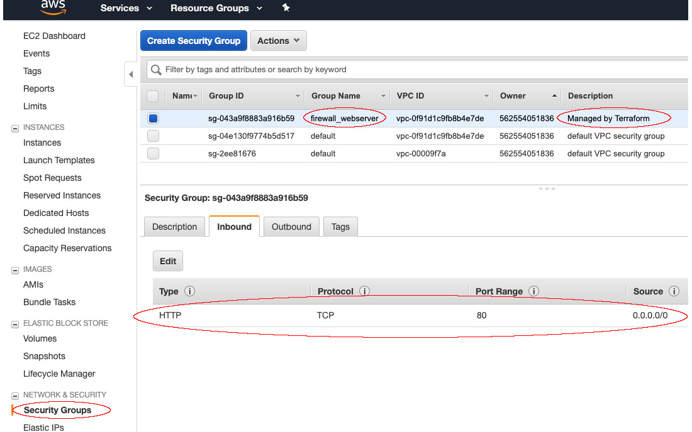
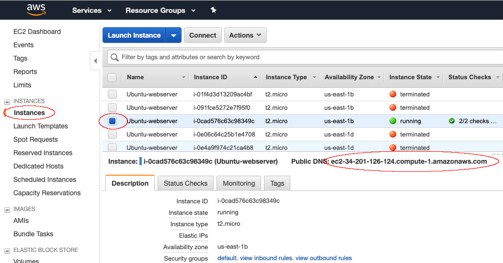
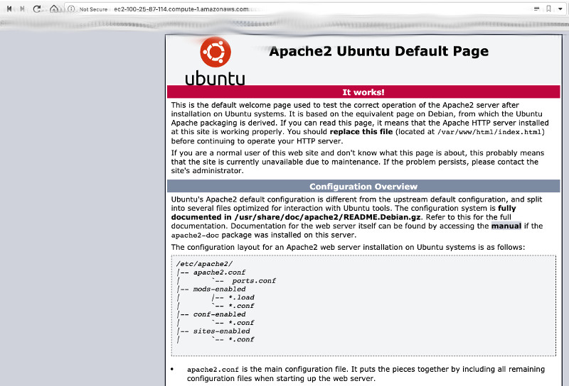
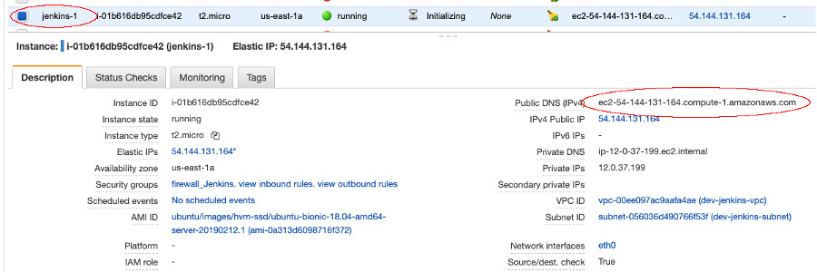
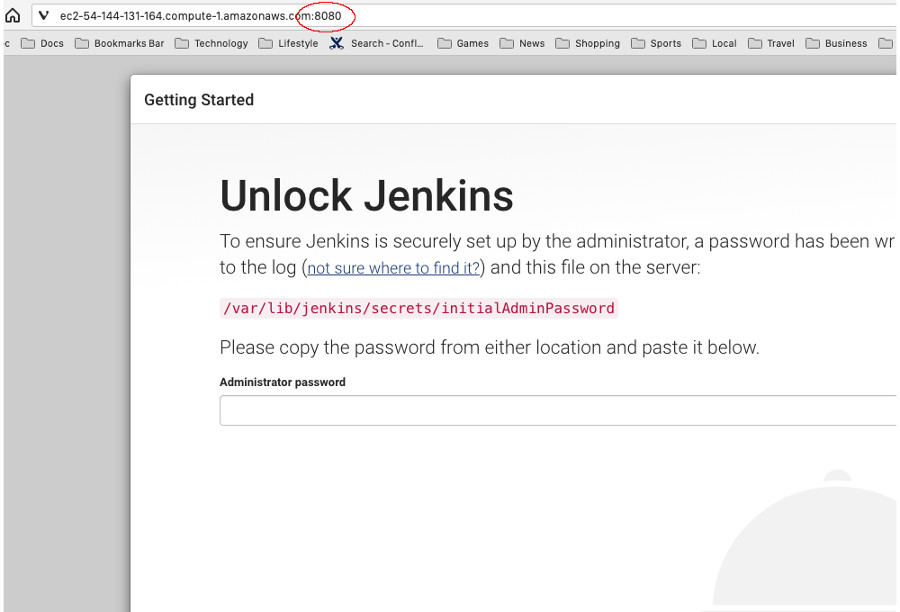

Todos sabem que o Terraform é uma solucão fantástica para criar infraestrutura através de código, porém nem todos utilizam as diversas possibilidades do mesmo, como por exemplos módulos. Com módulos podemos fazer a reutilização de código para nossa infraestrutura.

<!--more-->

**OBS:** Este post é a continuação do post anterior e utilizará a mesma base de código, portanto se você não leu o anterior, comece por lá clicando aqui: [Terraform Modules: Porquê E Como Trabalhar Com Módulos No Terraform - PARTE 1](/posts/terraform-modules-porque-e-comop1/)

**C**ontinuando de onde paramos...

## User Data

**O** AWS possui um recurso chamado *User Data*, o qual nos permite passar um script (bash) que deverá ser executado no momento de criação de uma instância. Utilizaremos este recurso do AWS também através de nosso código Terraform para:

-   Atualizar nossa base de repositórios do APT;
-   Instalar e iniciar os serviços necessários;
-   Liberar os serviços necessários no firewall do Ubuntu.

**C**aso suas instâncias ainda estejam rodando, você perceberá que o Terraform tentará destruir a instância e criá-la novamente após fazermos esta alteração. Isto se dá porque uma das alterações que faremos de fato exigirá que uma nova instância seja criada, pois incluiremos um script que deve rodar durante a criação da instância e, obviamente, a única forma de este script ser executado é justamente criando a instância novamente. Mas isso não é problema, certo? Somos engenheiros devops e em um mundo devops o objetivo é ter uma infraestrutura automatizada e extremamente descartável, certo? É por isso que codificamos tudo.

**C**omeçaremos com nosso servidor *webserver*.

**V**amos incluir uma nova tag *(Projeto)* bem como um bash script que será utilizado como *user_data*. Este bash script atualizará nossa base de repositórios e instalará o servidor web apache2, bem como habilitará o webserver no firewall padrão do Ubuntu.

**E**ste recurso *user_data* não é exatamente do Terraform, mas sim um mecanismo que o AWS nos provê para que possamos ter um script executado no momento de criação de uma instância ou VM.

**N**osso arquivo *variables.tf* do projeto *webserver* agora deverá estar assim:


variable "region" {
  type        = "string"
  description = "Região no AWS onde nossos recursos estarão."
  default     = "us-east-1"
}

variable "ami" {
  type        = "string"
  description = "Id da imagem EC2 que desejamos utilizar para nossa instância."
  default     = "ami-0a313d6098716f372"
}

variable "instance_type" {
  type        = "string"
  description = "Tipo de instância a ser utilizado"
  default     = "t2.micro"
}

variable "tags" {
  type        = "map"
  description = "Tags a serem aplicadas à nossa instância."

  default = {
    "Name"     = "Ubuntu-webserver"
    "Ambiente" = "Desenvolvimento"
    "Projeto"  = "Webserver"
  }
}

variable "user_data" {
  type        = "string"
  description = "Script a ser executado durante a criação da instância."

  default = <<-EOF
              #!/bin/bash
              sudo apt update
              sudo apt install apache2 -y
              sudo systemctl enable apache2
              sudo systemctl start apache2
              sudo ufw allow 'Apache'
              EOF
}


**A**gora que temos nossa variável *user_data* criada, devemos inserir isto em nosso arquivo *main.tf* para que nossa instância possa utilizar este script de inicialização. Nosso *main.tf* do projeto *webserver* agora ficará assim:


provider "aws" {
  region = "${var.region}"
}

resource "aws_instance" "server1" {
  ami           = "${var.ami}"
  instance_type = "${var.instance_type}"

  user_data = "${var.user_data}"

  tags = "${var.tags}"
}


**C**om estas alterações já conseguiríamos criar um servidor web com Apache2, no entanto por padrão o AWS mantém as portas de novas instâncias fechadas para o mundo externo, portanto precisamos também criar alguns *resources* para que nossa instância seja de fato utilizável:

-   VPC: Virtual Private Cloud é o recurso utilizado pelo AWS para definições de redes dentro de sua conta AWS;
-   Subnet: Definiremos uma subnet ou sub-rede para nossa infraestrutura;
-   Internet Gateway: Um gateway do aws que permitirá que nossa instância s ecomunique com a internet;
-   Route Table: Um atabela de roteamento que permitirá que nossa vpc encaminhe pacotes devidamente;
-   Security Groups: Security Groups ou Grupos de Segurança é como o AWS chama suas definições e regras de firewall;
-   Adicionar um ip público ao servidor.

**V**amos começar criando todas as novas variáveis que precisaremos. Nosso arquivo *variables.tf* do projeto *webserver* receberá várias alterações. As variáveis que devemos criar são:

-   Uma porta de origem para a regra de entrada ou *ingress*: *i_from_port*;
-   Uma porta de destino para a regra de entrada ou *ingress*: *i_to_port*;
-   Um IP ou range de ips para a regra de entrada ou *ingress*: *i_ip_range*;
-   Uma porta de origem para a regra de saída ou *egress*: *e_from_port*;
-   Uma porta de destino para a regra de saída ou *egress*: *e_to_port*;
-   Um IP ou range de ips para a regra de saída ou *egress*: *e_ip_range*;
-   Range de ips a ser utilizado na VPC ou *Virtual Private Cloud*: *vpc_ip_range*;
-   Tags para o gateway de internet: *dev_gw_tags*;
-   IP ou range de ips a serem aplicados na tabela de routeamento ou *route tables*: *rev_route_ips*;
-   Tags para nossa tabela de roteamento: *dev_route_tags*

**N**osso arquivo *variables.tf* do projeto *webserver* deverá ficar assim:


variable "region" {
  type        = "string"
  description = "Região no AWS onde nossos recursos estarão."
  default     = "us-east-1"
}

variable "ami" {
  type        = "string"
  description = "Id da imagem EC2 que desejamos utilizar para nossa instância."
  default     = "ami-0a313d6098716f372"
}

variable "instance_type" {
  type        = "string"
  description = "Tipo de instância a ser utilizado"
  default     = "t2.micro"
}

variable "tags" {
  type        = "map"
  description = "Tags a serem aplicadas à nossa instância."

  default = {
    "Name"     = "Ubuntu-webserver"
    "Ambiente" = "Desenvolvimento"
    "Projeto"  = "Webserver"
  }
}

variable "user_data" {
  type        = "string"
  description = "Script a ser executado durante a criação da instância."

  default = <<-EOF
              #!/bin/bash
              sudo apt update
              sudo apt install apache2 -y
              sudo systemctl enable apache2
              sudo systemctl start apache2
              sudo ufw allow 'Apache'
              EOF
}

variable "i_from_port" {
  type        = "string"
  description = "Uma porta de origem para a regra de entrada ou ingress."
  default     = 80
}

variable "i_to_port" {
  type        = "string"
  description = "Uma porta de destino para a regra de entrada ou ingress."
  default     = 80
}

variable "i_ip_range" {
  type        = "list"
  description = "IP ou range de ips para a regra de entrada ou ingress."
  default     = ["0.0.0.0/0"]
}

variable "e_from_port" {
  type        = "string"
  description = "Uma porta de origem para a regra de saída ou egress."
  default     = 0
}

variable "e_to_port" {
  type        = "string"
  description = "Uma porta de destino para a regra de saída ou egress."
  default     = 0
}

variable "e_ip_range" {
  type        = "list"
  description = "IP ou range de ips para a regra de saída ou egress."
  default     = ["0.0.0.0/0"]
}

variable "vpc_ip_range" {
  type        = "string"
  description = "Range de IPs para a VPC"
  default     = "10.0.0.0/16"
}

variable "dev_gw_tags" {
  type        = "map"
  description = "Tags a serem aplicadas ao gateway de internet"

  default = {
    "Name" = "dev-env-gw"
  }
}

variable "dev_route_ips" {
  type        = "string"
  description = "Range de IPs a serem aplicados na route table"
  default     = "0.0.0.0/0"
}

variable "dev_route_tags" {
  type        = "map"
  description = "Tags a serem aplicadas na route table"

  default = {
    "Name" = "dev-env-route-table"
  }
}


**C**om nossas variáveis criadas, vamos inserir estes *resources* em nosso arquivo *main.tf* do projeto *webserver*, o qual agora deverá ficar assim:


provider "aws" {
  region = "${var.region}"
}

resource "aws_vpc" "dev-env" {
  cidr_block           = "${var.vpc_ip_range}"
  enable_dns_hostnames = true
  enable_dns_support   = true
}

resource "aws_subnet" "dev-subnet" {
  cidr_block        = "${cidrsubnet(aws_vpc.dev-env.cidr_block, 3, 1)}"
  vpc_id            = "${aws_vpc.dev-env.id}"
  availability_zone = "us-east-1a"
}

resource "aws_security_group" "webserver" {
  name = "firewall_webserver"

  vpc_id = "${aws_vpc.dev-env.id}"

  ingress {
    from_port   = "${var.i_from_port}"
    to_port     = "${var.i_to_port}"
    protocol    = "tcp"
    cidr_blocks = "${var.i_ip_range}"
  }

  egress {
    from_port   = "${var.e_from_port}"
    to_port     = "${var.e_to_port}"
    protocol    = "-1"
    cidr_blocks = "${var.e_ip_range}"
  }
}

resource "aws_instance" "server1" {
  ami           = "${var.ami}"
  instance_type = "${var.instance_type}"

  user_data = "${var.user_data}"

  security_groups = ["${aws_security_group.webserver.id}"]

  subnet_id = "${aws_subnet.dev-subnet.id}"

  tags = "${var.tags}"
}

resource "aws_eip" "webserver-dev-ip" {
  instance = "${aws_instance.server1.id}"
  vpc      = true
}

resource "aws_internet_gateway" "dev-gw" {
  vpc_id = "${aws_vpc.dev-env.id}"

  tags = "${var.dev_gw_tags}"
}

resource "aws_route_table" "route-table-dev-env" {
  vpc_id = "${aws_vpc.dev-env.id}"

  route {
    cidr_block = "${var.dev_route_ips}"
    gateway_id = "${aws_internet_gateway.dev-gw.id}"
  }

  tags = "${var.dev_route_tags}"
}

resource "aws_route_table_association" "subnet-association" {
  subnet_id      = "${aws_subnet.dev-subnet.id}"
  route_table_id = "${aws_route_table.route-table-dev-env.id}"
}


**F**izemos muitas alterações, mas agora temos uma solução completa para que nosso webserver seja funcional. Criamos uma vpc, subnet, regras de firewall, ip estático público, tabela de roteamento, gateway de internet.. ufa.. Missão cumprida.

**C**om estas mudanças indicamos que estaremos aceitando conexões vindas pela porta 80, para a porta também 80. Estamos informando também que conexões de qualquer endereço IP serão aceitas, afinal queremos que nosso webserver seja acessível ao mundo inteiro via internet.

**T**ambém abrimos a porta 80 para conexões saindo, pois nosso webserver precisa ser capaz de responder às requisições que receber, certo?!

**I**sto já é o suficiente para criarmos novamente nosso servidor web, desta vez funcional. Execute *terraform plan*.

**S**e suas instâncias ainda estavam rodando, o Terraform irá apenas destruir a instância de nosso *webserver* para criar uma nova, aplicando todas as nossas mudanças. Caso você tenha destruído a mesma com *terraform destroy* antes, uma nova será criada da mesma forma. Lembre-se de executar o comando *terraform plan* a partir do diretório onde se encontra nosso projeto *webserver*:

```bash
$ terraform plan

Refreshing Terraform state in-memory prior to plan...
The refreshed state will be used to calculate this plan, but will not be
persisted to local or remote state storage.


------------------------------------------------------------------------

An execution plan has been generated and is shown below.
Resource actions are indicated with the following symbols:
  + create

Terraform will perform the following actions:

  + aws_eip.webserver-dev-ip
      id:                                          <computed>
      allocation_id:                               <computed>
      association_id:                              <computed>
      domain:                                      <computed>
      instance:                                    "${aws_instance.server1.id}"
      network_interface:                           <computed>
      private_dns:                                 <computed>
      private_ip:                                  <computed>
      public_dns:                                  <computed>
      public_ip:                                   <computed>
      public_ipv4_pool:                            <computed>
      vpc:                                         "true"

  + aws_instance.server1
      id:                                          <computed>
      ami:                                         "ami-0a313d6098716f372"
      arn:                                         <computed>
      associate_public_ip_address:                 <computed>
      availability_zone:                           <computed>
      cpu_core_count:                              <computed>
      cpu_threads_per_core:                        <computed>
      ebs_block_device.#:                          <computed>
      ephemeral_block_device.#:                    <computed>
      get_password_data:                           "false"
      host_id:                                     <computed>
      instance_state:                              <computed>
      instance_type:                               "t2.micro"
      ipv6_address_count:                          <computed>
      ipv6_addresses.#:                            <computed>
      key_name:                                    <computed>
      network_interface.#:                         <computed>
      network_interface_id:                        <computed>
      password_data:                               <computed>
      placement_group:                             <computed>
      primary_network_interface_id:                <computed>
      private_dns:                                 <computed>
      private_ip:                                  <computed>
      public_dns:                                  <computed>
      public_ip:                                   <computed>
      root_block_device.#:                         <computed>
      security_groups.#:                           <computed>
      source_dest_check:                           "true"
      subnet_id:                                   "${aws_subnet.dev-subnet.id}"
      tags.%:                                      "3"
      tags.Ambiente:                               "Desenvolvimento"
      tags.Name:                                   "Ubuntu-webserver"
      tags.Projeto:                                "Webserver"
      tenancy:                                     <computed>
      user_data:                                   "667f17a65f03728b9c8f8c29166f86915a180f0b"
      volume_tags.%:                               <computed>
      vpc_security_group_ids.#:                    <computed>

  + aws_internet_gateway.dev-gw
      id:                                          <computed>
      owner_id:                                    <computed>
      tags.%:                                      "1"
      tags.Name:                                   "dev-env-gw"
      vpc_id:                                      "${aws_vpc.dev-env.id}"

  + aws_route_table.route-table-dev-env
      id:                                          <computed>
      owner_id:                                    <computed>
      propagating_vgws.#:                          <computed>
      route.#:                                     "1"
      route.~3748360916.cidr_block:                "0.0.0.0/0"
      route.~3748360916.egress_only_gateway_id:    ""
      route.~3748360916.gateway_id:                "${aws_internet_gateway.dev-gw.id}"
      route.~3748360916.instance_id:               ""
      route.~3748360916.ipv6_cidr_block:           ""
      route.~3748360916.nat_gateway_id:            ""
      route.~3748360916.network_interface_id:      ""
      route.~3748360916.transit_gateway_id:        ""
      route.~3748360916.vpc_peering_connection_id: ""
      tags.%:                                      "1"
      tags.Name:                                   "dev-env-route-table"
      vpc_id:                                      "${aws_vpc.dev-env.id}"

  + aws_route_table_association.subnet-association
      id:                                          <computed>
      route_table_id:                              "${aws_route_table.route-table-dev-env.id}"
      subnet_id:                                   "${aws_subnet.dev-subnet.id}"

  + aws_security_group.webserver
      id:                                          <computed>
      arn:                                         <computed>
      description:                                 "Managed by Terraform"
images: []
resources:
- name: "featured-image"
  src: "featured-image.jpg"
lightgallery: true
images: []
resources:
- name: "featured-image"
  src: "featured-image.jpg"
lightgallery: true
      egress.#:                                    "1"
      egress.482069346.cidr_blocks.#:              "1"
      egress.482069346.cidr_blocks.0:              "0.0.0.0/0"
      egress.482069346.description:                ""
images: []
resources:
- name: "featured-image"
  src: "featured-image.jpg"
lightgallery: true
images: []
resources:
- name: "featured-image"
  src: "featured-image.jpg"
lightgallery: true
      egress.482069346.from_port:                  "0"
      egress.482069346.ipv6_cidr_blocks.#:         "0"
      egress.482069346.prefix_list_ids.#:          "0"
      egress.482069346.protocol:                   "-1"
      egress.482069346.security_groups.#:          "0"
      egress.482069346.self:                       "false"
      egress.482069346.to_port:                    "0"
      ingress.#:                                   "1"
      ingress.2214680975.cidr_blocks.#:            "1"
      ingress.2214680975.cidr_blocks.0:            "0.0.0.0/0"
      ingress.2214680975.description:              ""
images: []
resources:
- name: "featured-image"
  src: "featured-image.jpg"
lightgallery: true
images: []
resources:
- name: "featured-image"
  src: "featured-image.jpg"
lightgallery: true
      ingress.2214680975.from_port:                "80"
      ingress.2214680975.ipv6_cidr_blocks.#:       "0"
      ingress.2214680975.prefix_list_ids.#:        "0"
      ingress.2214680975.protocol:                 "tcp"
      ingress.2214680975.security_groups.#:        "0"
      ingress.2214680975.self:                     "false"
      ingress.2214680975.to_port:                  "80"
      name:                                        "firewall_webserver"
      owner_id:                                    <computed>
      revoke_rules_on_delete:                      "false"
      vpc_id:                                      "${aws_vpc.dev-env.id}"

  + aws_subnet.dev-subnet
      id:                                          <computed>
      arn:                                         <computed>
      assign_ipv6_address_on_creation:             "false"
      availability_zone:                           "us-east-1a"
      availability_zone_id:                        <computed>
      cidr_block:                                  "10.0.32.0/19"
      ipv6_cidr_block:                             <computed>
      ipv6_cidr_block_association_id:              <computed>
      map_public_ip_on_launch:                     "false"
      owner_id:                                    <computed>
      vpc_id:                                      "${aws_vpc.dev-env.id}"

  + aws_vpc.dev-env
      id:                                          <computed>
      arn:                                         <computed>
      assign_generated_ipv6_cidr_block:            "false"
      cidr_block:                                  "10.0.0.0/16"
      default_network_acl_id:                      <computed>
      default_route_table_id:                      <computed>
      default_security_group_id:                   <computed>
      dhcp_options_id:                             <computed>
      enable_classiclink:                          <computed>
      enable_classiclink_dns_support:              <computed>
      enable_dns_hostnames:                        "true"
      enable_dns_support:                          "true"
      instance_tenancy:                            "default"
      ipv6_association_id:                         <computed>
      ipv6_cidr_block:                             <computed>
      main_route_table_id:                         <computed>
      owner_id:                                    <computed>


Plan: 8 to add, 0 to change, 0 to destroy.

------------------------------------------------------------------------

Note: You didn't specify an "-out" parameter to save this plan, so Terraform
can't guarantee that exactly these actions will be performed if
"terraform apply" is subsequently run.
```

**T**udo parece correto. Podemos ver a instância que será criada novamente, bem como nossas regras de firewall no security groups, a vcp, subnet, ip estático, gateway de internet e tabelas de roteamento. Ao todo podemos ver que o terraform criará 8 *resources*. Agora vamos executar *terraform apply*:

```bash
$ terraform apply

(...)

aws_vpc.dev-env: Creating...
  arn:                              "" => "<computed>"
  assign_generated_ipv6_cidr_block: "" => "false"
  cidr_block:                       "" => "10.0.0.0/16"
  default_network_acl_id:           "" => "<computed>"
  default_route_table_id:           "" => "<computed>"
  default_security_group_id:        "" => "<computed>"
  dhcp_options_id:                  "" => "<computed>"
  enable_classiclink:               "" => "<computed>"
  enable_classiclink_dns_support:   "" => "<computed>"
  enable_dns_hostnames:             "" => "true"
  enable_dns_support:               "" => "true"
  instance_tenancy:                 "" => "default"
  ipv6_association_id:              "" => "<computed>"
  ipv6_cidr_block:                  "" => "<computed>"
  main_route_table_id:              "" => "<computed>"
  owner_id:                         "" => "<computed>"
aws_vpc.dev-env: Creation complete after 3s (ID: vpc-0f91d1c9fb8b4e7de)
aws_subnet.dev-subnet: Creating...
  arn:                             "" => "<computed>"
  assign_ipv6_address_on_creation: "" => "false"
  availability_zone:               "" => "us-east-1a"
  availability_zone_id:            "" => "<computed>"
  cidr_block:                      "" => "10.0.32.0/19"
  ipv6_cidr_block:                 "" => "<computed>"
  ipv6_cidr_block_association_id:  "" => "<computed>"
  map_public_ip_on_launch:         "" => "false"
  owner_id:                        "" => "<computed>"
  vpc_id:                          "" => "vpc-0f91d1c9fb8b4e7de"
aws_internet_gateway.dev-gw: Creating...
  owner_id:  "" => "<computed>"
  tags.%:    "0" => "1"
  tags.Name: "" => "dev-env-gw"
  vpc_id:    "" => "vpc-0f91d1c9fb8b4e7de"
aws_security_group.webserver: Creating...
  arn:                                   "" => "<computed>"
  description:                           "" => "Managed by Terraform"
images: []
resources:
- name: "featured-image"
  src: "featured-image.jpg"
lightgallery: true
images: []
resources:
- name: "featured-image"
  src: "featured-image.jpg"
lightgallery: true
  egress.#:                              "" => "1"
  egress.482069346.cidr_blocks.#:        "" => "1"
  egress.482069346.cidr_blocks.0:        "" => "0.0.0.0/0"
  egress.482069346.description:          "" => ""
images: []
resources:
- name: "featured-image"
  src: "featured-image.jpg"
lightgallery: true
images: []
resources:
- name: "featured-image"
  src: "featured-image.jpg"
lightgallery: true
  egress.482069346.from_port:            "" => "0"
  egress.482069346.ipv6_cidr_blocks.#:   "" => "0"
  egress.482069346.prefix_list_ids.#:    "" => "0"
  egress.482069346.protocol:             "" => "-1"
  egress.482069346.security_groups.#:    "" => "0"
  egress.482069346.self:                 "" => "false"
  egress.482069346.to_port:              "" => "0"
  ingress.#:                             "" => "1"
  ingress.2214680975.cidr_blocks.#:      "" => "1"
  ingress.2214680975.cidr_blocks.0:      "" => "0.0.0.0/0"
  ingress.2214680975.description:        "" => ""
images: []
resources:
- name: "featured-image"
  src: "featured-image.jpg"
lightgallery: true
images: []
resources:
- name: "featured-image"
  src: "featured-image.jpg"
lightgallery: true
  ingress.2214680975.from_port:          "" => "80"
  ingress.2214680975.ipv6_cidr_blocks.#: "" => "0"
  ingress.2214680975.prefix_list_ids.#:  "" => "0"
  ingress.2214680975.protocol:           "" => "tcp"
  ingress.2214680975.security_groups.#:  "" => "0"
  ingress.2214680975.self:               "" => "false"
  ingress.2214680975.to_port:            "" => "80"
  name:                                  "" => "firewall_webserver"
  owner_id:                              "" => "<computed>"
  revoke_rules_on_delete:                "" => "false"
  vpc_id:                                "" => "vpc-0f91d1c9fb8b4e7de"
aws_subnet.dev-subnet: Creation complete after 1s (ID: subnet-0f39213695d2a53f9)
aws_internet_gateway.dev-gw: Creation complete after 2s (ID: igw-065672778ce66cde4)
aws_route_table.route-table-dev-env: Creating...
  owner_id:                                   "" => "<computed>"
  propagating_vgws.#:                         "" => "<computed>"
  route.#:                                    "" => "1"
  route.3509993845.cidr_block:                "" => "0.0.0.0/0"
  route.3509993845.egress_only_gateway_id:    "" => ""
  route.3509993845.gateway_id:                "" => "igw-065672778ce66cde4"
  route.3509993845.instance_id:               "" => ""
  route.3509993845.ipv6_cidr_block:           "" => ""
  route.3509993845.nat_gateway_id:            "" => ""
  route.3509993845.network_interface_id:      "" => ""
  route.3509993845.transit_gateway_id:        "" => ""
  route.3509993845.vpc_peering_connection_id: "" => ""
  tags.%:                                     "" => "1"
  tags.Name:                                  "" => "dev-env-route-table"
  vpc_id:                                     "" => "vpc-0f91d1c9fb8b4e7de"
aws_security_group.webserver: Creation complete after 2s (ID: sg-043a9f8883a916b59)
aws_instance.server1: Creating...
  ami:                          "" => "ami-0a313d6098716f372"
  arn:                          "" => "<computed>"
  associate_public_ip_address:  "" => "<computed>"
  availability_zone:            "" => "<computed>"
  cpu_core_count:               "" => "<computed>"
  cpu_threads_per_core:         "" => "<computed>"
  ebs_block_device.#:           "" => "<computed>"
  ephemeral_block_device.#:     "" => "<computed>"
  get_password_data:            "" => "false"
  host_id:                      "" => "<computed>"
  instance_state:               "" => "<computed>"
  instance_type:                "" => "t2.micro"
  ipv6_address_count:           "" => "<computed>"
  ipv6_addresses.#:             "" => "<computed>"
  key_name:                     "" => "<computed>"
  network_interface.#:          "" => "<computed>"
  network_interface_id:         "" => "<computed>"
  password_data:                "" => "<computed>"
  placement_group:              "" => "<computed>"
  primary_network_interface_id: "" => "<computed>"
  private_dns:                  "" => "<computed>"
  private_ip:                   "" => "<computed>"
  public_dns:                   "" => "<computed>"
  public_ip:                    "" => "<computed>"
  root_block_device.#:          "" => "<computed>"
  security_groups.#:            "" => "1"
  security_groups.4047892134:   "" => "sg-043a9f8883a916b59"
  source_dest_check:            "" => "true"
  subnet_id:                    "" => "subnet-0f39213695d2a53f9"
  tags.%:                       "" => "3"
  tags.Ambiente:                "" => "Desenvolvimento"
  tags.Name:                    "" => "Ubuntu-webserver"
  tags.Projeto:                 "" => "Webserver"
  tenancy:                      "" => "<computed>"
  user_data:                    "" => "667f17a65f03728b9c8f8c29166f86915a180f0b"
  volume_tags.%:                "" => "<computed>"
  vpc_security_group_ids.#:     "" => "<computed>"
aws_route_table.route-table-dev-env: Creation complete after 1s (ID: rtb-0dc9e16bc23a8f496)
aws_route_table_association.subnet-association: Creating...
  route_table_id: "" => "rtb-0dc9e16bc23a8f496"
  subnet_id:      "" => "subnet-0f39213695d2a53f9"
aws_route_table_association.subnet-association: Creation complete after 0s (ID: rtbassoc-006d825f24a095591)
aws_instance.server1: Still creating... (10s elapsed)
aws_instance.server1: Still creating... (20s elapsed)
aws_instance.server1: Still creating... (30s elapsed)
aws_instance.server1: Creation complete after 34s (ID: i-03897e1ae2477b4fd)
aws_eip.webserver-dev-ip: Creating...
  allocation_id:     "" => "<computed>"
  association_id:    "" => "<computed>"
  domain:            "" => "<computed>"
  instance:          "" => "i-03897e1ae2477b4fd"
  network_interface: "" => "<computed>"
  private_dns:       "" => "<computed>"
  private_ip:        "" => "<computed>"
  public_dns:        "" => "<computed>"
  public_ip:         "" => "<computed>"
  public_ipv4_pool:  "" => "<computed>"
  vpc:               "" => "true"
aws_eip.webserver-dev-ip: Creation complete after 2s (ID: eipalloc-0aa1c542ad7f22d19)

Apply complete! Resources: 8 added, 0 changed, 0 destroyed.
```

**A**parentemente tudo está correto.

**P**rimeiramente, verificarei se meu *Security Group* foi devidamente criado para permitir as conexões na porta 80. Para isto, clique em Grupos de Segurança *(Security Groups)* no menu lateral esquerdo da Dashboard EC2 no AWS:



**N**osso *Security Group* foi criado corretamente conforme previsto. Agora podemos verificar se nossa instância foi criada, voltando para o menu de Instâncias. Ao identificar sua nova instância, selecione a caixa no canto esquerdo da mesma para que possamos ver as informações detalhadas desta instância, visto que precisaremos do DNS público para testarmos nosso webserver:



**C**opie este endereço de DNS Público e teste seu novo servidor web. Você pode fazê-lo através de um terminal ou console executando o comando *curl <seu endereço DNS público>*:

```bash
$ curl ec2-3-214-101-37.compute-1.amazonaws.com

<!DOCTYPE html PUBLIC "-//W3C//DTD XHTML 1.0 Transitional//EN" "http://www.w3.org/TR/xhtml1/DTD/xhtml1-transitional.dtd">
<html xmlns="http://www.w3.org/1999/xhtml">
  <!--
    Modified from the Debian original for Ubuntu
    Last updated: 2016-11-16
    See: https://launchpad.net/bugs/1288690
  -->
  <head>
    <meta http-equiv="Content-Type" content="text/html; charset=UTF-8" />
    <title>Apache2 Ubuntu Default Page: It works</title>
    <style type="text/css" media="screen">
  * {
    margin: 0px 0px 0px 0px;
    padding: 0px 0px 0px 0px;
  }
...
...
...
```

**O**u através de um navegador de internet qualquer, no qual você será capaz de ver a página inicial padrão do Apache:



**M**issão realmente cumprida? Claro que não. Afinal, ainda temos nosso projeto db, certo?! Temos que criar uma instância para nosso banco de dados.

**N**ão sei quanto a você, mas só de lembrar já dá vontade de desistir. Se fizemos todas essas mudanças para o webserver, agora precisaríamos fazer tudo similar para o *db*. **ERRADO!**

**A**gora que sofremos e fizemos de forma menos otimizada, vamos fazer com que possamos reaproveitar código para que não precisemos replicar tudo para o projeto *db* ou para diversos outros que possam surgir.

**A** ideia de utilizar-se módulos no Terraform é justamente a possibilidade de termos blocos de código de uso comum que possam ser reaproveitados de forma simplificada, embora ainda mantendo a flexibilidade de alterar atributos neste módulo.

**S**e por exemplo você costuma criar muitos clusters Kubernetes, ao invés de reescrever todo o código o tempo todo, o ideal seria ter um módulo Kubernetes com todos os parâmetros necessários para criar um cluster. Este módulo poderia ser importado por diversos projetos, alterando apenas as variáveis necessárias para tal projeto em específico.

**P**or hora, vamos destruir novamente nossa infraestrutura para não mantermos recursos no ar desnecessariamente. Execute *terraform destroy*:

```bash
$ terraform destroy

(...)
aws_eip.webserver-dev-ip: Destroying... (ID: eipalloc-0aa1c542ad7f22d19)
aws_route_table_association.subnet-association: Destroying... (ID: rtbassoc-006d825f24a095591)
aws_route_table_association.subnet-association: Destruction complete after 1s
aws_route_table.route-table-dev-env: Destroying... (ID: rtb-0dc9e16bc23a8f496)
aws_route_table.route-table-dev-env: Destruction complete after 1s
aws_internet_gateway.dev-gw: Destroying... (ID: igw-065672778ce66cde4)
aws_eip.webserver-dev-ip: Destruction complete after 2s
aws_instance.server1: Destroying... (ID: i-03897e1ae2477b4fd)
aws_internet_gateway.dev-gw: Still destroying... (ID: igw-065672778ce66cde4, 10s elapsed)
aws_instance.server1: Still destroying... (ID: i-03897e1ae2477b4fd, 10s elapsed)
aws_internet_gateway.dev-gw: Destruction complete after 10s
aws_instance.server1: Still destroying... (ID: i-03897e1ae2477b4fd, 20s elapsed)
aws_instance.server1: Still destroying... (ID: i-03897e1ae2477b4fd, 30s elapsed)
aws_instance.server1: Destruction complete after 30s
aws_security_group.webserver: Destroying... (ID: sg-043a9f8883a916b59)
aws_subnet.dev-subnet: Destroying... (ID: subnet-0f39213695d2a53f9)
aws_security_group.webserver: Destruction complete after 1s
aws_subnet.dev-subnet: Destruction complete after 1s
aws_vpc.dev-env: Destroying... (ID: vpc-0f91d1c9fb8b4e7de)
aws_vpc.dev-env: Destruction complete after 0s

Destroy complete! Resources: 8 destroyed.
```

**V**amos agora criar nosso módulo *setup_vm*.

**O** ideal é criarmos sempre módulos simples com funções bem específicas, portanto aqui poderíamos ter diversos módulos, como por exemplo: *instância*, *vpc*, *security_group*, *subnet*, etc... No entanto, para simplificar nosso exemplo, criaremos um módulo apenas que criará a instância (vm) bem como todos os recursos de rede que forem necessários para ter nosso webserver funcional.

**S**e lembrarmos bem, nossa árvore de diretórios é a seguinte:

```bash
terraform
└── db
    ├── main.tf
    ├── variables.tf
    ├── terraform.tfstate
    ├── terraform.tfstate.backup
└── webserver
    ├── main.tf
    ├── terraform.tfstate
    ├── terraform.tfstate.backup
    └── variables.tf
```

**N**ovamente, ignore caso você não possua os arquivos *terraform.tfstate* e *terraform.tfstate.backup*, eles não atrapalham em nada, visto que não os tendo você apenas precisaria executar novamente *terraform init .* dentro de cada projeto antes do *plan* e do *apply*.

**C**omecemos criando um diretório chamado *modules* para armazenarmos nossos módulos e, dentro deste novo diretório, criaremos um diretório chamado *vm_setup*, para nosso módulo que criará nossa instância bem como a configuração de rede para a mesma. Após criado o diretório, criaremos dois arquivos vazios, *main.tf* e *variables.tf*, dentro do diretório *vm_setup*. Nossa árvore de diretórios deverá estar assim:

```bash
terraform
├── db
│   ├── main.tf
│   ├── terraform.tfstate
│   ├── terraform.tfstate.backup
│   └── variables.tf
├── modules
│   └── vm_setup
│       ├── main.tf
│       └── variables.tf
└── webserver
    ├── main.tf
    ├── terraform.tfstate
    ├── terraform.tfstate.backup
    └── variables.tf
```

**C**omecemos editando nosso arquivo *variables.tf* do módulo *vm_setup*, que deverá ficar assim:


variable "region" {
  type        = "string"
  description = "Região no AWS onde nossos recursos estarão."
  default     = "us-east-1"
}

variable "ami" {
  type        = "string"
  description = "Id da imagem EC2 que desejamos utilizar para nossa instância."
  default     = "ami-0a313d6098716f372"
}

variable "instance_type" {
  type        = "string"
  description = "Tipo de instância a ser utilizado"
  default     = "t2.micro"
}

variable "instancia_tags" {
  type        = "map"
  description = "Tags a serem aplicadas à nossa instância."
}

variable "user_data" {
  type        = "string"
  description = "Script a ser executado durante a criação da instância."
}

variable "i_from_port" {
  type        = "string"
  description = "Ingress Origin port to receive connections."
}

variable "i_to_port" {
  type        = "string"
  description = "Ingress Destination port to pass connections to."
}

variable "i_ip_range" {
  type        = "list"
  description = "Ingress Ip range that will be able to connect to this server."
}

variable "e_from_port" {
  type        = "string"
  description = "Egress Origin port to receive connections from."
}

variable "e_to_port" {
  type        = "string"
  description = "Destination port to pass connections to."
}

variable "e_ip_range" {
  type        = "list"
  description = "Ip range that will be able to connect to this server."
}

variable "sg_tags" {
  type        = "map"
  description = "Tags a serem aplicadas no security group"
}

variable "vpc_ip_range" {
  type        = "string"
  description = "Range de IPs para a VPC"
}

variable "vpc_tags" {
  type        = "map"
  description = "Tags a serem aplicadas a vpc"
}

variable "subnet_tags" {
  type        = "map"
  description = "Tags a serem aplicadas a subnet"
}

variable "gw_tags" {
  type        = "map"
  description = "Tags a serem aplicadas ao gateway de internet"
}

variable "route_ips" {
  type        = "string"
  description = "Range de IPs a serem aplicados na route table"
}

variable "route_tags" {
  type        = "map"
  description = "Tags a serem aplicadas na route table"
}



**V**ocê deve ter notado que retiramos praticamente todos os valores *default* das variáveis. Apenas mantivemos os valores para as variáveis *region*, *ami* e *instance_type*, pois queremos reaproveitar estes valores, visto que este é o padrão adotado por nossa empresa. Isto significa que não importa quantos projetos importem este módulo, estes valores sempre serão aproveitados. Já os demais, nós definiremos quando importarmos o módulo, visto que queremos um ip externo novo para cada instância, regras de firewall diferentes para cada instância, etc. Mas, este é apenas o nosso cenário, um módulo pode vir com valores pré-definidos para todas as variáveis ou mesmo com valores para nenhuma delas. Cada cenário trás suas particularidades.

**É** importante lembrar também que você não é obrigado a ter uma vpc diferente para cada instância, bem como uma subnet e um gateway para cada instância. Estes recursos podem ser utilizados para diversas instâncias, porém no nosso exemplo teremos recursos dedicados.

**V**amos agora incluir o seguinte conteúdo no arquivo *main.tf* de nosso módulo *vm_setup*:


provider "aws" {
  region = "${var.region}"
}

resource "aws_vpc" "vpc" {
  cidr_block           = "${var.vpc_ip_range}"
  enable_dns_hostnames = true
  enable_dns_support   = true

  tags = "${var.vpc_tags}"
}

resource "aws_subnet" "subnet" {
  cidr_block        = "${cidrsubnet(aws_vpc.vpc.cidr_block, 3, 1)}"
  vpc_id            = "${aws_vpc.vpc.id}"
  availability_zone = "us-east-1a"

  tags = "${var.subnet_tags}"
}

resource "aws_security_group" "security_group" {
  name = "firewall_${var.project_name}"

  vpc_id = "${aws_vpc.vpc.id}"

  ingress {
    from_port   = "${var.i_from_port}"
    to_port     = "${var.i_to_port}"
    protocol    = "tcp"
    cidr_blocks = "${var.i_ip_range}"
  }

  egress {
    from_port   = "${var.e_from_port}"
    to_port     = "${var.e_to_port}"
    protocol    = "-1"
    cidr_blocks = "${var.e_ip_range}"
  }

  tags = "${var.sg_tags}"
}

resource "aws_instance" "server" {
  ami           = "${var.ami}"
  instance_type = "${var.instance_type}"

  user_data = "${var.user_data}"

  security_groups = ["${aws_security_group.security_group.id}"]

  subnet_id = "${aws_subnet.subnet.id}"

  tags = "${var.instance_tags}"
}

resource "aws_eip" "ip" {
  instance = "${aws_instance.server.id}"
  vpc      = true
}

resource "aws_internet_gateway" "gw" {
  vpc_id = "${aws_vpc.vpc.id}"

  tags = "${var.gw_tags}"
}

resource "aws_route_table" "route_table" {
  vpc_id = "${aws_vpc.vpc.id}"

  route {
    cidr_block = "${var.route_ips}"
    gateway_id = "${aws_internet_gateway.gw.id}"
  }

  tags = "${var.route_tags}"
}

resource "aws_route_table_association" "subnet-association" {
  subnet_id      = "${aws_subnet.subnet.id}"
  route_table_id = "${aws_route_table.route_table.id}"
}


**I**sto é tudo o que precisamos fazer em nosso módulo *vm_setup*. Este módulo está pronto para ser reutilizado quantas vezes forem necessárias.

**A**gora que temos toda a nossa base principal de código no módulo, vamos alterar nosso projeto *webserver*. Vamos editar o arquivo *main.tf* do projeto *webserver* para que ele não possua nenhum resource ou lógica de criação. Precisaremos apenas importar o nosso módulo e informar as variáveis que precisam ser passadas por terem sido deixadas sem valores definidos no módulo:


module "vm_setup" {
  source = "../modules/vm_setup"

  project_name  = "${var.project_name}"
  instance_tags = "${var.instance_tags}"
  user_data     = "${var.user_data}"
  i_from_port   = "${var.i_from_port}"
  i_to_port     = "${var.i_to_port}"
  i_ip_range    = "${var.i_ip_range}"
  e_from_port   = "${var.e_from_port}"
  e_to_port     = "${var.e_to_port}"
  e_ip_range    = "${var.e_ip_range}"
  vpc_ip_range  = "${var.vpc_ip_range}"
  gw_tags       = "${var.gw_tags}"
  route_ips     = "${var.route_ips}"
  route_tags    = "${var.route_tags}"
  sg_tags       = "${var.sg_tags}"
  vpc_tags      = "${var.vpc_tags}"
  subnet_tags   = "${var.subnet_tags}"
}


**B**om, está bem menor do que o antigo *main.tf* do *webserver*, certo?! Repare que ao invés de termos resources, agora temos apenas a chamada do módulo *(module)* e o parâmetro *source* que indica onde se encontra o nosso módulo.

**A**gora que temos o *main.tf* pronto, vamos alterar e deixar da seguinte forma nosso arquivo *variables.tf* do projeto *webserver*:


variable "project_name" {
  type        = "string"
  description = "Nome do projeto"
  default     = "Webserver"
}

variable "instance_tags" {
  type        = "map"
  description = "Tags a serem aplicadas à nossa instância."

  default = {
    "Name"     = "webserver-1"
    "Ambiente" = "Desenvolvimento"
    "Projeto"  = "Webserver"
  }
}

variable "user_data" {
  type        = "string"
  description = "Script a ser executado durante a criação da instância."

  default = <<-EOF
              #!/bin/bash
              sudo apt update
              sudo apt install apache2 -y
              sudo systemctl enable apache2
              sudo systemctl start apache2
              sudo ufw allow 'Apache'
              EOF
}

variable "i_from_port" {
  type        = "string"
  description = "Ingress Origin port to receive connections."
  default     = "80"
}

variable "i_to_port" {
  type        = "string"
  description = "Ingress Destination port to pass connections to."
  default     = "80"
}

variable "i_ip_range" {
  type        = "list"
  description = "Ingress Ip range that will be able to connect to this server."
  default     = ["0.0.0.0/0"]
}

variable "e_from_port" {
  type        = "string"
  description = "Egress Origin port to receive connections from."
  default     = "0"
}

variable "e_to_port" {
  type        = "string"
  description = "Destination port to pass connections to."
  default     = "0"
}

variable "e_ip_range" {
  type        = "list"
  description = "Ip range that will be able to connect to this server."
  default     = ["0.0.0.0/0"]
}

variable "vpc_ip_range" {
  type        = "string"
  description = "Range de IPs para a VPC"
  default     = "11.0.0.0/16"
}

variable "gw_tags" {
  type        = "map"
  description = "Tags a serem aplicadas ao gateway de internet"

  default = {
    "Name" = "dev-webserver-gw"
  }
}

variable "route_ips" {
  type        = "string"
  description = "Range de IPs a serem aplicados na route table"
  default     = "0.0.0.0/0"
}

variable "route_tags" {
  type        = "map"
  description = "Tags a serem aplicadas na route table"

  default = {
    "Name" = "dev-webserver-route-table"
  }
}

variable "sg_tags" {
  type        = "map"
  description = "Tags a serem aplicadas no security group"

  default = {
    "Name" = "dev-webserver-sg"
  }
}

variable "vpc_tags" {
  type        = "map"
  description = "Tags a serem aplicadas a vpc"

  default = {
    "Name" = "dev-webserver-vpc"
  }
}

variable "subnet_tags" {
  type        = "map"
  description = "Tags a serem aplicadas a subnet"

  default = {
    "Name" = "dev-webserver-subnet"
  }
}



**J**á podemos validar nosso código do webserver para termos certeza de que nosso módulo funciona. Execute *terraform init*, *terraform plan* e em seguida *terraform apply* dentro do diretório *webserver*:

```bash
$ terraform init .

Initializing modules...
- module.vm_setup

Initializing provider plugins...
- Checking for available provider plugins on https://releases.hashicorp.com...
- Downloading plugin for provider "aws" (2.12.0)...

The following providers do not have any version constraints in configuration,
so the latest version was installed.

To prevent automatic upgrades to new major versions that may contain breaking
changes, it is recommended to add version = "..." constraints to the
corresponding provider blocks in configuration, with the constraint strings
suggested below.

* provider.aws: version = "~> 2.12"

Terraform has been successfully initialized!

You may now begin working with Terraform. Try running "terraform plan" to see
any changes that are required for your infrastructure. All Terraform commands
should now work.

If you ever set or change modules or backend configuration for Terraform,
rerun this command to reinitialize your working directory. If you forget, other
commands will detect it and remind you to do so if necessary.
```

``` bash
$ terraform plan

Refreshing Terraform state in-memory prior to plan...
The refreshed state will be used to calculate this plan, but will not be
persisted to local or remote state storage.


------------------------------------------------------------------------

An execution plan has been generated and is shown below.
Resource actions are indicated with the following symbols:
  + create

Terraform will perform the following actions:

  + module.vm_setup.aws_eip.ip
      id:                                         <computed>
      allocation_id:                              <computed>
      association_id:                             <computed>
      domain:                                     <computed>
      instance:                                   "${aws_instance.server.id}"
      network_interface:                          <computed>
      private_dns:                                <computed>
      private_ip:                                 <computed>
      public_dns:                                 <computed>
      public_ip:                                  <computed>
      public_ipv4_pool:                           <computed>
      vpc:                                        "true"

  + module.vm_setup.aws_instance.server
      id:                                         <computed>
      ami:                                        "ami-0a313d6098716f372"
      arn:                                        <computed>
      associate_public_ip_address:                <computed>
      availability_zone:                          <computed>
      cpu_core_count:                             <computed>
      cpu_threads_per_core:                       <computed>
      ebs_block_device.#:                         <computed>
      ephemeral_block_device.#:                   <computed>
      get_password_data:                          "false"
      host_id:                                    <computed>
      instance_state:                             <computed>
      instance_type:                              "t2.micro"
      ipv6_address_count:                         <computed>
      ipv6_addresses.#:                           <computed>
      key_name:                                   <computed>
      network_interface.#:                        <computed>
      network_interface_id:                       <computed>
      password_data:                              <computed>
      placement_group:                            <computed>
      primary_network_interface_id:               <computed>
      private_dns:                                <computed>
      private_ip:                                 <computed>
      public_dns:                                 <computed>
      public_ip:                                  <computed>
      root_block_device.#:                        <computed>
      security_groups.#:                          <computed>
      source_dest_check:                          "true"
      subnet_id:                                  "${aws_subnet.subnet.id}"
      tags.%:                                     "3"
      tags.Ambiente:                              "Desenvolvimento"
      tags.Name:                                  "webserver-1"
      tags.Projeto:                               "Webserver"
      tenancy:                                    <computed>
      user_data:                                  "667f17a65f03728b9c8f8c29166f86915a180f0b"
      volume_tags.%:                              <computed>
      vpc_security_group_ids.#:                   <computed>

  + module.vm_setup.aws_internet_gateway.gw
      id:                                         <computed>
      owner_id:                                   <computed>
      tags.%:                                     "1"
      tags.Name:                                  "dev-webserver-gw"
      vpc_id:                                     "${aws_vpc.vpc.id}"

  + module.vm_setup.aws_route_table.route_table
      id:                                         <computed>
      owner_id:                                   <computed>
      propagating_vgws.#:                         <computed>
      route.#:                                    "1"
      route.~966145399.cidr_block:                "0.0.0.0/0"
      route.~966145399.egress_only_gateway_id:    ""
      route.~966145399.gateway_id:                "${aws_internet_gateway.gw.id}"
      route.~966145399.instance_id:               ""
      route.~966145399.ipv6_cidr_block:           ""
      route.~966145399.nat_gateway_id:            ""
      route.~966145399.network_interface_id:      ""
      route.~966145399.transit_gateway_id:        ""
      route.~966145399.vpc_peering_connection_id: ""
      tags.%:                                     "1"
      tags.Name:                                  "dev-webserver-route-table"
      vpc_id:                                     "${aws_vpc.vpc.id}"

  + module.vm_setup.aws_route_table_association.subnet-association
      id:                                         <computed>
      route_table_id:                             "${aws_route_table.route_table.id}"
      subnet_id:                                  "${aws_subnet.subnet.id}"

  + module.vm_setup.aws_security_group.security_group
      id:                                         <computed>
      arn:                                        <computed>
      description:                                "Managed by Terraform"
images: []
resources:
- name: "featured-image"
  src: "featured-image.jpg"
lightgallery: true
images: []
resources:
- name: "featured-image"
  src: "featured-image.jpg"
lightgallery: true
      egress.#:                                   "1"
      egress.482069346.cidr_blocks.#:             "1"
      egress.482069346.cidr_blocks.0:             "0.0.0.0/0"
      egress.482069346.description:               ""
images: []
resources:
- name: "featured-image"
  src: "featured-image.jpg"
lightgallery: true
images: []
resources:
- name: "featured-image"
  src: "featured-image.jpg"
lightgallery: true
      egress.482069346.from_port:                 "0"
      egress.482069346.ipv6_cidr_blocks.#:        "0"
      egress.482069346.prefix_list_ids.#:         "0"
      egress.482069346.protocol:                  "-1"
      egress.482069346.security_groups.#:         "0"
      egress.482069346.self:                      "false"
      egress.482069346.to_port:                   "0"
      ingress.#:                                  "1"
      ingress.2214680975.cidr_blocks.#:           "1"
      ingress.2214680975.cidr_blocks.0:           "0.0.0.0/0"
      ingress.2214680975.description:             ""
images: []
resources:
- name: "featured-image"
  src: "featured-image.jpg"
lightgallery: true
images: []
resources:
- name: "featured-image"
  src: "featured-image.jpg"
lightgallery: true
      ingress.2214680975.from_port:               "80"
      ingress.2214680975.ipv6_cidr_blocks.#:      "0"
      ingress.2214680975.prefix_list_ids.#:       "0"
      ingress.2214680975.protocol:                "tcp"
      ingress.2214680975.security_groups.#:       "0"
      ingress.2214680975.self:                    "false"
      ingress.2214680975.to_port:                 "80"
      name:                                       "firewall_Webserver"
      owner_id:                                   <computed>
      revoke_rules_on_delete:                     "false"
      tags.%:                                     "1"
      tags.Name:                                  "dev-webserver-sg"
      vpc_id:                                     "${aws_vpc.vpc.id}"

  + module.vm_setup.aws_subnet.subnet
      id:                                         <computed>
      arn:                                        <computed>
      assign_ipv6_address_on_creation:            "false"
      availability_zone:                          "us-east-1a"
      availability_zone_id:                       <computed>
      cidr_block:                                 "11.0.32.0/19"
      ipv6_cidr_block:                            <computed>
      ipv6_cidr_block_association_id:             <computed>
      map_public_ip_on_launch:                    "false"
      owner_id:                                   <computed>
      tags.%:                                     "1"
      tags.Name:                                  "dev-webserver-subnet"
      vpc_id:                                     "${aws_vpc.vpc.id}"

  + module.vm_setup.aws_vpc.vpc
      id:                                         <computed>
      arn:                                        <computed>
      assign_generated_ipv6_cidr_block:           "false"
      cidr_block:                                 "11.0.0.0/16"
      default_network_acl_id:                     <computed>
      default_route_table_id:                     <computed>
      default_security_group_id:                  <computed>
      dhcp_options_id:                            <computed>
      enable_classiclink:                         <computed>
      enable_classiclink_dns_support:             <computed>
      enable_dns_hostnames:                       "true"
      enable_dns_support:                         "true"
      instance_tenancy:                           "default"
      ipv6_association_id:                        <computed>
      ipv6_cidr_block:                            <computed>
      main_route_table_id:                        <computed>
      owner_id:                                   <computed>
      tags.%:                                     "1"
      tags.Name:                                  "dev-webserver-vpc"


Plan: 8 to add, 0 to change, 0 to destroy.

------------------------------------------------------------------------

Note: You didn't specify an "-out" parameter to save this plan, so Terraform
can't guarantee that exactly these actions will be performed if
"terraform apply" is subsequently run.
```

``` bash
$ terraform apply

(...)
module.vm_setup.aws_vpc.vpc: Creating...
  arn:                              "" => "<computed>"
  assign_generated_ipv6_cidr_block: "" => "false"
  cidr_block:                       "" => "11.0.0.0/16"
  default_network_acl_id:           "" => "<computed>"
  default_route_table_id:           "" => "<computed>"
  default_security_group_id:        "" => "<computed>"
  dhcp_options_id:                  "" => "<computed>"
  enable_classiclink:               "" => "<computed>"
  enable_classiclink_dns_support:   "" => "<computed>"
  enable_dns_hostnames:             "" => "true"
  enable_dns_support:               "" => "true"
  instance_tenancy:                 "" => "default"
  ipv6_association_id:              "" => "<computed>"
  ipv6_cidr_block:                  "" => "<computed>"
  main_route_table_id:              "" => "<computed>"
  owner_id:                         "" => "<computed>"
  tags.%:                           "" => "1"
  tags.Name:                        "" => "dev-webserver-vpc"
module.vm_setup.aws_vpc.vpc: Creation complete after 4s (ID: vpc-0b0b7f39832971416)
module.vm_setup.aws_internet_gateway.gw: Creating...
  owner_id:  "" => "<computed>"
  tags.%:    "0" => "1"
  tags.Name: "" => "dev-webserver-gw"
  vpc_id:    "" => "vpc-0b0b7f39832971416"
module.vm_setup.aws_subnet.subnet: Creating...
  arn:                             "" => "<computed>"
  assign_ipv6_address_on_creation: "" => "false"
  availability_zone:               "" => "us-east-1a"
  availability_zone_id:            "" => "<computed>"
  cidr_block:                      "" => "11.0.32.0/19"
  ipv6_cidr_block:                 "" => "<computed>"
  ipv6_cidr_block_association_id:  "" => "<computed>"
  map_public_ip_on_launch:         "" => "false"
  owner_id:                        "" => "<computed>"
  tags.%:                          "" => "1"
  tags.Name:                       "" => "dev-webserver-subnet"
  vpc_id:                          "" => "vpc-0b0b7f39832971416"
module.vm_setup.aws_security_group.security_group: Creating...
  arn:                                   "" => "<computed>"
  description:                           "" => "Managed by Terraform"
images: []
resources:
- name: "featured-image"
  src: "featured-image.jpg"
lightgallery: true
images: []
resources:
- name: "featured-image"
  src: "featured-image.jpg"
lightgallery: true
  egress.#:                              "" => "1"
  egress.482069346.cidr_blocks.#:        "" => "1"
  egress.482069346.cidr_blocks.0:        "" => "0.0.0.0/0"
  egress.482069346.description:          "" => ""
images: []
resources:
- name: "featured-image"
  src: "featured-image.jpg"
lightgallery: true
images: []
resources:
- name: "featured-image"
  src: "featured-image.jpg"
lightgallery: true
  egress.482069346.from_port:            "" => "0"
  egress.482069346.ipv6_cidr_blocks.#:   "" => "0"
  egress.482069346.prefix_list_ids.#:    "" => "0"
  egress.482069346.protocol:             "" => "-1"
  egress.482069346.security_groups.#:    "" => "0"
  egress.482069346.self:                 "" => "false"
  egress.482069346.to_port:              "" => "0"
  ingress.#:                             "" => "1"
  ingress.2214680975.cidr_blocks.#:      "" => "1"
  ingress.2214680975.cidr_blocks.0:      "" => "0.0.0.0/0"
  ingress.2214680975.description:        "" => ""
images: []
resources:
- name: "featured-image"
  src: "featured-image.jpg"
lightgallery: true
images: []
resources:
- name: "featured-image"
  src: "featured-image.jpg"
lightgallery: true
  ingress.2214680975.from_port:          "" => "80"
  ingress.2214680975.ipv6_cidr_blocks.#: "" => "0"
  ingress.2214680975.prefix_list_ids.#:  "" => "0"
  ingress.2214680975.protocol:           "" => "tcp"
  ingress.2214680975.security_groups.#:  "" => "0"
  ingress.2214680975.self:               "" => "false"
  ingress.2214680975.to_port:            "" => "80"
  name:                                  "" => "firewall_Webserver"
  owner_id:                              "" => "<computed>"
  revoke_rules_on_delete:                "" => "false"
  tags.%:                                "" => "1"
  tags.Name:                             "" => "dev-webserver-sg"
  vpc_id:                                "" => "vpc-0b0b7f39832971416"
module.vm_setup.aws_subnet.subnet: Creation complete after 1s (ID: subnet-09a5fd6f1e134a585)
module.vm_setup.aws_internet_gateway.gw: Creation complete after 2s (ID: igw-001720b264c39106f)
module.vm_setup.aws_route_table.route_table: Creating...
  owner_id:                                   "" => "<computed>"
  propagating_vgws.#:                         "" => "<computed>"
  route.#:                                    "" => "1"
  route.1246881252.cidr_block:                "" => "0.0.0.0/0"
  route.1246881252.egress_only_gateway_id:    "" => ""
  route.1246881252.gateway_id:                "" => "igw-001720b264c39106f"
  route.1246881252.instance_id:               "" => ""
  route.1246881252.ipv6_cidr_block:           "" => ""
  route.1246881252.nat_gateway_id:            "" => ""
  route.1246881252.network_interface_id:      "" => ""
  route.1246881252.transit_gateway_id:        "" => ""
  route.1246881252.vpc_peering_connection_id: "" => ""
  tags.%:                                     "" => "1"
  tags.Name:                                  "" => "dev-webserver-route-table"
  vpc_id:                                     "" => "vpc-0b0b7f39832971416"
module.vm_setup.aws_route_table.route_table: Creation complete after 1s (ID: rtb-0fa5e3d6be5f766fe)
module.vm_setup.aws_route_table_association.subnet-association: Creating...
  route_table_id: "" => "rtb-0fa5e3d6be5f766fe"
  subnet_id:      "" => "subnet-09a5fd6f1e134a585"
module.vm_setup.aws_security_group.security_group: Creation complete after 3s (ID: sg-0ca0d6c884a414b58)
module.vm_setup.aws_instance.server: Creating...
  ami:                          "" => "ami-0a313d6098716f372"
  arn:                          "" => "<computed>"
  associate_public_ip_address:  "" => "<computed>"
  availability_zone:            "" => "<computed>"
  cpu_core_count:               "" => "<computed>"
  cpu_threads_per_core:         "" => "<computed>"
  ebs_block_device.#:           "" => "<computed>"
  ephemeral_block_device.#:     "" => "<computed>"
  get_password_data:            "" => "false"
  host_id:                      "" => "<computed>"
  instance_state:               "" => "<computed>"
  instance_type:                "" => "t2.micro"
  ipv6_address_count:           "" => "<computed>"
  ipv6_addresses.#:             "" => "<computed>"
  key_name:                     "" => "<computed>"
  network_interface.#:          "" => "<computed>"
  network_interface_id:         "" => "<computed>"
  password_data:                "" => "<computed>"
  placement_group:              "" => "<computed>"
  primary_network_interface_id: "" => "<computed>"
  private_dns:                  "" => "<computed>"
  private_ip:                   "" => "<computed>"
  public_dns:                   "" => "<computed>"
  public_ip:                    "" => "<computed>"
  root_block_device.#:          "" => "<computed>"
  security_groups.#:            "" => "1"
  security_groups.451482694:    "" => "sg-0ca0d6c884a414b58"
  source_dest_check:            "" => "true"
  subnet_id:                    "" => "subnet-09a5fd6f1e134a585"
  tags.%:                       "" => "3"
  tags.Ambiente:                "" => "Desenvolvimento"
  tags.Name:                    "" => "webserver-1"
  tags.Projeto:                 "" => "Webserver"
  tenancy:                      "" => "<computed>"
  user_data:                    "" => "667f17a65f03728b9c8f8c29166f86915a180f0b"
  volume_tags.%:                "" => "<computed>"
  vpc_security_group_ids.#:     "" => "<computed>"
module.vm_setup.aws_route_table_association.subnet-association: Creation complete after 0s (ID: rtbassoc-00a9a948e69786f49)
module.vm_setup.aws_instance.server: Still creating... (10s elapsed)
module.vm_setup.aws_instance.server: Still creating... (20s elapsed)
module.vm_setup.aws_instance.server: Creation complete after 24s (ID: i-0488ccf1f11a615b4)
module.vm_setup.aws_eip.ip: Creating...
  allocation_id:     "" => "<computed>"
  association_id:    "" => "<computed>"
  domain:            "" => "<computed>"
  instance:          "" => "i-0488ccf1f11a615b4"
  network_interface: "" => "<computed>"
  private_dns:       "" => "<computed>"
  private_ip:        "" => "<computed>"
  public_dns:        "" => "<computed>"
  public_ip:         "" => "<computed>"
  public_ipv4_pool:  "" => "<computed>"
  vpc:               "" => "true"
module.vm_setup.aws_eip.ip: Creation complete after 1s (ID: eipalloc-02469b07ece998da1)

Apply complete! Resources: 8 added, 0 changed, 0 destroyed.
```

**T**udo parece ter funcionado. 8 *resources* criados. Sinta-se livre para ir à dashboard do AWS e verificar que a instância webserver-1 foi criada, bem como o security group, vpc, etc.

**C**omo estamos executando um script para instalar o Apache, devemos dar alguns poucos minutos para que a máquina finalize toda essa configuração e em seguida já podemos testar com *curl* ou através do navegador utilizando o DNS público que foi gerado para esta instância.

**C**omo nem sempre as coisas fluem como esperamos no trabalho, devido a constantes mudanças de escopo nos projetos ou mesmo de prioridades, logo quando finalizamos a criação do módulo e criamos nossa instância webserver nosso gerente informou que os planos mudaram e que o projeto *db* ia parar por enquanto. Surgiu um projeto com prioridade maior: o projeto de integração contínua *(continuous integration)* ou simplesmente CI.

**P**ara que as equipes de desenvolvimento possam começar a trabalhar e a testar seu código, elas precisam de uma ferramenta de CI e a escolhida pela equipe foi o *jenkins*.

**C**om esta mudança, nós agora precisamos criar o projeto *jenkins*.

**E**mbora possa parecer um grande trabalho, nós já temos nosso módulo que criará tudo o que precisaremos para subir uma instância com todos os requisitos de rede. Tudo o que precisaremos fazer é alterar algumas poucas variáveis, certo!?

**C**omo prova disso, vamos apenas copiar os arquivos *main.tf* e *variables.tf* do nosso projeto *webserver* e colar ambos em um novo diretório *jenkins*. Navegue até o diretório principal terraform e execute os comandos a seguir ou copie e cole através de sua interface gráfica:

```bash
$ mkdir jenkins && cp webserver/*.tf jenkins/
```

**C**omo não possuímos nenhum valor declarado diretamente no arquivo *main.tf*, não precisamos alterar absolutamente nada neste arquivo para o projeto *jenkins*. Vamos então fazer algumas poucas alterações no arquivo *variables.tf* do projeto *jenkins*:


variable "project_name" {
  type        = "string"
  description = "Nome do projeto"
  default     = "Jenkins"
}

variable "instance_tags" {
  type        = "map"
  description = "Tags a serem aplicadas à nossa instância."

  default = {
    "Name"     = "jenkins-1"
    "Ambiente" = "Desenvolvimento"
    "Projeto"  = "Jenkins"
  }
}

variable "user_data" {
  type        = "string"
  description = "Script a ser executado durante a criação da instância."

  default = <<-EOF
              #!/bin/bash
              wget -q -O - https://pkg.jenkins.io/debian/jenkins.io.key | sudo apt-key add -
              sudo sh -c 'echo deb http://pkg.jenkins.io/debian-stable binary/ > /etc/apt/sources.list.d/jenkins.list'
              sudo apt update
              sudo apt install default-jre -y
              sudo apt install jenkins -y
              sudo systemctl enable jenkins
              sudo systemctl start jenkins
              EOF
}

variable "i_from_port" {
  type        = "string"
  description = "Ingress Origin port to receive connections."
  default     = "8080"
}

variable "i_to_port" {
  type        = "string"
  description = "Ingress Destination port to pass connections to."
  default     = "8080"
}

variable "i_ip_range" {
  type        = "list"
  description = "Ingress Ip range that will be able to connect to this server."
  default     = ["0.0.0.0/0"]
}

variable "e_from_port" {
  type        = "string"
  description = "Egress Origin port to receive connections from."
  default     = "0"
}

variable "e_to_port" {
  type        = "string"
  description = "Destination port to pass connections to."
  default     = "0"
}

variable "e_ip_range" {
  type        = "list"
  description = "Ip range that will be able to connect to this server."
  default     = ["0.0.0.0/0"]
}

variable "vpc_ip_range" {
  type        = "string"
  description = "Range de IPs para a VPC"
  default     = "12.0.0.0/16"
}

variable "gw_tags" {
  type        = "map"
  description = "Tags a serem aplicadas ao gateway de internet"

  default = {
    "Name" = "dev-jenkins-gw"
  }
}

variable "route_ips" {
  type        = "string"
  description = "Range de IPs a serem aplicados na route table"
  default     = "0.0.0.0/0"
}

variable "route_tags" {
  type        = "map"
  description = "Tags a serem aplicadas na route table"

  default = {
    "Name" = "dev-jenkins-route-table"
  }
}

variable "sg_tags" {
  type        = "map"
  description = "Tags a serem aplicadas no security group"

  default = {
    "Name" = "dev-jenkins-sg"
  }
}

variable "vpc_tags" {
  type        = "map"
  description = "Tags a serem aplicadas a vpc"

  default = {
    "Name" = "dev-jenkins-vpc"
  }
}

variable "subnet_tags" {
  type        = "map"
  description = "Tags a serem aplicadas a subnet"

  default = {
    "Name" = "dev-jenkins-subnet"
  }
}


**B**asicamente alteramos algumas variáveis e o script de instalação, visto que aqui instalaremos o Jenkins e não o Apache.

**P**ara termos certeza de que nosso código funcionará, navegue até o diretório *jenkins* e execute *terraform init*, *terraform plan* e *terraform apply*:

```bash
$ terraform init

Initializing modules...
- module.vm_setup
  Getting source "../modules/vm_setup"

Initializing provider plugins...
- Checking for available provider plugins on https://releases.hashicorp.com...
- Downloading plugin for provider "aws" (2.12.0)...

The following providers do not have any version constraints in configuration,
so the latest version was installed.

To prevent automatic upgrades to new major versions that may contain breaking
changes, it is recommended to add version = "..." constraints to the
corresponding provider blocks in configuration, with the constraint strings
suggested below.

* provider.aws: version = "~> 2.12"

Terraform has been successfully initialized!

You may now begin working with Terraform. Try running "terraform plan" to see
any changes that are required for your infrastructure. All Terraform commands
should now work.

If you ever set or change modules or backend configuration for Terraform,
rerun this command to reinitialize your working directory. If you forget, other
commands will detect it and remind you to do so if necessary.
```

```bash
$ terraform plan

Refreshing Terraform state in-memory prior to plan...
The refreshed state will be used to calculate this plan, but will not be
persisted to local or remote state storage.


------------------------------------------------------------------------

An execution plan has been generated and is shown below.
Resource actions are indicated with the following symbols:
  + create

Terraform will perform the following actions:

  + module.vm_setup.aws_eip.ip
      id:                                         <computed>
      allocation_id:                              <computed>
      association_id:                             <computed>
      domain:                                     <computed>
      instance:                                   "${aws_instance.server.id}"
      network_interface:                          <computed>
      private_dns:                                <computed>
      private_ip:                                 <computed>
      public_dns:                                 <computed>
      public_ip:                                  <computed>
      public_ipv4_pool:                           <computed>
      vpc:                                        "true"

  + module.vm_setup.aws_instance.server
      id:                                         <computed>
      ami:                                        "ami-0a313d6098716f372"
      arn:                                        <computed>
      associate_public_ip_address:                <computed>
      availability_zone:                          <computed>
      cpu_core_count:                             <computed>
      cpu_threads_per_core:                       <computed>
      ebs_block_device.#:                         <computed>
      ephemeral_block_device.#:                   <computed>
      get_password_data:                          "false"
      host_id:                                    <computed>
      instance_state:                             <computed>
      instance_type:                              "t2.micro"
      ipv6_address_count:                         <computed>
      ipv6_addresses.#:                           <computed>
      key_name:                                   <computed>
      network_interface.#:                        <computed>
      network_interface_id:                       <computed>
      password_data:                              <computed>
      placement_group:                            <computed>
      primary_network_interface_id:               <computed>
      private_dns:                                <computed>
      private_ip:                                 <computed>
      public_dns:                                 <computed>
      public_ip:                                  <computed>
      root_block_device.#:                        <computed>
      security_groups.#:                          <computed>
      source_dest_check:                          "true"
      subnet_id:                                  "${aws_subnet.subnet.id}"
      tags.%:                                     "3"
      tags.Ambiente:                              "Desenvolvimento"
      tags.Name:                                  "jenkins-1"
      tags.Projeto:                               "Jenkins"
      tenancy:                                    <computed>
      user_data:                                  "d9fc733fb7880cd2d7da5ac8dc490d7dc583ed51"
      volume_tags.%:                              <computed>
      vpc_security_group_ids.#:                   <computed>

  + module.vm_setup.aws_internet_gateway.gw
      id:                                         <computed>
      owner_id:                                   <computed>
      tags.%:                                     "1"
      tags.Name:                                  "dev-jenkins-gw"
      vpc_id:                                     "${aws_vpc.vpc.id}"

  + module.vm_setup.aws_route_table.route_table
      id:                                         <computed>
      owner_id:                                   <computed>
      propagating_vgws.#:                         <computed>
      route.#:                                    "1"
      route.~966145399.cidr_block:                "0.0.0.0/0"
      route.~966145399.egress_only_gateway_id:    ""
      route.~966145399.gateway_id:                "${aws_internet_gateway.gw.id}"
      route.~966145399.instance_id:               ""
      route.~966145399.ipv6_cidr_block:           ""
      route.~966145399.nat_gateway_id:            ""
      route.~966145399.network_interface_id:      ""
      route.~966145399.transit_gateway_id:        ""
      route.~966145399.vpc_peering_connection_id: ""
      tags.%:                                     "1"
      tags.Name:                                  "dev-jenkins-route-table"
      vpc_id:                                     "${aws_vpc.vpc.id}"

  + module.vm_setup.aws_route_table_association.subnet-association
      id:                                         <computed>
      route_table_id:                             "${aws_route_table.route_table.id}"
      subnet_id:                                  "${aws_subnet.subnet.id}"

  + module.vm_setup.aws_security_group.security_group
      id:                                         <computed>
      arn:                                        <computed>
      description:                                "Managed by Terraform"
images: []
resources:
- name: "featured-image"
  src: "featured-image.jpg"
lightgallery: true
images: []
resources:
- name: "featured-image"
  src: "featured-image.jpg"
lightgallery: true
      egress.#:                                   "1"
      egress.482069346.cidr_blocks.#:             "1"
      egress.482069346.cidr_blocks.0:             "0.0.0.0/0"
      egress.482069346.description:               ""
images: []
resources:
- name: "featured-image"
  src: "featured-image.jpg"
lightgallery: true
images: []
resources:
- name: "featured-image"
  src: "featured-image.jpg"
lightgallery: true
      egress.482069346.from_port:                 "0"
      egress.482069346.ipv6_cidr_blocks.#:        "0"
      egress.482069346.prefix_list_ids.#:         "0"
      egress.482069346.protocol:                  "-1"
      egress.482069346.security_groups.#:         "0"
      egress.482069346.self:                      "false"
      egress.482069346.to_port:                   "0"
      ingress.#:                                  "1"
      ingress.516175195.cidr_blocks.#:            "1"
      ingress.516175195.cidr_blocks.0:            "0.0.0.0/0"
      ingress.516175195.description:              ""
images: []
resources:
- name: "featured-image"
  src: "featured-image.jpg"
lightgallery: true
images: []
resources:
- name: "featured-image"
  src: "featured-image.jpg"
lightgallery: true
      ingress.516175195.from_port:                "8080"
      ingress.516175195.ipv6_cidr_blocks.#:       "0"
      ingress.516175195.prefix_list_ids.#:        "0"
      ingress.516175195.protocol:                 "tcp"
      ingress.516175195.security_groups.#:        "0"
      ingress.516175195.self:                     "false"
      ingress.516175195.to_port:                  "8080"
      name:                                       "firewall_Jenkins"
      owner_id:                                   <computed>
      revoke_rules_on_delete:                     "false"
      tags.%:                                     "1"
      tags.Name:                                  "dev-jenkins-sg"
      vpc_id:                                     "${aws_vpc.vpc.id}"

  + module.vm_setup.aws_subnet.subnet
      id:                                         <computed>
      arn:                                        <computed>
      assign_ipv6_address_on_creation:            "false"
      availability_zone:                          "us-east-1a"
      availability_zone_id:                       <computed>
      cidr_block:                                 "12.0.32.0/19"
      ipv6_cidr_block:                            <computed>
      ipv6_cidr_block_association_id:             <computed>
      map_public_ip_on_launch:                    "false"
      owner_id:                                   <computed>
      tags.%:                                     "1"
      tags.Name:                                  "dev-jenkins-subnet"
      vpc_id:                                     "${aws_vpc.vpc.id}"

  + module.vm_setup.aws_vpc.vpc
      id:                                         <computed>
      arn:                                        <computed>
      assign_generated_ipv6_cidr_block:           "false"
      cidr_block:                                 "12.0.0.0/16"
      default_network_acl_id:                     <computed>
      default_route_table_id:                     <computed>
      default_security_group_id:                  <computed>
      dhcp_options_id:                            <computed>
      enable_classiclink:                         <computed>
      enable_classiclink_dns_support:             <computed>
      enable_dns_hostnames:                       "true"
      enable_dns_support:                         "true"
      instance_tenancy:                           "default"
      ipv6_association_id:                        <computed>
      ipv6_cidr_block:                            <computed>
      main_route_table_id:                        <computed>
      owner_id:                                   <computed>
      tags.%:                                     "1"
      tags.Name:                                  "dev-jenkins-vpc"


Plan: 8 to add, 0 to change, 0 to destroy.

------------------------------------------------------------------------

Note: You didn't specify an "-out" parameter to save this plan, so Terraform
can't guarantee that exactly these actions will be performed if
"terraform apply" is subsequently run.
```

```bash
$ terraform apply

(...)
module.vm_setup.aws_vpc.vpc: Creating...
  arn:                              "" => "<computed>"
  assign_generated_ipv6_cidr_block: "" => "false"
  cidr_block:                       "" => "12.0.0.0/16"
  default_network_acl_id:           "" => "<computed>"
  default_route_table_id:           "" => "<computed>"
  default_security_group_id:        "" => "<computed>"
  dhcp_options_id:                  "" => "<computed>"
  enable_classiclink:               "" => "<computed>"
  enable_classiclink_dns_support:   "" => "<computed>"
  enable_dns_hostnames:             "" => "true"
  enable_dns_support:               "" => "true"
  instance_tenancy:                 "" => "default"
  ipv6_association_id:              "" => "<computed>"
  ipv6_cidr_block:                  "" => "<computed>"
  main_route_table_id:              "" => "<computed>"
  owner_id:                         "" => "<computed>"
  tags.%:                           "" => "1"
  tags.Name:                        "" => "dev-jenkins-vpc"
module.vm_setup.aws_vpc.vpc: Creation complete after 4s (ID: vpc-00ee097ac9aafa4ae)
module.vm_setup.aws_internet_gateway.gw: Creating...
  owner_id:  "" => "<computed>"
  tags.%:    "0" => "1"
  tags.Name: "" => "dev-jenkins-gw"
  vpc_id:    "" => "vpc-00ee097ac9aafa4ae"
module.vm_setup.aws_subnet.subnet: Creating...
  arn:                             "" => "<computed>"
  assign_ipv6_address_on_creation: "" => "false"
  availability_zone:               "" => "us-east-1a"
  availability_zone_id:            "" => "<computed>"
  cidr_block:                      "" => "12.0.32.0/19"
  ipv6_cidr_block:                 "" => "<computed>"
  ipv6_cidr_block_association_id:  "" => "<computed>"
  map_public_ip_on_launch:         "" => "false"
  owner_id:                        "" => "<computed>"
  tags.%:                          "" => "1"
  tags.Name:                       "" => "dev-jenkins-subnet"
  vpc_id:                          "" => "vpc-00ee097ac9aafa4ae"
module.vm_setup.aws_security_group.security_group: Creating...
  arn:                                  "" => "<computed>"
  description:                          "" => "Managed by Terraform"
images: []
resources:
- name: "featured-image"
  src: "featured-image.jpg"
lightgallery: true
images: []
resources:
- name: "featured-image"
  src: "featured-image.jpg"
lightgallery: true
  egress.#:                             "" => "1"
  egress.482069346.cidr_blocks.#:       "" => "1"
  egress.482069346.cidr_blocks.0:       "" => "0.0.0.0/0"
  egress.482069346.description:         "" => ""
images: []
resources:
- name: "featured-image"
  src: "featured-image.jpg"
lightgallery: true
images: []
resources:
- name: "featured-image"
  src: "featured-image.jpg"
lightgallery: true
  egress.482069346.from_port:           "" => "0"
  egress.482069346.ipv6_cidr_blocks.#:  "" => "0"
  egress.482069346.prefix_list_ids.#:   "" => "0"
  egress.482069346.protocol:            "" => "-1"
  egress.482069346.security_groups.#:   "" => "0"
  egress.482069346.self:                "" => "false"
  egress.482069346.to_port:             "" => "0"
  ingress.#:                            "" => "1"
  ingress.516175195.cidr_blocks.#:      "" => "1"
  ingress.516175195.cidr_blocks.0:      "" => "0.0.0.0/0"
  ingress.516175195.description:        "" => ""
images: []
resources:
- name: "featured-image"
  src: "featured-image.jpg"
lightgallery: true
images: []
resources:
- name: "featured-image"
  src: "featured-image.jpg"
lightgallery: true
  ingress.516175195.from_port:          "" => "8080"
  ingress.516175195.ipv6_cidr_blocks.#: "" => "0"
  ingress.516175195.prefix_list_ids.#:  "" => "0"
  ingress.516175195.protocol:           "" => "tcp"
  ingress.516175195.security_groups.#:  "" => "0"
  ingress.516175195.self:               "" => "false"
  ingress.516175195.to_port:            "" => "8080"
  name:                                 "" => "firewall_Jenkins"
  owner_id:                             "" => "<computed>"
  revoke_rules_on_delete:               "" => "false"
  tags.%:                               "" => "1"
  tags.Name:                            "" => "dev-jenkins-sg"
  vpc_id:                               "" => "vpc-00ee097ac9aafa4ae"
module.vm_setup.aws_subnet.subnet: Creation complete after 2s (ID: subnet-056036d490766f53f)
module.vm_setup.aws_internet_gateway.gw: Creation complete after 2s (ID: igw-07d91193ed6199e69)
module.vm_setup.aws_route_table.route_table: Creating...
  owner_id:                                   "" => "<computed>"
  propagating_vgws.#:                         "" => "<computed>"
  route.#:                                    "" => "1"
  route.2483516231.cidr_block:                "" => "0.0.0.0/0"
  route.2483516231.egress_only_gateway_id:    "" => ""
  route.2483516231.gateway_id:                "" => "igw-07d91193ed6199e69"
  route.2483516231.instance_id:               "" => ""
  route.2483516231.ipv6_cidr_block:           "" => ""
  route.2483516231.nat_gateway_id:            "" => ""
  route.2483516231.network_interface_id:      "" => ""
  route.2483516231.transit_gateway_id:        "" => ""
  route.2483516231.vpc_peering_connection_id: "" => ""
  tags.%:                                     "" => "1"
  tags.Name:                                  "" => "dev-jenkins-route-table"
  vpc_id:                                     "" => "vpc-00ee097ac9aafa4ae"
module.vm_setup.aws_route_table.route_table: Creation complete after 1s (ID: rtb-0ce8ab0131038ace4)
module.vm_setup.aws_route_table_association.subnet-association: Creating...
  route_table_id: "" => "rtb-0ce8ab0131038ace4"
  subnet_id:      "" => "subnet-056036d490766f53f"
module.vm_setup.aws_route_table_association.subnet-association: Creation complete after 0s (ID: rtbassoc-079c784b79f6afbde)
module.vm_setup.aws_security_group.security_group: Creation complete after 4s (ID: sg-0cf1f754345d2077f)
module.vm_setup.aws_instance.server: Creating...
  ami:                          "" => "ami-0a313d6098716f372"
  arn:                          "" => "<computed>"
  associate_public_ip_address:  "" => "<computed>"
  availability_zone:            "" => "<computed>"
  cpu_core_count:               "" => "<computed>"
  cpu_threads_per_core:         "" => "<computed>"
  ebs_block_device.#:           "" => "<computed>"
  ephemeral_block_device.#:     "" => "<computed>"
  get_password_data:            "" => "false"
  host_id:                      "" => "<computed>"
  instance_state:               "" => "<computed>"
  instance_type:                "" => "t2.micro"
  ipv6_address_count:           "" => "<computed>"
  ipv6_addresses.#:             "" => "<computed>"
  key_name:                     "" => "<computed>"
  network_interface.#:          "" => "<computed>"
  network_interface_id:         "" => "<computed>"
  password_data:                "" => "<computed>"
  placement_group:              "" => "<computed>"
  primary_network_interface_id: "" => "<computed>"
  private_dns:                  "" => "<computed>"
  private_ip:                   "" => "<computed>"
  public_dns:                   "" => "<computed>"
  public_ip:                    "" => "<computed>"
  root_block_device.#:          "" => "<computed>"
  security_groups.#:            "" => "1"
  security_groups.674803908:    "" => "sg-0cf1f754345d2077f"
  source_dest_check:            "" => "true"
  subnet_id:                    "" => "subnet-056036d490766f53f"
  tags.%:                       "" => "3"
  tags.Ambiente:                "" => "Desenvolvimento"
  tags.Name:                    "" => "jenkins-1"
  tags.Projeto:                 "" => "Jenkins"
  tenancy:                      "" => "<computed>"
  user_data:                    "" => "d9fc733fb7880cd2d7da5ac8dc490d7dc583ed51"
  volume_tags.%:                "" => "<computed>"
  vpc_security_group_ids.#:     "" => "<computed>"
module.vm_setup.aws_instance.server: Still creating... (10s elapsed)
module.vm_setup.aws_instance.server: Still creating... (20s elapsed)
module.vm_setup.aws_instance.server: Still creating... (30s elapsed)
module.vm_setup.aws_instance.server: Creation complete after 33s (ID: i-01b616db95cdfce42)
module.vm_setup.aws_eip.ip: Creating...
  allocation_id:     "" => "<computed>"
  association_id:    "" => "<computed>"
  domain:            "" => "<computed>"
  instance:          "" => "i-01b616db95cdfce42"
  network_interface: "" => "<computed>"
  private_dns:       "" => "<computed>"
  private_ip:        "" => "<computed>"
  public_dns:        "" => "<computed>"
  public_ip:         "" => "<computed>"
  public_ipv4_pool:  "" => "<computed>"
  vpc:               "" => "true"
module.vm_setup.aws_eip.ip: Creation complete after 1s (ID: eipalloc-0da512c233d8d51b8)

Apply complete! Resources: 8 added, 0 changed, 0 destroyed.
```

**A**ssim como com o *webserver*, precisamos aguardar alguns minutos após a finalização do *terraform apply*, visto que ao finalizar tudo, a instância começará a executar o nosso bash script que, neste caso, terá que instalar o java e o jenkins na instância.

**A**pós alguns minutos, copie o endereço DNS que foi atribuído a ela a partir da interface do AWS e cole-a em seu browser adicionando a porta *8080*, que é a padrão do Jenkins:





**P**ara quem nunca instalou o Jenkins, esta é de fato a tela do Jenkins inicial. Por questões de segurança, logo quando instalado, o Jenkins vem bloqueado e requer um desbloqueio através de uma senha que o mesmo gera no ato da instalação. Mas o nosso assunto aqui não é Jenkins, mas sim a utilização de módulos com o Terraform e, neste caso, a nossa missão está de fato cumprida. Bom, ao menos até que a diretoria da empresa nos solicite outra mudança ou decida que o projeto *bd* vai ser implementado de fato.

**S**inta-se livre para brincar com este código e criar novas instâncias de teste reaproveitando todo o código que criamos aqui. ;]

**Não esqueça** de executar *terraform destroy* em ambos os diretórios, *webserver* e *jenkins* para evitar de deixar resources rodando sem necessidade no AWS.

**E**ste código completo encontra-se disponível aqui: https://github.com/kalib/examples/tree/master/blog_codes/terraform

**H**appy Hacking!
