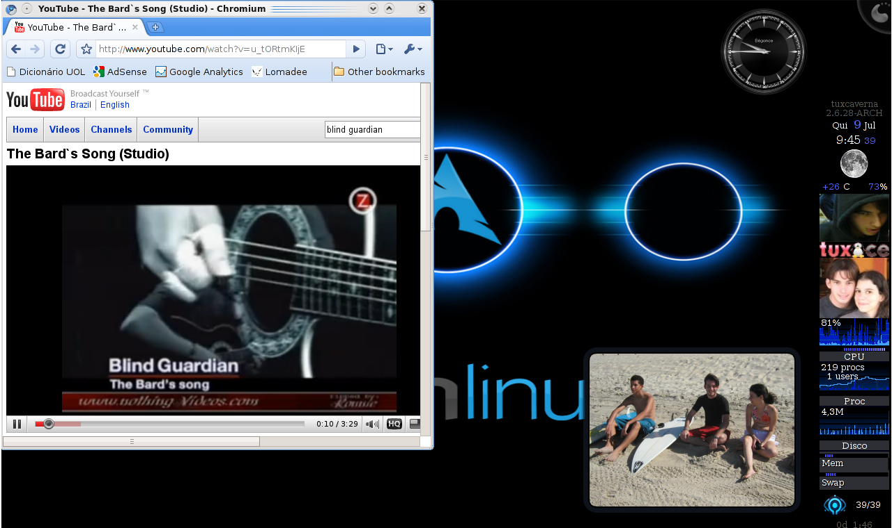

**S**audações pessoal..

**E**u já havia postado aqui a notícia sobre o lançamento do navegador Chromium para o Linux, bem como o fato de o mesmo se encontrar disponível em nosso repositório nacional do Arch Linux. Na ocasião o projeto chromium ainda era bem imaturo e não possuía nenhum suporte à plugins. Bom, as coisas estão mudando.

<!--more-->

**P**ara quem ainda não sabe, Chromium é o projeto open source que serve de base para o já conhecido Chrome do Google.

**O**ntem saiu uma nova build do chromium que trás suporte total ao flash, precisando-se apenas criar um link simbólico para o seu já existente plugin flash que se encontra no diretório de seu firefox.



**E**sta nova build, já se encontra atualizada em nosso repositório nacional, graças ao nosso amigo [Paulo (aka thotypous)](https://matias.archlinux-br.org/), e você pode instalar, caso ainda não tenha, ou apenas atualizar o seu com os seguintes comandos:

```bash
pacman -Sy

pacman -S chromium-snapshot
```

**E**stes comandos irão atualizar sua lista de repositórios e em seguida atualizar/instalar seu chromium.

**F**eito isto, basta criar o link simbólico para o plugin do flash, seguindo a seguinte sequência de comandos:

```bash
cd /opt/chromium-browser
mkdir plugins
cd plugins
ln -s /usr/lib/mozilla/plugins/libflashplayer.so .
```

**F**eito isto, execute seu chromium e digite no campo de url:

about:

**V**ocê verá claramente que o plugin flash está instalado. Agora é só correr pro abraço e testar em sites como o youtube por exemplo.

**A**braços
