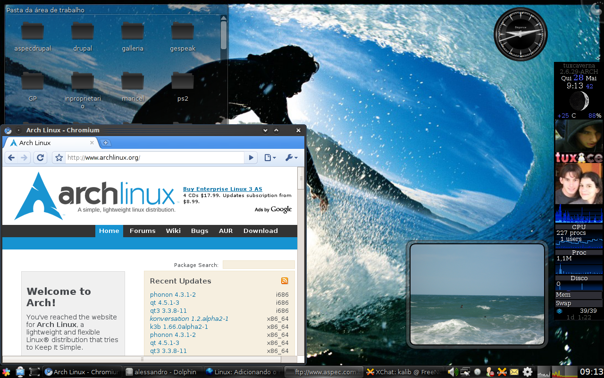

**S**audações pessoal, tudo tranquilo?

**G**ostaria de lhes comunicar que o Google Chromium alpha já está pronto e rodando no Arch.

<!--more-->

**F**iquei animado ao ver o post do [Paulo Matias](https://matias.archlinux-br.org/archives/736) no qual ele nos passava essa ótima notícia. Sim, uma das vantagens em ser usuário Arch. Novidades aparecem constantemente.

**É** isso mesmo. Você que é usuário Arch Linux já pode fazer inveja à seus coleguinhas..

**C**omo o próprio Paulo já explicou em seu post, vocês podem instalar de duas formas:

1- Baixando o pacote chromium-browser no [AUR](https://aur.archlinux.org/packages.php?ID=24266).

2- Pelo [repositório brasileiro](https://www.vivaolinux.com.br/dica/Adicionando-o-repositorio-brasileiro-no-ArchLinux) do archlinux.

**M**aiores informações no próprio blog do [Paulo](https://matias.archlinux-br.org/archives/736).

**P**essoal, essa é nossa chance de ajudar a testar o máximo possível e reportar todos os bugs. Isso vai ajudar o Google a melhorar cada vez mais o Google Chromium para o Linux como um todo.

**A**braços
