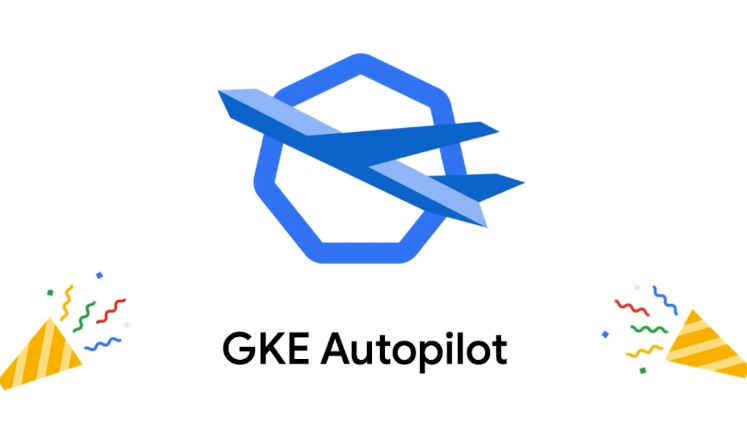
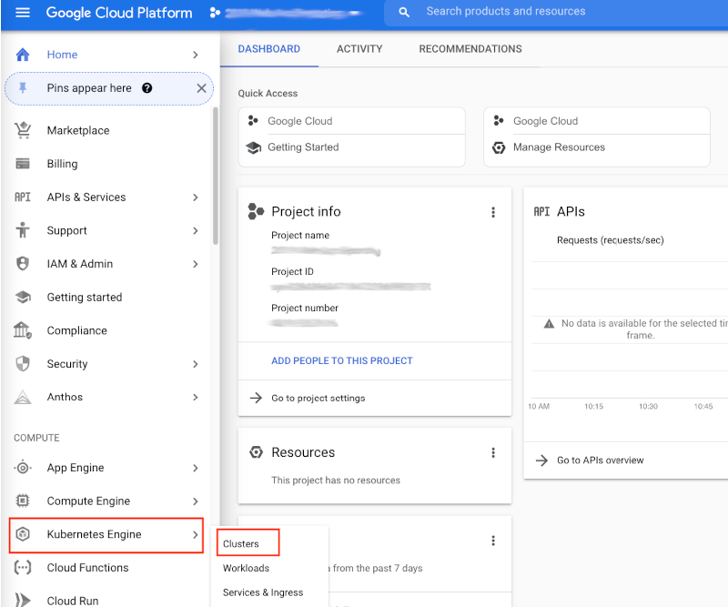
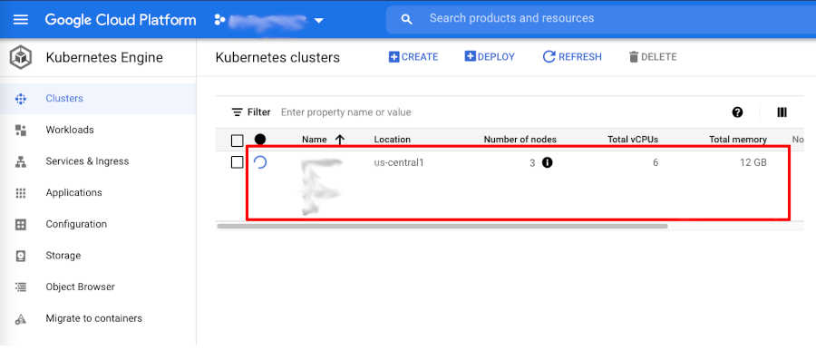
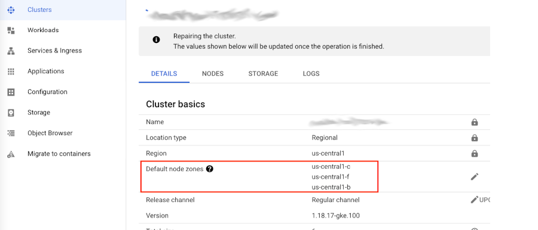
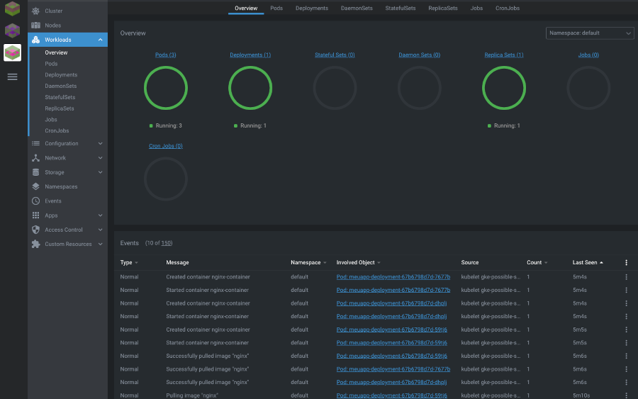

O GKE é a plataforma Kubernetes do GCP. Um ambiente simplificado que nos possibilita criar clusters rapidamente bem como o deployment de nossas aplicações sem a necessidade de lidarmos com a instalação do Kubernetes e seus serviços. Neste post faremos um simples deployment de cluster GKE utilizando o Terraform.

<!--more-->

## GKE - Google Kubernetes Engine

**O** GKE, ou Google Kubernetes Engine, é a plataforma gerenciada do Kubernetes no Google Cloud Platform, ou GCP. Embora o Kubernetes funcione de forma muito parecida em qualquer provedor ou mesmo em instalações locais, cada plataforma possui suas próprias customizações ou capacidades.

**A** solução de Kubernetes oferecida no GCP é segura e completamente gerenciada pelo Google, oferendo a você a opção de preocupar-se em gerenciar apenas seus nodes, assim como acontece em todos os demais provedores de Cloud tais como AWS, IBM e Azure. Além disto, você também possui a opção de gerenciar unicamente as suas aplicações, de forma que o Google passe a cuidar e gerenciar também os seus nodes, o que torna a vida de desenvolvedores e engenheiros ainda mais fácil. Esta opção se chama Auto Pilot e foi disponibilizada recentemente no GCP.



**A** proposta do Google com este GKE Auto Pilot é dar-lhe maior agilidade e simplicidade, visto que o Google gerencia agora todas as camadas do seu cluster e você passa agora a ser cobrado por Pods, ao invés de VMs que utiliza como Nodes.

**B**om, mas isto já é um outro assunto...

**O** foco do post de hoje é a criação de um cluster utilizando o Terraform. Para isto não utilizaremos o Auto Pilot, pois queremos ter o controle sobre os nossos nodes, escolher a capacidade do nosso node, etc.

## Leitura Recomendada

**C**aso você tenha pouca familiaridade com Google Cloud e ainda não possua uma conta criada e já preparada em seu ambiente, recomendo que primeiro leia o post [Terraform: Criando uma infraestrutura no Google Cloud](/posts/terraform-criando-uma-infraestrutura-no/).

**N**o post citado acima explico um pouco melhor os passos necessários para quem deseja utilizar GCP pela primeira vez, bem como a preparação do ambiente, criação da conta, instalação e configuração de credenciais básicas e preparo do ambiente para o Terraform com GCP.

**C**aso não tenha ainda familiaridade com o Terraform, sugiro que leia os seguintes posts também, visto que aqui não explicarei a parte do terraform com tantos detalhes:

- [Infraestrutura como Código (IAC - Infrastructure as Code)](/posts/infraestrutura-como-codigo-com-terraform/)
- [Introdução ao Terraform](/posts/introducao-ao-terraform/)
- [Terraform: Variáveis e Outputs](/posts/terraform-variaveis-e-outputs/)
- [Terraform Modules: Porquê E Como Trabalhar Com Módulos No Terraform - PARTE 1](/posts/terraform-variaveis-e-outputs/)
- [Terraform Modules: Porquê E Como Trabalhar Com Módulos No Terraform - PARTE 2](/posts/terraform-modules-porque-e-como/)

## Criando nosso cluster

**A**gora que você já possui um domínio básico de Terraform vamos começar a criar o código para a criação de nosso cluster.

**O** Google possui 2 providers disponíveis para Terraform, sendo eles o *google* e o *google-beta*. Ambos são muito parecidos, porém o *google-beta*, conforme o nome indica, se diferencia do provider *google* pelo fato de suportar os recursos beta do GCP, os quais não são suportados pelo provider *google*.

**V**amos começar criando um arquivo chamado *versions.tf*.

**E**mbora este arquivo não seja uma exigência, gosto de utilizar e recomendo como uma boa prática, já que é nele que definimos alguns fatores importantes de nossa configuração, tais como versão do terraform que esperamos que seja utilizada, versão dos provedores ou *providers*, etc.

**E**ste será o conteúdo do nosso arquivo *versions.tf*:

```go
terraform {
  required_providers {
    google = {
      source  = "hashicorp/google"
      version = "3.52.0"
    }
  }

  required_version = "~> 0.14"
}
```

**A**qui estamos definindo a versão que queremos para o provider google e também a versão que desejamos para o nosso Terraform.

**E**mbora eu esteja utilizando a versão *0.15* em meu sistema no momento, utilizei *0.14* no exemplo de código para facilitar a vida de quem possa não estar ainda rodando a última versão disponível.

**E**m seguida criaremos um arquivo simples de variáveis chamado *terraform.tfvars*:

```go
project_id = "seu-projeto-aqui"
region     = "us-central1"
```

**A**tente para a primeira linha, na qual você deverá inserir o nome do seu projeto existente no GCP. Em seguida, utilizei a região *us-central1* por ser a região mais próxima de onde moro, mas sinta-se livre para utilizar qualquer outra região.

**E**m seguida vamos criar as definições do nosso cluster. Utilizaremos o arquivo *gke.tf*:

```go
# Algumas variáveis extras
variable "gke_username" {
  default     = ""
  description = "user do gke"
}

variable "gke_password" {
  default     = ""
  description = "password do gke"
}

variable "gke_num_nodes" {
  default     = 2
  description = "numero de nodes para o cluster"
}

# Cluster GKE
resource "google_container_cluster" "marcelo_cluster" {
  name     = sensitive("${var.project_id}-gke")
  location = var.region

  remove_default_node_pool = true
  initial_node_count       = 1

  network    = google_compute_network.vpc.name
  subnetwork = google_compute_subnetwork.subnet.name

  master_auth {
    username = var.gke_username
    password = var.gke_password

    client_certificate_config {
      issue_client_certificate = false
    }
  }
}

# Node Pool Gerenciado Separadamente
resource "google_container_node_pool" "nodes_primarios" {
  name       = "${google_container_cluster.marcelo_cluster.name}-node-pool"
  location   = var.region
  cluster    = google_container_cluster.marcelo_cluster.name
  node_count = var.gke_num_nodes

  node_config {
    oauth_scopes = [
      "https://www.googleapis.com/auth/logging.write",
      "https://www.googleapis.com/auth/monitoring",
    ]

    labels = {
      env = sensitive(var.project_id)
    }

    machine_type = "e2-standard-2"
    tags         = ["gke-node", sensitive("${var.project_id}-gke")]
    metadata = {
      disable-legacy-endpoints = "true"
    }
  }
}
```

**N**este arquivo temos todas as definições necessárias para criarmos o cluster, incluindo a quantidade de nodes que desejamos em nosso pool (2), as configurações de rede (vpc e subrede), as quais serão criadas em outro arquivo, o tamanho ou tipo de instância que utilizaremos para os nodes, etc.

**N**este arquivo utilizei o parâmetro *sensitive* para proteger algumas informações. Falaremos sobre ele adiante, mas basicamente ele nos ajuda a ocultar informações em nosso plan/apply.

**A**gora que temos nossa definicão de cluster, o próximo passo é criarmos as definições de vpc. Utilizaremos um arquivo chamado *vpc.tf*:

```go
variable "project_id" {
  description = "project id"
}

variable "region" {
  description = "region"
}

provider "google" {
  project = var.project_id
  region  = var.region
}

# VPC
resource "google_compute_network" "vpc" {
  name                    = sensitive("${var.project_id}-vpc")
  auto_create_subnetworks = "false"
}

# Subnet
resource "google_compute_subnetwork" "subnet" {
  name          = sensitive("${var.project_id}-subnet")
  region        = var.region
  network       = google_compute_network.vpc.name
  ip_cidr_range = "10.10.0.0/24"
}
```

**A**qui criamos algumas variáveis adicionais, mas sinta-se livre para movê-las também para o arquivo de variáveis. Apenas optei por ter variáveis em arquivos juntamente com a criação dos recursos para facilitar a visualização nos exemplos.

**B**asicamente estamos criando uma vpc e uma subrede com faixa de ip 10.10.0.0/24, a qual será utilizada para a criação do nosso cluster.

**A**gora já temos todos os recusos necessários para o nosso cluster. A única coisa que iremos adicionar será um arquivo com alguns outputs ou saídas que nos serão úteis para, por exemplo, identificarmos nosso cluster, região, projeto no GCP, etc.

**C**riaremos o arquivo *outputs.tf* com o seguinte conteúdo:

```go
output "region" {
  value       = var.region
  description = "Região do GCloud"
}

output "project_id" {
  value       = var.project_id
  description = "ID do projeto GCP"
  sensitive   = true
}

output "kubernetes_cluster_name" {
  value       = google_container_cluster.marcelo_cluster.name
  description = "Nome do cluster GKE"
  sensitive   = true
}

output "kubernetes_cluster_host" {
  value       = google_container_cluster.marcelo_cluster.endpoint
  description = "Host do cluster GKE"
  sensitive   = true
}
```

**D**eclaramos aqui que queremos 4 outputs, sendo eles a região, o id do projeto, o nome do cluster Kubernetes e o Host do cluster.

**R**eparem que utilizamos o parâmetro *sensitive* em 3 outputs: project_id, kubernetes_cluster_name e kubernetes_cluster_host. Isto não é um requisito, mas sim uma funcionalidade interessante que foi lançada recentemente pelo Terraform. O *sensitive* nos permite ocultar informações que consideramos sensíveis, de forma que elas não serão apresentadas na saída dos comandos Terraform plan ou Terraform apply. Este recurso é muito útil para projetos que envolvem automação, como por exemplo pipelines de CI/CD que executam os códigos de Terraform automaticamente e apresentam sua saída nos logs ou tela.

**A**o utilizar a opção *sensitive* o retorno na tela será da seguinte forma:

```go
Changes to Outputs:
  + kubernetes_cluster_host = (sensitive value)
  + kubernetes_cluster_name = (sensitive value)
  + project_id              = (sensitive value)
  + region                  = "us-central1"
```

**B**om, agora que já temos todo o nosso código pronto, podemos aplicar o nosso código e criar a nossa infraestrutura.

**E**stes devem ser os nossos arquivos até então:

```bash
- gke.tf
- outputs.tf
- versions.tf
- vpc.tf
```

**P**rimeiramente executamos *terraform init*, para que possamos iniciar nosso projeto terraformn atual, baixar os providers necessários e inicializar o nosso status:

```bash
➜ terraform init       

Initializing the backend...

Initializing provider plugins...
- Reusing previous version of hashicorp/google from the dependency lock file
- Using previously-installed hashicorp/google v3.52.0

Terraform has been successfully initialized!

You may now begin working with Terraform. Try running "terraform plan" to see
any changes that are required for your infrastructure. All Terraform commands
should now work.

If you ever set or change modules or backend configuration for Terraform,
rerun this command to reinitialize your working directory. If you forget, other
commands will detect it and remind you to do so if necessary.
```

**A**gora que baixamos e inicializamos nosso provider *hashicorp/google*, podemos executar o *plano* para nosso código:

```bash
➜ terraform plan

Terraform used the selected providers to generate the following execution plan. Resource actions are indicated with the following symbols:
  + create

Terraform will perform the following actions:

  # google_compute_network.vpc will be created
  + resource "google_compute_network" "vpc" {
      + auto_create_subnetworks         = false
      + delete_default_routes_on_create = false
      + gateway_ipv4                    = (known after apply)
      + id                              = (known after apply)
      + mtu                             = (known after apply)
      + name                            = (sensitive)
      + project                         = (known after apply)
      + routing_mode                    = (known after apply)
      + self_link                       = (known after apply)
    }

  # google_compute_subnetwork.subnet will be created
  + resource "google_compute_subnetwork" "subnet" {
      + creation_timestamp         = (known after apply)
      + fingerprint                = (known after apply)
      + gateway_address            = (known after apply)
      + id                         = (known after apply)
      + ip_cidr_range              = "10.10.0.0/24"
      + name                       = (sensitive)
      + network                    = (sensitive)
      + private_ipv6_google_access = (known after apply)
      + project                    = (known after apply)
      + region                     = "us-central1"
      + secondary_ip_range         = (known after apply)
      + self_link                  = (known after apply)
    }

  # google_container_cluster.marcelo_cluster will be created
  + resource "google_container_cluster" "marcelo_cluster" {
      + cluster_ipv4_cidr           = (known after apply)
      + default_max_pods_per_node   = (known after apply)
      + enable_binary_authorization = false
      + enable_kubernetes_alpha     = false
      + enable_legacy_abac          = false
      + enable_shielded_nodes       = false
      + endpoint                    = (known after apply)
      + id                          = (known after apply)
      + initial_node_count          = 1
      + instance_group_urls         = (known after apply)
      + label_fingerprint           = (known after apply)
      + location                    = "us-central1"
      + logging_service             = (known after apply)
      + master_version              = (known after apply)
      + monitoring_service          = (known after apply)
      + name                        = (sensitive)
      + network                     = (sensitive)
      + node_locations              = (known after apply)
      + node_version                = (known after apply)
      + operation                   = (known after apply)
      + project                     = (known after apply)
      + remove_default_node_pool    = true
      + self_link                   = (known after apply)
      + services_ipv4_cidr          = (known after apply)
      + subnetwork                  = (sensitive)

      + addons_config {
          + cloudrun_config {
              + disabled           = (known after apply)
              + load_balancer_type = (known after apply)
            }

          + horizontal_pod_autoscaling {
              + disabled = (known after apply)
            }

          + http_load_balancing {
              + disabled = (known after apply)
            }

          + network_policy_config {
              + disabled = (known after apply)
            }
        }

      + authenticator_groups_config {
          + security_group = (known after apply)
        }

      + cluster_autoscaling {
          + enabled = (known after apply)

          + auto_provisioning_defaults {
              + oauth_scopes    = (known after apply)
              + service_account = (known after apply)
            }

          + resource_limits {
              + maximum       = (known after apply)
              + minimum       = (known after apply)
              + resource_type = (known after apply)
            }
        }

      + database_encryption {
          + key_name = (known after apply)
          + state    = (known after apply)
        }

      + master_auth {
          + client_certificate     = (known after apply)
          + client_key             = (sensitive value)
          + cluster_ca_certificate = (known after apply)

          + client_certificate_config {
              + issue_client_certificate = false
            }
        }

      + network_policy {
          + enabled  = (known after apply)
          + provider = (known after apply)
        }

      + node_config {
          + disk_size_gb      = (known after apply)
          + disk_type         = (known after apply)
          + guest_accelerator = (known after apply)
          + image_type        = (known after apply)
          + labels            = (known after apply)
          + local_ssd_count   = (known after apply)
          + machine_type      = (known after apply)
          + metadata          = (known after apply)
          + min_cpu_platform  = (known after apply)
          + oauth_scopes      = (known after apply)
          + preemptible       = (known after apply)
          + service_account   = (known after apply)
          + tags              = (known after apply)
          + taint             = (known after apply)

          + shielded_instance_config {
              + enable_integrity_monitoring = (known after apply)
              + enable_secure_boot          = (known after apply)
            }

          + workload_metadata_config {
              + node_metadata = (known after apply)
            }
        }

      + node_pool {
          + initial_node_count  = (known after apply)
          + instance_group_urls = (known after apply)
          + max_pods_per_node   = (known after apply)
          + name                = (known after apply)
          + name_prefix         = (known after apply)
          + node_count          = (known after apply)
          + node_locations      = (known after apply)
          + version             = (known after apply)

          + autoscaling {
              + max_node_count = (known after apply)
              + min_node_count = (known after apply)
            }

          + management {
              + auto_repair  = (known after apply)
              + auto_upgrade = (known after apply)
            }

          + node_config {
              + disk_size_gb      = (known after apply)
              + disk_type         = (known after apply)
              + guest_accelerator = (known after apply)
              + image_type        = (known after apply)
              + labels            = (known after apply)
              + local_ssd_count   = (known after apply)
              + machine_type      = (known after apply)
              + metadata          = (known after apply)
              + min_cpu_platform  = (known after apply)
              + oauth_scopes      = (known after apply)
              + preemptible       = (known after apply)
              + service_account   = (known after apply)
              + tags              = (known after apply)
              + taint             = (known after apply)

              + shielded_instance_config {
                  + enable_integrity_monitoring = (known after apply)
                  + enable_secure_boot          = (known after apply)
                }

              + workload_metadata_config {
                  + node_metadata = (known after apply)
                }
            }

          + upgrade_settings {
              + max_surge       = (known after apply)
              + max_unavailable = (known after apply)
            }
        }

      + release_channel {
          + channel = (known after apply)
        }
    }

  # google_container_node_pool.nodes_primarios will be created
  + resource "google_container_node_pool" "nodes_primarios" {
      + cluster             = (sensitive)
      + id                  = (known after apply)
      + initial_node_count  = (known after apply)
      + instance_group_urls = (known after apply)
      + location            = "us-central1"
      + max_pods_per_node   = (known after apply)
      + name                = (sensitive)
      + name_prefix         = (known after apply)
      + node_count          = 2
      + node_locations      = (known after apply)
      + project             = (known after apply)
      + version             = (known after apply)

      + management {
          + auto_repair  = (known after apply)
          + auto_upgrade = (known after apply)
        }

      + node_config {
          + disk_size_gb      = (known after apply)
          + disk_type         = (known after apply)
          + guest_accelerator = (known after apply)
          + image_type        = (known after apply)
          + labels            = {
              + "env" = (sensitive)
            }
          + local_ssd_count   = (known after apply)
          + machine_type      = "e2-standard-2"
          + metadata          = {
              + "disable-legacy-endpoints" = "true"
            }
          + oauth_scopes      = [
              + "https://www.googleapis.com/auth/logging.write",
              + "https://www.googleapis.com/auth/monitoring",
            ]
          + preemptible       = false
          + service_account   = (known after apply)
          + tags              = [
              + "gke-node",
              + (sensitive),
            ]
          + taint             = (known after apply)

          + shielded_instance_config {
              + enable_integrity_monitoring = (known after apply)
              + enable_secure_boot          = (known after apply)
            }

          + workload_metadata_config {
              + node_metadata = (known after apply)
            }
        }

      + upgrade_settings {
          + max_surge       = (known after apply)
          + max_unavailable = (known after apply)
        }
    }

Plan: 4 to add, 0 to change, 0 to destroy.

Changes to Outputs:
  + kubernetes_cluster_host = (sensitive value)
  + kubernetes_cluster_name = (sensitive value)
  + project_id              = (sensitive value)
  + region                  = "us-central1"

─────────────────────────────────────────────────────────────────────────────────────────────────────────────────────────────────────────────────────────────

Note: You didn't use the -out option to save this plan, so Terraform can't guarantee to take exactly these actions if you run "terraform apply" now.
```

**R**epare que recebemos diversas vezes parâmetros protegidos e mascarados com apenas *sensitive value*. Este é o resultado de todas as entradas em nosso código em que optamos por utilizar *sensitive*. Repare que, por padrão, o Terraform já habilita o sensitive automaticamente para campos de password, por exemplo.

**T**udo parece certo em nosso plan, teremos 4 recursos a serem adicionados, 0 alterados e 0 destruídos. Neste caso, os 4 a serem adicionados são:

- VPC
- Subrede/Subnet
- Cluster Kubernetes (GKE)
- Node Pool - O node pool ou pool de nodes será o grupo no qual teremos nossos nodes ou VMs que serão os nodes de nosso cluster.

**A**gora podemos aplicar o nosso código:

```bash
➜ terraform apply --auto-approve

google_compute_network.vpc: Creating...
google_compute_network.vpc: Still creating... [10s elapsed]
...
```

**E**nquanto nosso código é aplicado, já podemos logar no GCP e abrir a sessão de **Kubernetes/GKE**:



**A**o clicarmos em Clusters poderemos ver que de fato nosso cluster está sendo inicializado:



**E**sta será a saída final do nosso comando *terraform apply*:

```bash
➜ terraform apply --auto-approve 

google_compute_network.vpc: Creating...
google_compute_network.vpc: Still creating... [10s elapsed]
google_compute_network.vpc: Creation complete after 12s [id=projects/balbalbalbalb/global/networks/balbalbalbalb-vpc]
google_compute_subnetwork.subnet: Creating...
google_compute_subnetwork.subnet: Still creating... [10s elapsed]
google_compute_subnetwork.subnet: Still creating... [20s elapsed]
google_compute_subnetwork.subnet: Creation complete after 22s [id=projects/balbalbalbalb/regions/us-central1/subnetworks/balbalbalbalb-subnet]
google_container_cluster.marcelo_cluster: Creating...
google_container_cluster.marcelo_cluster: Still creating... [10s elapsed]
google_container_cluster.marcelo_cluster: Still creating... [20s elapsed]
google_container_cluster.marcelo_cluster: Still creating... [30s elapsed]
google_container_cluster.marcelo_cluster: Still creating... [40s elapsed]
google_container_cluster.marcelo_cluster: Still creating... [50s elapsed]
google_container_cluster.marcelo_cluster: Still creating... [1m0s elapsed]
google_container_cluster.marcelo_cluster: Still creating... [1m10s elapsed]
google_container_cluster.marcelo_cluster: Still creating... [1m20s elapsed]
google_container_cluster.marcelo_cluster: Still creating... [1m30s elapsed]
google_container_cluster.marcelo_cluster: Still creating... [1m40s elapsed]
google_container_cluster.marcelo_cluster: Still creating... [1m50s elapsed]
google_container_cluster.marcelo_cluster: Still creating... [2m0s elapsed]
google_container_cluster.marcelo_cluster: Still creating... [2m10s elapsed]
google_container_cluster.marcelo_cluster: Still creating... [2m20s elapsed]
google_container_cluster.marcelo_cluster: Still creating... [2m30s elapsed]
google_container_cluster.marcelo_cluster: Still creating... [2m40s elapsed]
google_container_cluster.marcelo_cluster: Still creating... [2m50s elapsed]
google_container_cluster.marcelo_cluster: Still creating... [3m0s elapsed]
google_container_cluster.marcelo_cluster: Still creating... [3m10s elapsed]
google_container_cluster.marcelo_cluster: Still creating... [3m20s elapsed]
google_container_cluster.marcelo_cluster: Still creating... [3m30s elapsed]
google_container_cluster.marcelo_cluster: Still creating... [3m40s elapsed]
google_container_cluster.marcelo_cluster: Still creating... [3m50s elapsed]
google_container_cluster.marcelo_cluster: Still creating... [4m0s elapsed]
google_container_cluster.marcelo_cluster: Still creating... [4m10s elapsed]
google_container_cluster.marcelo_cluster: Still creating... [4m20s elapsed]
google_container_cluster.marcelo_cluster: Still creating... [4m30s elapsed]
google_container_cluster.marcelo_cluster: Still creating... [4m40s elapsed]
google_container_cluster.marcelo_cluster: Still creating... [4m50s elapsed]
google_container_cluster.marcelo_cluster: Still creating... [5m0s elapsed]
google_container_cluster.marcelo_cluster: Still creating... [5m10s elapsed]
google_container_cluster.marcelo_cluster: Still creating... [5m20s elapsed]
google_container_cluster.marcelo_cluster: Still creating... [5m30s elapsed]
google_container_cluster.marcelo_cluster: Creation complete after 5m35s [id=projects/balbalbalbalb/locations/us-central1/clusters/balbalbalbalb-gke]
google_container_node_pool.nodes_primarios: Creating...
google_container_node_pool.nodes_primarios: Still creating... [10s elapsed]
google_container_node_pool.nodes_primarios: Still creating... [20s elapsed]
google_container_node_pool.nodes_primarios: Still creating... [30s elapsed]
google_container_node_pool.nodes_primarios: Still creating... [40s elapsed]
google_container_node_pool.nodes_primarios: Still creating... [50s elapsed]
google_container_node_pool.nodes_primarios: Still creating... [1m0s elapsed]
google_container_node_pool.nodes_primarios: Still creating... [1m10s elapsed]
google_container_node_pool.nodes_primarios: Still creating... [1m20s elapsed]
google_container_node_pool.nodes_primarios: Still creating... [1m30s elapsed]
google_container_node_pool.nodes_primarios: Creation complete after 1m35s [id=projects/balbalbalbalb/locations/us-central1/clusters/balbalbalbalb-gke/nodePools/balbalbalbalb-gke-node-pool]

Apply complete! Resources: 4 added, 0 changed, 0 destroyed.

Outputs:

kubernetes_cluster_host = <sensitive>
kubernetes_cluster_name = <sensitive>
project_id = <sensitive>
region = "us-central1"
```

**A**ssumindo que você já possui a cli do google cloud instalada e autenticada, você poderá agora configurar seu *kubectl* para utilizar o seu novo cluster utilizando o seguinte comando:

```bash
➜ gcloud container clusters get-credentials $(terraform output -raw kubernetes_cluster_name) --region $(terraform output -raw region)

Fetching cluster endpoint and auth data.
WARNING: cluster <NOME_DE_SEU_CLUSTER> is not running. The kubernetes API may not be available.
kubeconfig entry generated for balbalbalbalb-gke.
```

**C**omo definimos alguns outputs em nosso código Terraform, o comando acima deverá funcionar corretamente.

**U**ma alternativa mais manual seria o seguinte:

```bash
➜ gcloud container clusters get-credentials <NOME_DE_SEU_CLUSTER> --region <SUA_REGIÃO>
```

**E**m seguida, podemos utilizar o *kubectl* para termos certeza de que nosso cluster está ativo.

**C**omeçaremos listando nossos nodes:

```bash
➜ kubectl get nodes
NAME                                                  STATUS   ROLES    AGE   VERSION
gke-balbalbalbalb-222-a77a8f3d-8pqc   Ready    <none>   14m   v1.18.17-gke.100
gke-balbalbalbalb-222-a77a8f3d-bpr3   Ready    <none>   14m   v1.18.17-gke.100
gke-balbalbalbalb-222-e6a547a0-bnqr   Ready    <none>   14m   v1.18.17-gke.100
gke-balbalbalbalb-222-e6a547a0-chpd   Ready    <none>   14m   v1.18.17-gke.100
gke-balbalbalbalb-222-fbfe4d87-351m   Ready    <none>   14m   v1.18.17-gke.100
gke-balbalbalbalb-222-fbfe4d87-fqfv   Ready    <none>   14m   v1.18.17-gke.100
```

**OPAAAAAA**... Algo estranho aqui?

**E**m nosso código Terraform especificamos **2** para a quantidade de nodes. Porque então estamos com 6 nodes no cluster?

**M**uita calma jovem gafanhoto, tudo tem um porque de ser.

**O** GCP nos permite trabalhar com clusters simples, os quais são chamados clusters de Zona, mas também nos permite optar por clusters Regionais, ou multi-zonas. Quando definimos uma zona para a criação do nosso cluster, significa que o cluster será criado apenas naquela zona específica, tanto o control plane quanto os nossos nodes.

**N**o nosso caso, se voltarmos ao código Terraform, podemos ver que definimos uma região, e não uma zona, certo?! Repare nas linhas destacadas a seguir, onde especificamos que queremos 2 nodes, porém de forma **regional** ou em uma **region**:

```go
# Algumas variáveis extras
...
...
...
variable "gke_num_nodes" {
  default     = 2
  description = "numero de nodes para o cluster"
}

# Cluster GKE
resource "google_container_cluster" "marcelo_cluster" {
  name     = sensitive("${var.project_id}-gke")
  location = var.region
...
...
}

# Node Pool Gerenciado Separadamente
resource "google_container_node_pool" "nodes_primarios" {
  name       = "${google_container_cluster.marcelo_cluster.name}-node-pool"
  location   = var.region
  cluster    = google_container_cluster.marcelo_cluster.name
  node_count = var.gke_num_nodes
...
...
...
}
```

**A**o optarmos por 2 nodes de forma regional, significa que o GKE utilizará alta disponibilidade em nosso cluster, ou seja, irá criar 2 nodes em cada uma das 3 zonas daquela região, logo teremos 6 nodes ao todo. Quando isso faz sentido? Quando queremos alta disponibilidade, para o caso de uma das zonas cair por exemplo.

**P**odemos também ver isso claramente na página de detalhes do cluster no GCP:



**V**amos agora fazer o deployment de alguns recursos do Kubernetes apenas para termos a certeza de que está tudo ok.

**C**omeçarei confirmando que este é um cluster novo e que nada está rodando nele por enquanto:

```bash
➜ kubectl get all               

NAME                 TYPE        CLUSTER-IP     EXTERNAL-IP   PORT(S)   AGE
service/kubernetes   ClusterIP   10.239.240.1   <none>        443/TCP   36m
```

**A**gora criaremos um arquivo yaml simples chamado *meu-primeiro-deployment.yaml*:

```yaml
apiVersion: apps/v1
kind: Deployment
metadata:
    name: meuapp-deployment
    labels:
        app: meuapp
        type: front-end
spec:
    template: 
        metadata:
            name: meuapp-pod
            labels: 
                app: meuapp
                tipo: front-end
        spec:
            containers:
            - name: nginx-container
              image: nginx
    replicas: 3
    selector:
        matchLabels:
            tipo: front-end
```

**F**açamos então o nosso deployment no cluster com...

```bash
➜ kubectl create -f meu-primeiro-deployment.yaml 

deployment.apps/meuapp-deployment created
```

**S**e executarmos novamente *kubectl get all* deveremos agora ter 1 deployment, 1 replicaset e 3 pods rodando em nosso cluster:

```bash
➜ kubectl get all                               

NAME                                     READY   STATUS    RESTARTS   AGE
pod/meuapp-deployment-67b6798d7d-59tj6   1/1     Running   0          14s
pod/meuapp-deployment-67b6798d7d-7677b   1/1     Running   0          14s
pod/meuapp-deployment-67b6798d7d-dhplj   1/1     Running   0          14s

NAME                 TYPE        CLUSTER-IP     EXTERNAL-IP   PORT(S)   AGE
service/kubernetes   ClusterIP   10.239.240.1   <none>        443/TCP   41m

NAME                                READY   UP-TO-DATE   AVAILABLE   AGE
deployment.apps/meuapp-deployment   3/3     3            3           14s

NAME                                           DESIRED   CURRENT   READY   AGE
replicaset.apps/meuapp-deployment-67b6798d7d   3         3         3       14s
```

**E**xatamente como esperávamos.

**P**osso inclusive ter uma visualização gráfica disto utilizando o Lens, sobre o qual falei no post anterior: - [Lens - Uma IDE para o Kubernetes](/posts/lens-uma-ide-para-o/)



**S**ucesso!

**A**gora que confirmamos que tudo roda, não esqueça de deletar seu cluster após terminar de se divertir com ele para evitar gastar dinheiro desnecessariamente.

```bash
➜ terraform destroy --auto-approve
```

**H**ave fun!
