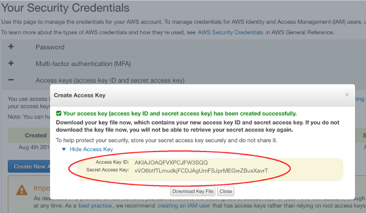
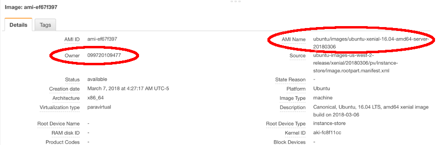
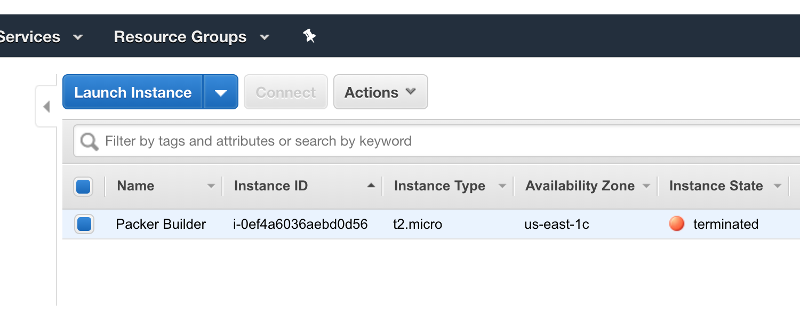
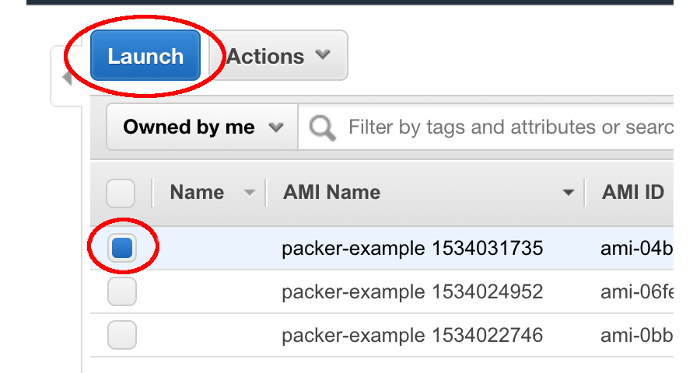
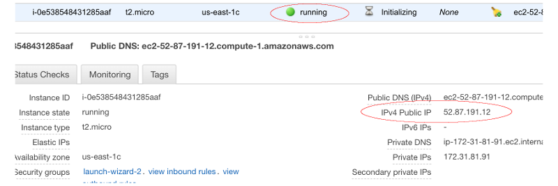
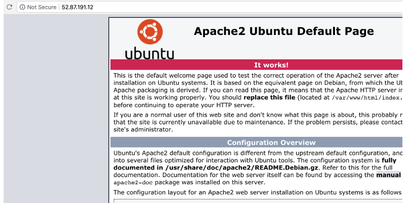

Um exemplo de como utilizar a ferramenta Open Source Packer para criar uma imagem de forma automatizada para AWS EC2 com Puppet e Bash script para provisionar as configurações da imagem/vm.

<!--more-->

## Packer, Puppet, Bash e AWS

**A** plataforma AWS da Amazon é atualmente uma das maiores e mais populares quando o assunto é Cloud e automação em nuvem, permitindo o uso de soluções de infra estrutura completamente na nuvem, sem a necessidade de termos Hardware físico, otimizando custos e nos dando mais flexibilidade.

**A** própria plataforma nos disponibiliza diversos recursos para facilitar a implementação de nossas soluções e tornar nossas tarefas rotineiras mais simples. Por exemplo, para a criação de VMs, ou instâncias, no AWS de forma mais rápida, podemos utilizar uma imagem previamente criada, de forma que possamos evitar alguns passos e configurações repetitivas.

**U**ma vez que eu identifico uma necessidade para minha aplicação e sei que preciso de uma máquina virtual com configurações e aplicações específicas para poder rodar minha aplicação, eu posso criar uma imagem com todos estes pré-requisitos de forma que ao resolver criar uma nova VM, eu não precise realizar todos estes passos manualmente. Além de evitar trabalho repetitivo, nos garante uma maior flexibilidade ao ter nossa infraestrutura como código, de forma que podemos literalmente ter as instruções que compõem nossa infraestrutura em um repositório Git, por exemplo, além de nos permitir realizar alterações nesta imagem também de forma simples e rápida para a geração de novas imagens de instâncias com as nossas alterações em poucos segundos ou minutos, dependendo da quantidade de alterações envolvdidas.

**S**e você ainda não faz ideia de o que seja o Packer ou o que ele é capaz de fazer, sugiro que volte uma casa e leia meu [post anterior](/posts/criando-uma-imagem-aws-ec2/), onde explico o que é o Packer e apresento um simples exemplo de seu uso para a criação de imagens para o Docker.

**O** intuito deste post é mostrar como podemos estruturar um simples código para que possamos criar uma imagem no AWS que poderá ser utilizada posteriormente para a criação de instâncias. Esta imagem será criada através do Packer e, para incrementar ainda mais nossa imagem, utilizaremos o recurso de provisioners (ou provisionadores/provedores) disponível no Packer. Utilizaremos dois provisioners como recursos externos para o provisionamento e configuração de nossa imagem, sendo eles bash script e [Puppet](https://puppet.com/).

## AWS

**U**ma vez que estou assumindo que você já possui o Packer instalado, bem como que você já possui uma ideia de como ele funciona, vamos iniciar pelo AWS. (Ainda não possui o Packer e não sabe o que ele faz? Novamente, [Automatizando a Criacao De Imagens Com Packer](/posts/automatizando-a-criacao-de-imagens/).)

**O** primeiro pré-requisito para este post/tutorial é uma conta no AWS. Caso você não possua uma e queira repetir os passos aqui descritos, siga e crie uma. Lembrando que o AWS lhe dá uma série de recursos que podem ser utilizados gratuitamente no que eles chamam de "Free Tier". Uma vez que utilizaremos apenas recursos simples aqui, você não deverá ser cobrado por nada ao seguir os exemplos deste post. O ideal é que você exclua os recursos ou encerre sua conta após o término deste exercício para evitar ser cobrado por algo. Caso não o faça e resolva continuar testando algumas coisas no AWS, você pode ser cobrado em alguns centavos ou reais, dependendo de o que resolva testar e por quanto. (Sua responsabilidade, claro.)

**A** conta no AWS pode ser criada aqui: [AWS Conta Gratuita](https://aws.amazon.com/free/).

**U**ma vez que a conta no AWS esteja criada e pronta para uso, o primeiro passo será de fato conseguir uma chave para que possamos nos comunicar com o AWS via CLI através de uma API. Durante a criação de nosso código com o Packer precisaremos utilizar esta chave de acesso, portanto vá em frente e crie uma através deste link: [IAM](https://console.aws.amazon.com/iam/home?#security_credential.

**C**lique na opção Access Keys, ou Chaves de Acesso, e crie uma nova. **É extremamente importante** que você esteja atento neste momento, pois ele apenas lhe mostrará o ID e senha para a chave uma única vez, portanto esteja pronto para copiar e salvar ambos os valores. Será algo similar a isto:



**É** claro que eu já excluí essa chave... :p Não perca seu tempo... >]

**U**ma vez que você tenha salvo ambos os valores, vamos tratar da identificação/autenticação com o AWS.

**O** mecanismo padrão do Packer de autenticação neste caso seria através de duas variáveis em nosso arquivo json:

```json
{
  "builders": [{
    "type": "amazon-ebs",
    "access_key": "SUA ACCESS KEY AQUI",
    "secret_key": "SUA SECRET ACCESS KEY AQUI",
... ... ...
```

**E**mbora seja a forma mais simples, não a utilizaremos. Fica claro que não é uma forma muito segura, certo?! Quando se pensa em infraestrutura como código, um dos principais objetivos é podermos versionar e hospedar nosso código em um repositório Git, por exemplo. Ter nossa chave como parte do código não é nada seguro, especialmente se vamos compartilhar este código em um repositório Git.

**A** forma mais simples de lidarmos com isso é salvando nossa chave e senha como variáveis de ambiente e, em nosso arquivo json, importarmos estas variáveis de ambiente diretamente.

**E**m Linux ou OS X, digite o seguinte em um terminal ou console:

```bash
$ export AWS_ACCESS_KEY_ID=SUA ACCESS KEY AQUI
$ export AWS_SECRET_ACCESS_KEY=SUA SECRET ACCESS KEY AQUI
```

**C**ertifique-se de que os valores foram definidos corretamente:

```bash
$ echo $AWS_ACCESS_KEY_ID
$ echo $AWS_SECRET_ACCESS_KEY
```

Por hora isso é tudo de que precisaremos para o AWS.

## Packer

**H**ora de começarmos a escrever nosso código que será utilizado pelo Packer para a criação de nossa imagem.

**D**esta vez estaremos criando uma imagem EC2 para o AWS, portanto alguns provisioners e parâmetros serão diferentes dos utilizados no [post anterior](/posts/automatizando-a-criacao-de-imagens/), onde criamos uma imagem para o Docker.

**C**omecemos criando um arquivo json vazio. Chamarei meu arquivo de *ubuntuaws.json*.

**A** primeira coisa que faremos é incluir as credenciais de nossa conta no AWS. Como criamos duas variáveis de ambiente em nosso host, chamadas *AWS_ACCESS_KEY_ID* e *AWS_SECRET_ACCESS_KEY*, invocaremos estas duas variáveis da seguinte forma no início de nosso arquivo: *env \`AWS_ACCESS_KEY_ID\`*, etc... Vamos ao código.

```json
{
  "variables": {
    "aws_access_key": "{{env `AWS_ACCESS_KEY_ID`}}",
    "aws_secret_key": "{{env `AWS_SECRET_ACCESS_KEY`}}",
    "region": "us-east-1"
  },
}
```

**N**ormalmente uma varíavel poderia ser declarada apenas com *"aws_access_key": "sua_chave"*, conforme fizemos com a variável *region* acima, no entanto, por questões de segurança, não queremos ter nossa chave exposta no código, certo?! Portanto, estamos trazendo os valores diretamente das variáveis de ambiente que criamos. A utilização do parâmetro *env* é o que indica ao Packer que ele deverá buscar estas variáveis em nosso *env* (environment).

**É** importante lembrar que o aws possui datacenters e recursos em diversas regiões do mundo. Você não precisa obrigatoriamente utilizar a região *us-east-1*. Optei por utilizar esta região em meu código pelo fato de eu morar em Toronto, o que faz desta região uma boa escolha para meus recursos de nuvem por conta da proximidade (menor delay).

**S**e você está no Brasil, provavelmente a melhor opção seja *sa-east-1*, a qual se encontra em São Paulo. De qualquer forma, você pode verificar a lista de regiões disponíveis no AWS através [deste link](https://docs.aws.amazon.com/pt_br/AWSEC2/latest/UserGuide/using-regions-availability-zones.html#concepts-available-regions).

**A**té então nosso código está simples e não faz basicamente nada além de definir as duas variáves para nossa autenticação, mas ainda assim é importante termos certeza de que não cometemos nenhum erro de sintaxe:

```bash
$ packer validate ubuntuaws.json
Error initializing core: 1 error(s) occurred:

* at least one builder must be defined
```

**P**or enquanto ignore este erro, nossa sintaxe esta correta. O Packer apenas está nos dizendo que não conseguiu iniciar o projeto pois ao menos um builder deve ser definido e, até então, nós não definimos nenhum. Este será o nosso próximo passo. Desta vez, ao invés de utilizarmos um builder do tipo Docker, utilizaremos um do tipo *amazon-ebs*. Começaremos inserindo uma vírgula ao fim do bloco de variáveis e nosso código agora ficará da seguinte forma:

```json
{
  "variables": {
    "aws_access_key": "{{env `AWS_ACCESS_KEY_ID`}}",
    "aws_secret_key": "{{env `AWS_SECRET_ACCESS_KEY`}}",
    "region": "us-east-1"
  },
"builders": [{
    "type": "amazon-ebs",
    "access_key": "{{user `aws_access_key`}}",
    "secret_key": "{{user `aws_secret_key`}}",
    "region": "{{user `region`}},
    "source_ami_filter": {
      "filters": {
      "virtualization-type": "hvm",
      "name": "ubuntu/images/*ubuntu-xenial-16.04-amd64-server-*",
      "root-device-type": "ebs"
      },
      "owners": ["099720109477"],
      "most_recent": true
    },
    "instance_type": "t2.micro",
    "ssh_username": "ubuntu",
    "ami_name": "packer-example {{timestamp}}"
  }]
}
```

**O** que temos agora:

*builders:* Inciamos nosso bloco de builders com as intruções ou parâmetros que definirão as especificações mais básicas para a criação de nossa imagem no AWS.

*type:* Aqui indicamos o tipo de builders que utilizaremos. No caso do EC2 do AWS, o tipo se chama *amazon-ebs*. Basicamente este builder irá utilizar uma imagem previamente existente, como as fornecidas por padrão pela Amazon, para criar uma nova imagem que poderá ser futuramente utilizada para provisionar suas instâncias EC2 com EBS (Elastic Block Storage).

*access_key:* e *secret_key:* Aqui apenas indicamos que queremos utilizar o valor das variáveis que criamos mais acima. É importante lembrar que quando as definimos, utilizamos *env*, para indicar que a origem delas estava em nossas variáveis de ambiente. Agora estamos utilizando *user* para indicar que são variáveis criadas em nosso código mesmo (usuário).

*region:* Novamente, assim como com as chaves, anteriormente nós declaramos esta variável e agora estamos inserindo-a em nosso código como uma variável de usuário *user*.

*source_ami_filter:* Neste bloco iremos passar as informações básicas sobre a imagem que será utilizada como origem ou *source* base para nossa imagem. Lembrando novamente de que utilizaremos uma AMI (Amazon Machine Image) já existente por padrão no AWS.

*filters:* Utilizaremos alguns filtros para definir a nossa imagem *source*.

*virtualization_type:* Nosso primeiro parâmetro de filtro será o tipo de virtualização que desejamos utilizar. Se você já utilizou AWS antes, provavelmente reparou que você possui algumas formas de virtualização disponíveis, como HVM e PV. Utilizaremos HVM em nosso código.

*name:* Aqui indicamos o nome da imagem *source* que queremos utilizar como base de nossa imagem. Como a Canonical vive atualizando suas imagens no marketplace do AWS, não utilizaremos um nome exato aqui, pois correríamos o risco de esta imagem ter sido descontinuada ou mesmo de estar desatualizada quando você estiver lendo e executando este tutorial, portanto utilizaremos um coringa (asterísco) e indicaremos um parâmetro extra para dizer que queremos utilizar a mais recente. Para nome, utilizaremos apenas: *ubuntu/images/\*ubuntu-xenial-16.04-amd64-server-\** onde o asterísco do final indica que não nos importa o final do nome, e qualquer coisa será válida.

*root-device-type:* Indicamos *ebs* como tipo de storage para nossa imagem e tipo de instância.

*owners:* Indicamos o dono da imagem. Na página do AWS, cada imagem é vinculada a um dono, conforme imagem abaixo:



*most_recent:* Este é o parâmetro que, quando definido como *true*, fará com que seja utilizada a imagem mais recente que atenda aos demais filtros utilizados para a imagem.

*instance_type:* Indica o tipo de instância que será utilizada no AWS. O AWS possui dezenas de categorias de instâncias, onde cada categoria ou tipo possui uma quantidade diferente de memória, CPU, etc.

*ami_name:* Finalmente, aqui indicamos o nome que queremos atribuir à nossa imagem ao final da criação da mesma.

**A**gora que possuímos um código mais completo e que realmente conseguirá fazer algo, vamos validar o código e executá-lo em seguida para criarmos nossa primeira imagem no AWS.

```bash
$ packer validate ubuntuaws.json
Template validated successfully.
```

**C**ódigo validado e sem erros.

**É** importante entender o que realmente acontece durante a criação de uma imagem. O Packer não tem como executar as instruções e rodar o que queremos para criar a imagem de forma estática e mágica, portanto o que vai acontecer na verdade será o seguinte:

1. Primeiramente o Packer irá buscar a imagem que definimos que será utilizada como fonte;
2. O packer irá criar literalmente uma instância no AWS utilizando as propriedades que definimos em nosso código para executar nossas instruções e garantir que tudo funcionará. Uma vez que todas as instruções sejam realizadas com sucesso, ele irá desligar e remover esta instância ou máquina virtual e irá salvar a imagem gerada;

**S**e durante a execução do Packer build você verificar o painel de instâncias EC2 no AWS, ficará claro que o Packer cria uma instância temporária durante a criação da imagem.

**H**ora do build:

```bash
$ packer build ubuntuaws.json
amazon-ebs output will be in this color.

==> amazon-ebs: Prevalidating AMI Name: packer-example 1534022746
    amazon-ebs: Found Image ID: ami-5c150e23
==> amazon-ebs: Creating temporary keypair: packer_5b6f545a-8955-2f4f-b66a-8fd752d75bee
==> amazon-ebs: Creating temporary security group for this instance: packer_5b6f545c-0f04-553a-7944-a70d081be39d
==> amazon-ebs: Authorizing access to port 22 from 0.0.0.0/0 in the temporary security group...
==> amazon-ebs: Launching a source AWS instance...
==> amazon-ebs: Adding tags to source instance
    amazon-ebs: Adding tag: "Name": "Packer Builder"
    amazon-ebs: Instance ID: i-0ef4a6036aebd0d56
==> amazon-ebs: Waiting for instance (i-0ef4a6036aebd0d56) to become ready...
==> amazon-ebs: Waiting for SSH to become available...
==> amazon-ebs: Connected to SSH!
==> amazon-ebs: Stopping the source instance...
    amazon-ebs: Stopping instance, attempt 1
==> amazon-ebs: Waiting for the instance to stop...
==> amazon-ebs: Creating the AMI: packer-example 1534022746
    amazon-ebs: AMI: ami-0bbd7494d2e6cee71
==> amazon-ebs: Waiting for AMI to become ready...
==> amazon-ebs: Terminating the source AWS instance...
==> amazon-ebs: Cleaning up any extra volumes...
==> amazon-ebs: No volumes to clean up, skipping
==> amazon-ebs: Deleting temporary security group...
==> amazon-ebs: Deleting temporary keypair...
Build 'amazon-ebs' finished.

==> Builds finished. The artifacts of successful builds are:
--> amazon-ebs: AMIs were created:
us-east-1: ami-0bbd7494d2e6cee71
```

**V**erificando em minha interface de instâncias da região que escolhi (us-east-1) posso ver que existe uma instância que foi criada mas que já foi terminada ou deletada. Esta é a instância que o Packer criou automaticamente para dar início à criação de nossa imagem:



**D**a mesma forma, se formos na interface de imagens (AMI), veremos a nossa imagem recém criada:


**D**e certa forma não fizemos nada aqui, visto que utilizamos uma imagem base do Ubuntu com o Packer e salvamos uma nova imagem sem mudar absolutamente nada neste Ubuntu, portanto basicamente criamos apenas uma cópia da imagem original. Nada empolgante...

**V**amos incrementar um pouco nossa imagem realizando mudanças em nosso Ubuntu. De nada nos valeria criar uma imagem se ela não tiver nenhuma customização, certo?!

**C**omeçaremos criando um simples shell script chamado *setup.sh* com o seguinte conteúdo:

```bash
#!/bin/bash

sudo apt-get update

sudo apt-get upgrade -y

sudo apt-get install puppet -y
```

**T**rata-se de um simples script que basicamente irá atualizar o sistema operacional e em seguida instalar o Puppet no mesmo.

**V**oltando ao nosso arquivo ubuntuaws.json, vamos incluir um bloco de código *provisioner* ou provisionador. Existem diversos tipos de provisioners, mas para este momento utilizaremos apenas um, chamado *shell* pois desejamos executar um shell script. Nosso código agora estará assim:

```json
{
  "variables": {
    "aws_access_key": "{{env `AWS_ACCESS_KEY_ID`}}",
    "aws_secret_key": "{{env `AWS_SECRET_ACCESS_KEY`}}",
    "region": "us-east-1"
  },
  "builders": [{
    "type": "amazon-ebs",
    "access_key": "{{user `aws_access_key`}}",
    "secret_key": "{{user `aws_secret_key`}}",
    "region": "{{user `region`}},
    "source_ami_filter": {
      "filters": {
      "virtualization-type": "hvm",
      "name": "ubuntu/images/*ubuntu-xenial-16.04-amd64-server-*",
      "root-device-type": "ebs"
      },
      "owners": ["099720109477"],
      "most_recent": true
    },
    "instance_type": "t2.micro",
    "ssh_username": "ubuntu",
    "ami_name": "packer-example {{timestamp}}"
  }],
  "provisioners": [
    {
      "type": "shell",
      "script": "./setup.sh"
    }
  ]
}
```

**A**ntes de entrarmos em maiores detalhes e na utilização do Puppet em si para nossa imagem, vamos testar nosso código e aplicá-lo novamente:

**I**ncluímos aqui:

*provisioners:* Para indicar que utilizaremos provisioners

*type:* Tipo de provisioner. Neste exemplo, será *bash*

*script:* Com o provisioner bash nós podemos declarar diretamente os comandos que queremos executar na imagem ou indicar um script com os comandos. Neste caso, optei por utilizar um script.

**V**alidando e executando nosso código:
(PS: Como a saída dos comandos apt-get update e apt-get upgrade são muito extensas, cortarei a maior parte aqui...)

```bash
$ packer validate ubuntuaws.json
Template validated successfully.

$ packer build ubuntuaws.json
amazon-ebs output will be in this color.

==> amazon-ebs: Prevalidating AMI Name: packer-example 1534024952
    amazon-ebs: Found Image ID: ami-5c150e23
==> amazon-ebs: Creating temporary keypair: packer_5b6f5cf9-dedc-aec2-ad77-acb29d37e8f9
==> amazon-ebs: Creating temporary security group for this instance: packer_5b6f5cfa-d35c-ff6c-aaad-cf02cedf8e74
==> amazon-ebs: Authorizing access to port 22 from 0.0.0.0/0 in the temporary security group...
==> amazon-ebs: Launching a source AWS instance...
==> amazon-ebs: Adding tags to source instance
    amazon-ebs: Adding tag: "Name": "Packer Builder"
    amazon-ebs: Instance ID: i-0bbf230a251f76393
==> amazon-ebs: Waiting for instance (i-0bbf230a251f76393) to become ready...
==> amazon-ebs: Waiting for SSH to become available...
==> amazon-ebs: Connected to SSH!

######
--->>> REPARE A SEGUIR QUANDO O PACKER COMEÇA A EXECUTAR NOSSO SCRIPT SETUP.SH <<<---
######

==> amazon-ebs: Provisioning with shell script: ./setup.sh
    amazon-ebs: Hit:1 https://us-east-1.ec2.archive.ubuntu.com/ubuntu xenial InRelease
    amazon-ebs: Get:2 https://us-east-1.ec2.archive.ubuntu.com/ubuntu xenial-updates InRelease [109 kB]

######
--->>> NESTE MOMENTO O COMANDO "SUDO APT-GET UPDATE" ESTÁ SENDO EXECUTADO <<<---
######
...
...

######
--->>> A PARTIR DAQUI O COMANDO "SUDO APT-GET UPGRADE -Y" ESTÁ SENDO EXECUTADO <<<---
######

amazon-ebs: Calculating upgrade...
amazon-ebs: The following packages will be upgraded:
amazon-ebs:   cloud-init gnupg gpgv grub-legacy-ec2
amazon-ebs: 4 upgraded, 0 newly installed, 0 to remove and 0 not upgraded.
amazon-ebs: Need to get 1,188 kB of archives.
amazon-ebs: After this operation, 76.8 kB of additional disk space will be used.
amazon-ebs: Get:1 https://us-east-1.ec2.archive.ubuntu.com/ubuntu xenial-updates/main amd64 gpgv amd64 1.4.20-1ubuntu3.3 [165 kB]
amazon-ebs: Get:2 https://us-east-1.ec2.archive.ubuntu.com/ubuntu xenial-updates/main amd64 gnupg amd64 1.4.20-1ubuntu3.3 [626 kB]

...
...

######
--->>> A PARTIR DAQUI O COMANDO "SUDO APT-GET INSTALL PUPPET -Y" ESTÁ SENDO EXECUTADO <<<---
######

amazon-ebs: The following additional packages will be installed:
 amazon-ebs:   augeas-lenses debconf-utils facter fonts-lato hiera javascript-common
 amazon-ebs:   libaugeas0 libjs-jquery libruby2.3 puppet-common rake ruby ruby-augeas
 amazon-ebs:   ruby-deep-merge ruby-did-you-mean ruby-json ruby-minitest ruby-net-telnet
 amazon-ebs:   ruby-nokogiri ruby-power-assert ruby-rgen ruby-safe-yaml ruby-selinux
 amazon-ebs:   ruby-shadow ruby-test-unit ruby2.3 rubygems-integration unzip virt-what zip
 amazon-ebs: Suggested packages:
 amazon-ebs:   augeas-doc mcollective-common apache2 | lighttpd | httpd augeas-tools
 amazon-ebs:   puppet-el vim-puppet etckeeper ruby-rrd ri ruby-dev bundler
 amazon-ebs: The following NEW packages will be installed:
 amazon-ebs:   augeas-lenses debconf-utils facter fonts-lato hiera javascript-common
 amazon-ebs:   libaugeas0 libjs-jquery libruby2.3 puppet puppet-common rake ruby
 amazon-ebs:   ruby-augeas ruby-deep-merge ruby-did-you-mean ruby-json ruby-minitest
 amazon-ebs:   ruby-net-telnet ruby-nokogiri ruby-power-assert ruby-rgen ruby-safe-yaml
 amazon-ebs:   ruby-selinux ruby-shadow ruby-test-unit ruby2.3 rubygems-integration unzip
 amazon-ebs:   virt-what zip
 amazon-ebs: 0 upgraded, 31 newly installed, 0 to remove and 0 not upgraded.
 amazon-ebs: Need to get 8,267 kB of archives.
 amazon-ebs: After this operation, 38.2 MB of additional disk space will be used.
 amazon-ebs: Get:1 https://us-east-1.ec2.archive.ubuntu.com/ubuntu xenial/main amd64 fonts-lato all 2.0-1 [2,693 kB]
...
...

######
--->>>  E O PROCESSO SE ENCERRA <<<---
######

==> amazon-ebs: Stopping the source instance...
    amazon-ebs: Stopping instance, attempt 1
==> amazon-ebs: Waiting for the instance to stop...
==> amazon-ebs: Creating the AMI: packer-example 1534024952
    amazon-ebs: AMI: ami-06fe27bd22afcaa71
==> amazon-ebs: Waiting for AMI to become ready...
==> amazon-ebs: Terminating the source AWS instance...
==> amazon-ebs: Cleaning up any extra volumes...
==> amazon-ebs: No volumes to clean up, skipping
==> amazon-ebs: Deleting temporary security group...
==> amazon-ebs: Deleting temporary keypair...
Build 'amazon-ebs' finished.

==> Builds finished. The artifacts of successful builds are:
--> amazon-ebs: AMIs were created:
us-east-1: ami-06fe27bd22afcaa71
```

**A** partir deste momento já temos duas imagens criadas. Uma vez que a primeira não tinha nada de diferente do Ubuntu convencional e padrão do AWS, poderíamos muito bem deletá-la. Já a segunda imagem, é um pouco diferente da imagem padrão, visto que ela já conta com um sistema mais atualizado (apt-get upgrade), bem como possui o puppet já instalado nela.

**D**esta mesma maneira seria possível fazer um deployment bem mais complexo de acordo com suas necessidades e, sempre que lhe fosse necessário atualizar ou modificar algo, você poderia gerar uma nova imagem e aplicá-la onde desejasse.

**M**as vamos incrementar um pouco mais nossa imagem, desta vez com o puppet como segundo provisioner.

**Puppet**

**U**ma vez que o objetivo deste post não é apresentar o [Puppet](https://puppet.com) em si, por hora ficaremos apenas com a informação de que o Puppet é uma ferramenta open source para gerenciamento de configurações (CM Tool - Configuration Management Tool) muito robusta e flexível.

**E**m futuros posts pretendo apresentar mais detalhes e explicações sobre o Puppet em si, mas para este post o objetivo é apenas demonstrar a flexibilidade do Packer para a criação de imagens, mesmo quando integramos diversos elementos a ele, como bash script e Puppet.

**C**rie um novo arquivo chamado *deployment.pp*. O Puppet chama seus arquivos de configuração ou instruções de manifests (manifestos) e estes sempre possuem a extensão .pp.

**I**nsira o seguinte conteúdo em seu arquivo *deployment.pp*:

```ruby
exec { 'apt-update':
  command => '/usr/bin/apt-get update'
}

package { 'apache2':
  ensure => installed,
  before => Service['apache2'],
}

service { 'apache2':
  ensure => running,
  before => Package['mysql-server'],
}

package { 'mysql-server':
  ensure => installed,
  before => Service['mysql'],
}

service { 'mysql':
  ensure => running,
  before => Package['php'],
}

package { 'php':
  ensure => installed,
  before => File['/var/www/html/info.php'],
}

file { '/var/www/html/info.php':
  ensure => file,
  content => '<?php  phpinfo(); ?>',
  require => Package['apache2'],
}
```

**E**ste manifesto Puppet tem a tarefa de instalar um servidor web LAMP em nossa imagem Ubuntu, com Apache, Mysql e PHP, bem como expor uma página de informações do php default (php.info).

**C**omo puppet não é o foco para este post, não entrarei em detalhes sobre as linhas contidas neste manifesto *deployment.pp*.

**PS:** Também estou assumindo que você já possui o puppet instalado em sua máquina. ;] (sudo apt-get install puppet -y)

**V**amos primeiramente validar nosso código puppet para garantirmos que está tudo em ordem:

```bash
$ puppet parser validate deployment.pp
```

**S**e nada for apresentado na tela, significa que está tudo certo.

**A**gora vamos voltar ao nosso código packer e editar o arquivo *ubuntuaws.json* para inserir nosso segundo provisioner (Puppet):

```json
{
  "variables": {
    "aws_access_key": "{{env `AWS_ACCESS_KEY_ID`}}",
    "aws_secret_key": "{{env `AWS_SECRET_ACCESS_KEY`}}",
    "region": "us-east-1"
  },
  "builders": [{
    "type": "amazon-ebs",
    "access_key": "{{user `aws_access_key`}}",
    "secret_key": "{{user `aws_secret_key`}}",
    "region": "{{user `region`}},
    "source_ami_filter": {
      "filters": {
      "virtualization-type": "hvm",
      "name": "ubuntu/images/*ubuntu-xenial-16.04-amd64-server-*",
      "root-device-type": "ebs"
      },
      "owners": ["099720109477"],
      "most_recent": true
    },
    "instance_type": "t2.micro",
    "ssh_username": "ubuntu",
    "ami_name": "packer-example {{timestamp}}"
  }],
  "provisioners": [
    {
      "type": "shell",
      "script": "./setup.sh"
    },
    {
      "type": "puppet-masterless",
      "manifest_file": "deployment.pp"
    }
  ]
}
```

**O** que incluímos? Apenas mais um item dentro do bloco provisioners, porém desta vez com o tipo *puppet-masterless*:

*type:* Indicamos que o tipo deste provisioner é *puppet-masterless*. O Puppet pode funcionar de forma cliente/servidor, ou de forma autônoma, sem um master. Aqui queremos que ele funcione de forma autônoma e independente, portanto utilizaremos *puppet-masterless* (puppet sem master).

*manifest_file:* Indicamos que arquivo(s) de manifesto(s) do puppet devem ser executados. Neste caso, iremos apenas apontar para nosso *deployment.pp*.

**V**alidando nosso código:

```bash
$ packer validate ubuntuaws.json
Template validated successfully.
```

**T**udo certo com nosso código, portanto vamos executar novamente nosso build. Desta vez o Packer irá criar nossa imagem Ubuntu executando ambos, o shell script e o manifesto puppet, portanto nossa saída será bastante extensa. Como já vimos os detalhes nas execuções anteriores, irei cortar a saída aqui para focar na execução do manifesto puppet em si:

```bash
$ packer build ubuntuaws.json
amazon-ebs output will be in this color.

==> amazon-ebs: Prevalidating AMI Name: packer-example 1534028156
    amazon-ebs: Found Image ID: ami-5c150e23
==> amazon-ebs: Creating temporary keypair: packer_5b6f697c-9aa2-4a5b-0554-255f223460ce
==> amazon-ebs: Creating temporary security group for this instance: packer_5b6f697e-92da-f29d-8688-92b3d787afff
==> amazon-ebs: Authorizing access to port 22 from 0.0.0.0/0 in the temporary security group...
==> amazon-ebs: Launching a source AWS instance...
==> amazon-ebs: Adding tags to source instance
    amazon-ebs: Adding tag: "Name": "Packer Builder"
    amazon-ebs: Instance ID: i-01b0ccb4a7d4462ae
...
...
...

#####
--->>> A PARTIR DAQUI O PACKER INICIA A EXECUÇÃO DO MANIFESTO COM O PUPPET <<<---
#####

==> amazon-ebs: Provisioning with Puppet...
    amazon-ebs: Creating Puppet staging directory...
    amazon-ebs: Creating directory: /tmp/packer-puppet-masterless
    amazon-ebs: Uploading manifests...
    amazon-ebs: Creating directory: /tmp/packer-puppet-masterless/manifests
    amazon-ebs: Uploading manifest file from: deployment.pp
    amazon-ebs: Running Puppet: cd /tmp/packer-puppet-masterless && FACTER_packer_build_name='amazon-ebs' FACTER_packer_builder_type='amazon-ebs' sudo -E puppet apply --detailed-exitcodes /tmp/packer-puppet-masterless/manifests/deployment.pp
    amazon-ebs: Notice: Compiled catalog for ip-172-31-91-36.ec2.internal in environment production in 0.43 seconds
    amazon-ebs: Notice: /Stage[main]/Main/Exec[apt-update]/returns: executed successfully
    amazon-ebs: Notice: /Stage[main]/Main/Package[apache2]/ensure: ensure changed 'purged' to 'present'
    amazon-ebs: Notice: /Stage[main]/Main/Package[mysql-server]/ensure: ensure changed 'purged' to 'present'
    amazon-ebs: Notice: /Stage[main]/Main/Package[php]/ensure: ensure changed 'purged' to 'present'
    amazon-ebs: Notice: /Stage[main]/Main/File[/var/www/html/info.php]/ensure: defined content as '{md5}d9c0c977ee96604e48b81d795236619a'
    amazon-ebs: Notice: Finished catalog run in 35.64 seconds

#####
--->>> FINALIZOU A EXECUÇÃO DO MANIFESTO PUPPET <<<---
#####

==> amazon-ebs: Stopping the source instance...
    amazon-ebs: Stopping instance, attempt 1
==> amazon-ebs: Waiting for the instance to stop...
==> amazon-ebs: Creating the AMI: packer-example 1534031735
    amazon-ebs: AMI: ami-04b480ee18474759c
==> amazon-ebs: Waiting for AMI to become ready...
==> amazon-ebs: Terminating the source AWS instance...
==> amazon-ebs: Cleaning up any extra volumes...
==> amazon-ebs: No volumes to clean up, skipping
==> amazon-ebs: Deleting temporary security group...
==> amazon-ebs: Deleting temporary keypair...
Build 'amazon-ebs' finished.

==> Builds finished. The artifacts of successful builds are:
--> amazon-ebs: AMIs were created:
us-east-1: ami-04b480ee18474759c
```

**E** nossa imagem foi criada com sucesso.

**A** partir deste momento você decide o que fazer. As possibilidades são infinitas, dependendo do que se deseja conseguir ou arquitetar e como deseja que sua pipeline funcione.

**P**or exemplo, você poderia ter uma pipeline no *Jenkins* que iniciasse o build de uma nova imagem atualizada, que por sua vez chamasse shell script e puppet para provisionamento e configuração desta imagem, em seguida o Jenkins poderia chamar o terraform para criar uma instância ou múltiplas instâncias em um cluster por trás de um load balancer utilizando a imagem que foi criada pelo Packer, etc..etc..etc.. Sua criatividade será o seu limite.

**P**ara confirmarmos que nosso código completo funcionou e que nossa imagem foi gerada com sucesso, você pode criar manualmente uma instância a partir do AWS com esta sua nova imagem.

## Testando sua imagem

1- Efetue login em sua conta do AWS;

2- Vá ao menu de Serviços/Services -> Imagens/Images -> AMIs;

3- Na lista de imagens disponíveis, selecione a sua mais recente, para ter certeza de que está escolhendo a que foi criada por último, pois ela será a imagem que contém o deployment via puppet por completo (Repare a data de criação para ter certeza);

4- Ao selecionar a imagem, clique em Lançar/Launch, conforme imagem abaixo:



5- Selecione o tipo de instância padrão que pode ser utilizada gratuitamente para este exemplo, *t2.micro*, em seguida clique em *Próximo/Next*, conforme imagem abaixo:


6- Na tela seguinte, deixe tudo como está **exceto** a opção de *Atribuir Ip Público/Auto-Assign Public IP*. Ative esta opção, em seguida clique em *Próximo*, conforme imagem abaixo:


7- Na tela seguinte, pode manter o padrão de 8GB de disco/storage e clicar em *Próximo*;

8- Na parte de Tags, pode novamente manter tudo vazio para este exemplo e clicar em *Próximo*;

9- Nas configurações de Grupo de Segurança/Security Group, pode manter o padrão, mas certifique-se de **inserir mais uma regra de firewall** para que possamos testar o servidor web. Por padrão o AWS já apresentará a porta 22 (SSH) aberta, portanto vamos abrir também a porta 80, conforme imagem abaixo. Em seguida, clique em Revisar e Lançar/Review and Launch;


10- Em seguida, confirme novamente e clique em *Lançar/Launch*;

11- Uma janela popup será apresentada lhe perguntando se você deseja criar um par de chaves. Fica a seu critério. Caso deseje se conectar a esta instância via ssh, crie uma chave, do contrário, pode prosseguir sem criar uma chave. Como eu apenas quero testar se o servidor web estará rodando, e já abrimos a porta 80 no firewall, poderemos confirmar isto através de nosso navegador, portanto ignorarei a chave e clicarei em Lançar Instância/Launch Instance;

12- O AWS lhe informará que sua instância está sendo criada. Como se trata de uma instância Linux, costuma ser um processo rápido, geralmente leva algo entre 1 e 2 minutos. Você pode ir para a página principal de instâncias e aguardar sua instância estar com status *running*;

13- Copie o IP público ou externo que o AWS atribuiu à sua instância conforme imagem abaixo:



14- Agora cole o ip em qualquer browser e você deverá ver uma página default do apache que está rodando em seu novo servidor web:



**F**inalizado.

**L**embre-se de excluir os recursos no AWS para evitar ser cobrado:

* Instâncias
* Volumes
* Imagens
* Security Groups

... ou o que mais você tiver criado em seus testes caso não os vá mais utilizar.
