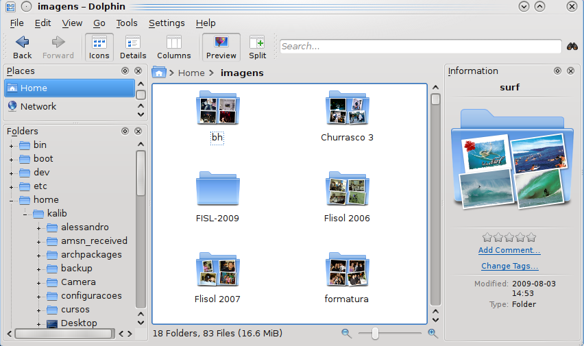
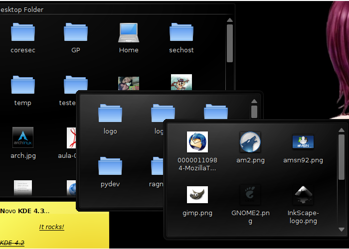
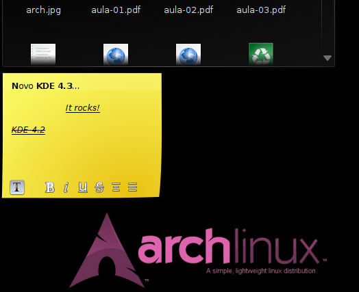

**S**audações pessoal...

**E**stive meio ausente nos últimos dias por problemas com minha máquina. Recentemente meu hd queimou e acabei ficando meio "inativo". Ontem consegui reinstalar todo o meu sistema operacional (Archlinux) e restaurar todos os meus backups.

<!--more-->

**A**gora sim.. Atividade novamente. ;]

**D**e quebra, volto com uma boa notícia.

**F**ans de KDE e usuários do Archlinux podem, desde ontem, comemorar o lançamento do KDE 4.3 que se deu ontem e já se encontra inclusive nos repositórios oficiais do Archlinux.

**E**sta nova versão do KDE conta com várias mudanças no que diz respeito a correção de bugs, mas também em aparência e funcionalidades.

**O** design e os efeitos estão bem mais atraentes como por exemplo a vizualização de pastas de imagens com previews como na imagem a seguir.

**O**utro efeito que muito me chamou a atenção, é a possibilidade de vizualizar e navegar entre arquivos e diretórios que se encontrem em minha área de trabalho apenas por passar o mouse em cima e segurar por um segundo, me possibilitando ver o conteúdo daquela determinada pasta bem como interagir com ela. Ao tirar o mouse de cima, ela some novamente. ;] Confira a imagem a seguir:

**P**ara quem, assim como eu, gosta de notas rápidas em seu desktop, o knotes continua surpreendendo, trazendo agora as funções de negrito, sublinhado, centralizado, etc..

**M**uitas outras coisas novas surgiram, bem como efeitos de área, etc, etc, etc..

**S**em mais comentários, experimente e confira as novidades.

**S**e você já possui o kde 4.2 em seu archlinux, pode simplesmente atualizar com o seguinte comando:

# pacman -Syu

**C**aso ainda não tenha, instale com:

# pacman -S kde

**A**braços!
