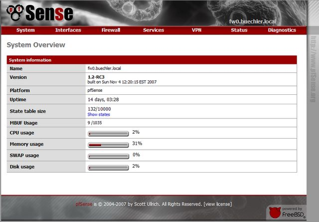
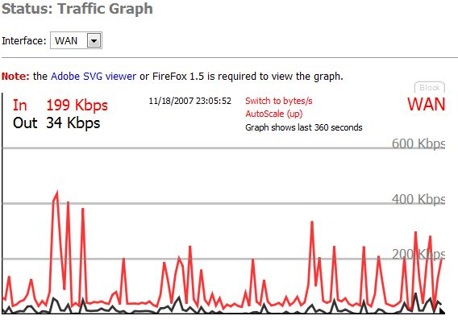
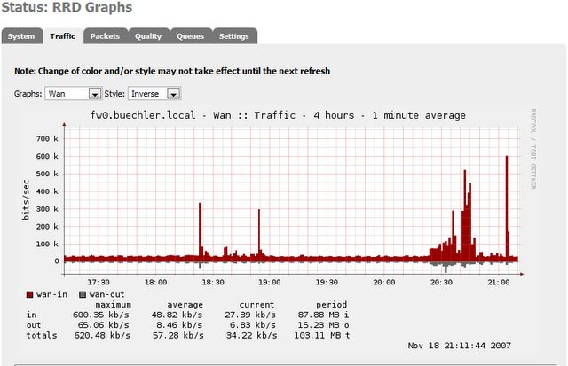
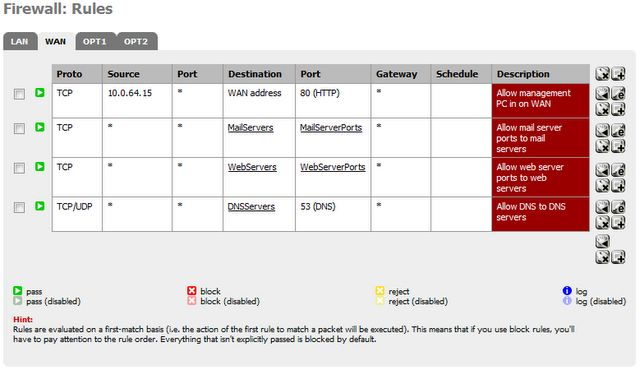

Apostila sobre um dos melhores sistemas open source de firewall disponibilizada gratuitamente, pfSense 2.x!

<!--more-->

**G**ostaria de passar adiante a notícia de que o colega *Leonardo Damasceno* acaba de compartilhar com a comunidade uma apostila de sua autoria sobre o [pfSense](https://www.pfsense.org), de forma a divulgar mais este magnífico sistema, bem como facilitar a vida daqueles que ainda não o dominam.

**S**egue link direto fornecido pelo mesmo para [download](https://www.marcelocavalcante.net/repositorio/pfsense-leonardodamasceno.pdf). A apostila ou livro, como prefira chamar, possui aproximadamente 70 páginas de informações úteis e diretas, sem muitas complicações.

**N**ão sabe o que é pfSense?

**O** pfSense é um sistema operacional baseado no *Free BSD* que pode ser instalado em um computador para servir como um firewall/roteador dedicado em uma rede. Como ferramenta *open source*, o pfSense tem se destacado nesta função, sendo considerado um dos melhores e mais confiáveis para este trabalho, oferecendo, além de sua estabilidade e confiabilidade, recursos e funções que geralmente são encontrados apenas em firewalls comerciais e caros. Não creio ser necessário lembrar a confiabilidade dos sistemas *Free BSD*...

**E**mbora seja uma versão customizada do Free BSD, não é necessário qualquer conhecimento sobre este sistema para operar o psSense, visto que ele é atualizado e completamente configurado através de uma interface web. Na maioria dos casos o pfSense tem sido aplicado como um firewall de perímetro, roteador, access point wireless, servidor DHCP, servidor DNS e VPN.

**O** mesmo apresenta diversos recursos gráficos para análise de tráfego, pacotes, performance, etc. Além de configurações avançadas para regras de firewall para LAN, WAN e utilizãção de Aliases de forma simples e intuitiva.

