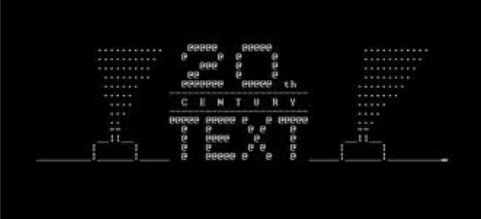
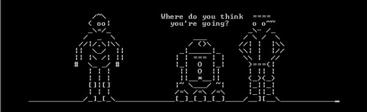

**Q**uem disse que o terminal ou linha de comando serve apenas para trabalho e coisas chatas?

<!--more-->

**E**stá entediado em frente ao seu terminal GNU/Linux?	Que tal algo para passar o tempo e, ao mesmo tempo, lhe trazer uma certa nostalgia? Assista Star Wars sem precisar sair de sua linha de comando ou terminal.

**T**udo o que você precisa digitar é:

```bash
 $ telnet towel.blinkenlights.nl
```

**F**eito isso, basta apreciar o show...





**H**ave fun!
