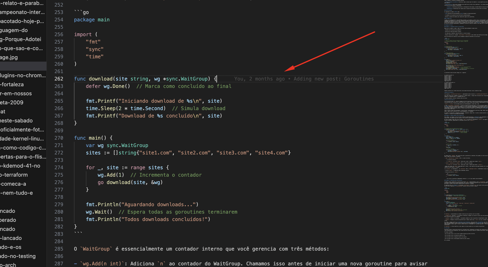

O [Git](https://git-scm.com/) é uma ferramenta incrivelmente profunda, e a maioria de nós usa apenas a superfície com **add**, **commit** e **push**. Se você quer passar de **usuário funcional** para **power user**, aqui estão alguns dos meus favoritos truques e hacks que nem todo mundo conhece.

<!--more-->

Em muitos momentos passei por situações em que, na correria do dia a dia, em meio a trocentas tarefas e telas, fiquei desatento ou digitei um comando de commit mais rápido do que deveria, sem checar em que branch eu estava e apenas depois disto percebi que era o branch errado. Ou fiz diversas alterações em um arquivo de código que ainda está em desenvolvimento mas nem tudo está pronto para ir junto com meu commit. E que tal ter mais eficiência na hora de fazer uma busca em seu histórico no git?

Estas e mais algumas dicas melhoram meu dia a dia com o git e podem lhe ajudar bastante também. Sem mais lenga lenga, vamos lá.

## 1. O engano "Fiz commit na branch errada"

Todos nós já passamos por isso: você passou uma hora programando, deu o commit e percebeu que ainda estava no branch *main* em vez de uma branch de feature/funcionalidade ou do seu ticket em questão.

O Hack:

```bash
git branch nova-feature     # Cria um novo branch onde você está
git reset --hard HEAD~1     # Volta ao 'main' um commit atrás
git checkout nova-feature   # Muda para o seu branch desejado
```

Isso efetivamente "move" seu último commit para uma nova branch sem perder nada.

## 2. Staging Interativo (git add -p)

Às vezes você modificou vários arquivos, mas quer commitar apenas a lógica e deixar os comentários de "TODO" ou logs de debug para depois.

O Truque: Use *git add -p* (modo patch). O Git percorrerá cada alteração ("hunk") e perguntará se você deseja incluí-la no commit.

- *y:* sim, incluir este trecho.
- *n:* não, não incluir.
- *s:* dividir este trecho em pedaços ainda menores.

## 3. Pesquisando no Histórico (git log -S)

Precisa descobrir exatamente quando uma string específica (como o nome de uma função ou uma variável estranha) foi adicionada ou removida do código?

O Hack:

```bash
git log -S "nome_da_funcao_deletada"
```

Esta ferramenta, ou função do Git, se chama Pickaxe, e é um poderoso recurso que lhe permite fazer buscas no histórico do repositório para achar commits que inseriram ou removeram strings específicas ou expressões regulares.

## 4. Recuperando Commits "Deletados" (git reflog)

Se você acidentalmente deu um *hard reset* ou deletou um branch e acha que seu trabalho sumiu para sempre — provavelmente não sumiu. O Git mantém um registro de cada vez que o ponteiro HEAD se move.

O Truque: Execute *git reflog*. Você verá uma lista de todas as ações executadas. Encontre o SHA (o código/hash) de logo antes do "desastre" e execute:

```bash
git checkout [SHA]
```

## 5. Logs Bonitos e Levíveis

O *git log* padrão é um pouco poluído. Você pode transformá-lo em um gráfico compacto, colorido e que mostra a estrutura de branches claramente.

O Hack: Cole isso no seu terminal para criar um apelido (alias) chamado *lg*:

```bash
git config --global alias.lg "log --graph --pretty=format:'%Cred%h%Creset -%C(yellow)%d%Creset %s %Cgreen(%cr) %C(bold blue)<%an>%Creset' --abbrev-commit"
```

Agora, basta digitar *git lg* para ver uma representação visual incrível do histórico do seu projeto.

## 6. Fixup e Autosquash

Se você encontrou um erro de digitação no seu último commit, não crie um novo commit chamado "Corrigindo erro". Em vez disso, use um *"fixup"*.

O Hack:

Prepare a correção:

```bash
git add .
```

Faça o commit como correção:

```bash
git commit --fixup [hash do commit original]
```

Quando for enviar (push), use:

```bash
git rebase -i --autosquash
```

O Git mesclará automaticamente a correção no commit original, mantendo seu histórico perfeitamente limpo.

## Dica de Ouro: A alternativa ao "Git Blame"

Se você usa o VS Code, instale a extensão *GitLens*. Ela coloca uma anotação discreta no final de cada linha, dizendo quem escreveu aquilo e quando, sem você precisar rodar nenhum comando.

