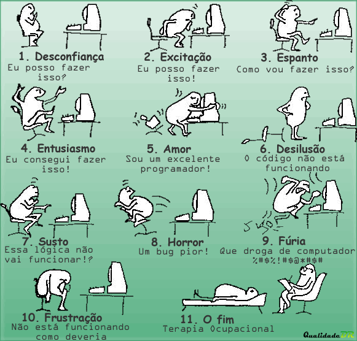

**S**audações pessoal,

**U**m feliz dia do programador para todos aqueles que, profissionalmente, curiosamente ou mesmo por mera falta do que fazer escrevem ou já escreveram linhas de código!

<!--more-->

**E**sta profissão que na maior parte das vezes não trá$ o retorno e$perado, o que apenas demonstra o quão apaixonados por linha de código são essas pessoas... e por problemas.

**D**esafiador...estressante...cansativo...divertido...prazeroso... Como em qualquer "casamento"... na alegria e na tristeza!

**O**bviamente que eu não vou colocar em todas as centenas de linguagens de programação que existem.. portanto, se a sua linguagem favorita não foi homenageada abaixo, não fique triste. São muitas..difícil lembrar de todas.. O que vale é a intenção.

**A**braço!
