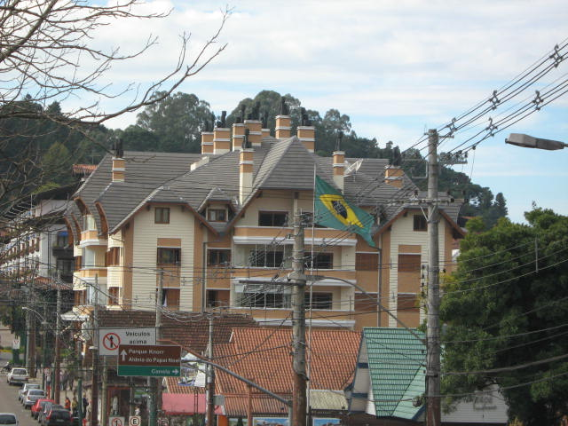
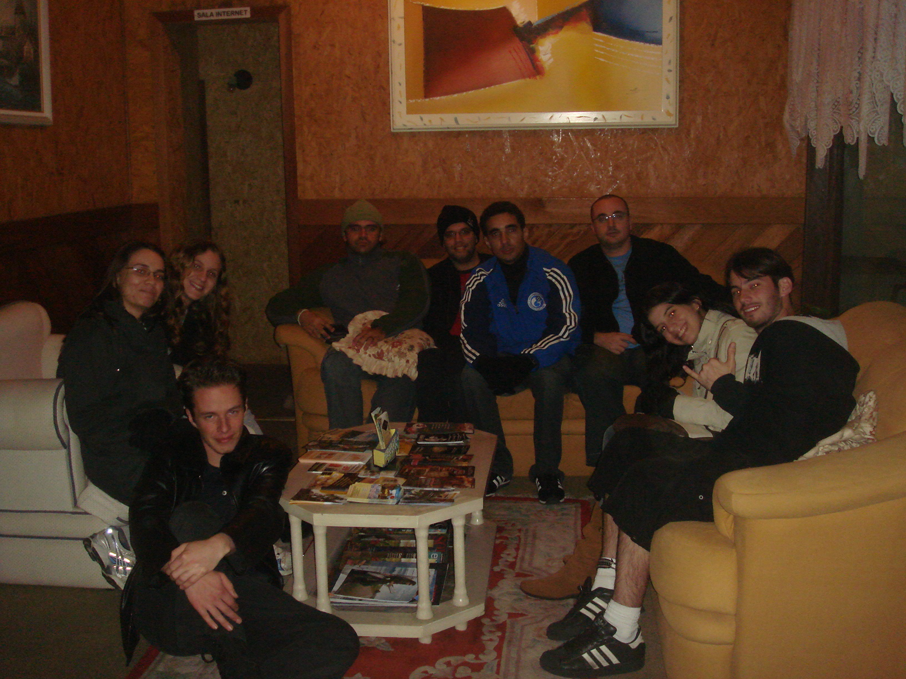
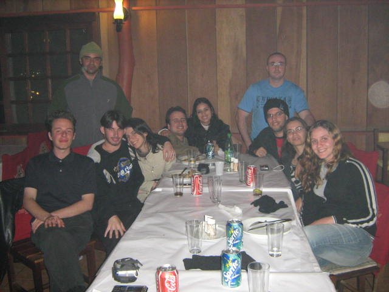
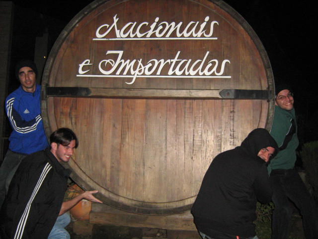
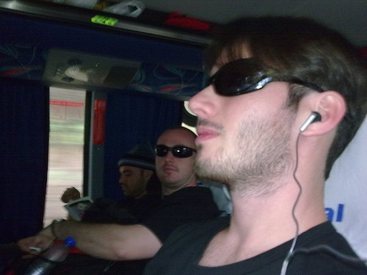
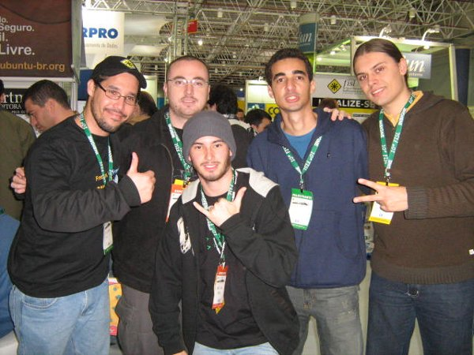
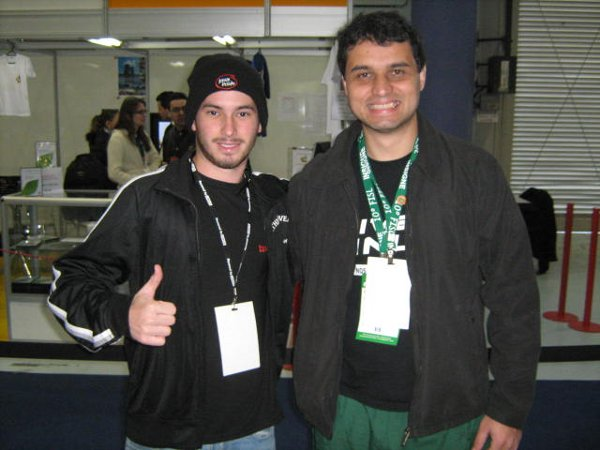
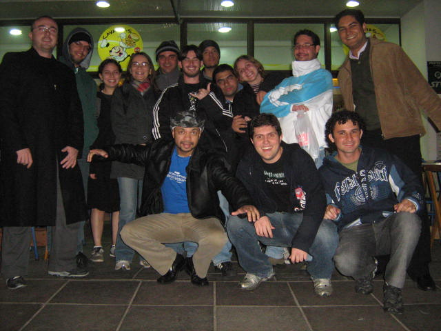
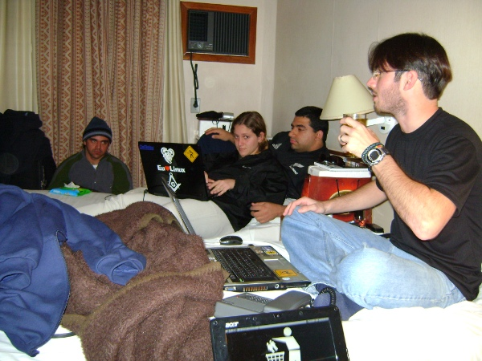
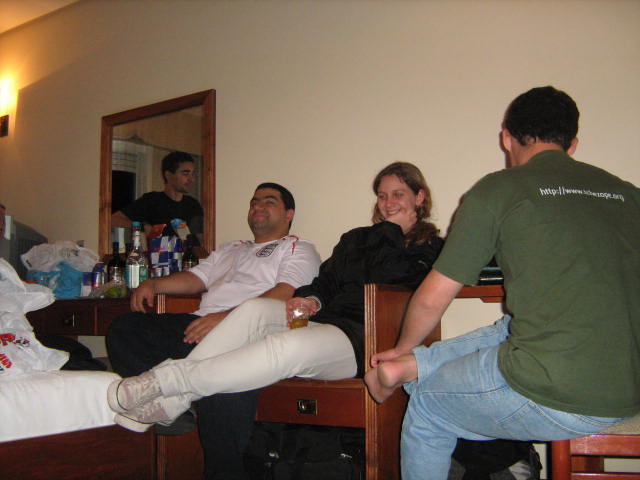

**T**ardo mas não falho..

**D**epois de dias corridos aqui na empresa, finalmente consegui publicar algumas fotos do FISL bem como um pequeno relato do que achei dessa experiência.

<!--more-->

**A**ntes do Fisl em si, eu havia combinado, juntamente com o pessoal do Arch Linux Brasil, de passar uns dias conhecendo Gramado, já que todos dizem ser uma cidade linda. De fato.. Ninguém mentiu em relação a isso. As primeiras impressões que tive de Gramado foram excelentes. Uma cidade calma e bonita.

**O** estado de calmaria parece ter sumido logo que cheguei à pousada na qual tínhamos reservas. Lá pude conhecer pessoalmente o pessoal do Arch Linux Brasil com quem eu já trabalhava havia algum tempo, porém apenas virtualmente. De cara pude ver que, como diria meu amigo Carlos, "só tinha doido naquela po***". Hehehe

**P**essoal muito amigável e extrovertido. Obrigado Carlos, Hugo, Morgana, Kessia, Nilo, Rafael, Anne e é claro, os que já foram comigo: Mari, Gilfran e Tati. ;]

**O**s dias que passamos em Gramado foram ótimos para conhecer a cidade, tomar um bom vinho e bater papo ou fazer gracinhas. Sem dúvidas foi uma das semanas em que mais ri na vida.

**C**onhecemos alguns locais bacanas e pudemos perceber o respeito e a tranquilidade do povo de lá. Uma cidade que não possui sinais de trânsito e mesmo assim todos os carros param ao menor sinal de pedestre pretendendo atravessar a rua??? o.O Onde estou?

**E**m Gramado é preciso aprender a aproveitar seu tempo ao máximo, portanto não recomendo de forma alguma o passeio das Jardineiras. Hehehe. Foi uma das coisas mais entediantes de minha vida. Ainda bem que tomei iniciativa cedo e não fiquei para o "passeio" completo, visto que em 10 minutos alguns de nós, do Arch Linux Brasil, pedimos ao motorista do ônibus para dar uma parada. Aproveitamos para descer e fomos jogar cartas e tomar um pouco do bom vinho de Gramado. O passeio se resumia em um ônibus rodando a 30 km/h pela cidade ao som da voz do motorista falando a uns 5m/h. o.O Dava sono... hehehe..

**D**epois de curtir bastante em Gramado, partimos para Porto Alegre.

**P**or lá o evento foi ótimo. Pude conhecer muita gente que só conhecia pela internet, tirar fotos, conhecer projetos, trocar experiências, etc...

**A**lém de conhecer os feras do Arch Linux Brasil como Hugo,  Carlos, Douglas, Farid, Thiago, Rodrigo, Kessia, Nilo, dentre outros, conheci também algumas figuras como o Fabio, Elgio e o Cabelo, sendo estes três membros do viva o linux.

**C**onheci algumas pessoas do projeto KDE Brasil, ao qual acabei me integrando já tendo começado meus trabalhos esta semana. Vai ser bom ajudar em um projeto grande como este. ;]

**T**ambém pude conhecer pessoalmente pessoas de outros projetos como o Fedora. Alguns deles eu já conhecia virtualmente. Todos nos receberam muito bens. Alguns até pareciam usuários Arch, de tanto que andavam conosco, como o Bruno e o Rafael.

**M**as como nem tudo é trabalho e evento. Durante as noites aproveitávamos para sair, conhecer a cidade ou mesmo fazer algumas curtições em nossos próprios Hotéis, o que saia mais barato e as vezes mais divertido.

**B**om, resumidamente, foram estas as minhas impressões.

**A**braços
