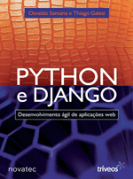
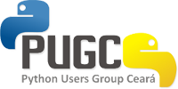

**G**ostaria de lembrar a todos os interessados que amanhã teremos o [III Pylestras](https://pylestras.appspot.com/) aqui em Fortaleza.

<!--more-->

**S**e você não faz ideia sobre o que seja Python ou sabe que é uma linguagem de programação mas não conhece maiores detalhes sobre a mesma, recomendo a leitura destes links bem como sua participação no evento, que com certeza será bem interessante.

[The Zen Of Phyton](https://blog.marcelocavalcante.net/blog/2008/11/24/the-zen-of-python/)

[Porque Python?](https://blog.marcelocavalcante.net/blog/2008/11/20/porque-python/)

[Porque escolhi Python - Python para SysAdmins](https://blog.marcelocavalcante.net/blog/2009/11/21/porque-escolhi-python-python-para-sysadmins/)

**O** evento consiste em 4 palestras conforme apresentadas abaixo:

* Pyoquê?
* That n00b is behaving like a bloody git
* Não desperdice seu tempo, use Django extensions
* SQLAlchemy - Desenvolvendo uma aplicação com Python

**O** evento acontecerá na Faculdade Farias Brito no horário entre 8:00 e 12:00.

**A**lém das palestras o evento contará com um sorteio do livro Python e Django - Desenvolvimento Ágil de Aplicações Web.

**O** evento está sendo organizado pelo pessoal do [PUG-CE](https://pug-ce.python.org.br/sobre/) (Python User Group Ceará).

**P**ara maiores detalhes sobre o evento, visite a página: [Aqui!](https://pylestras.appspot.com/)

**A**braços!
