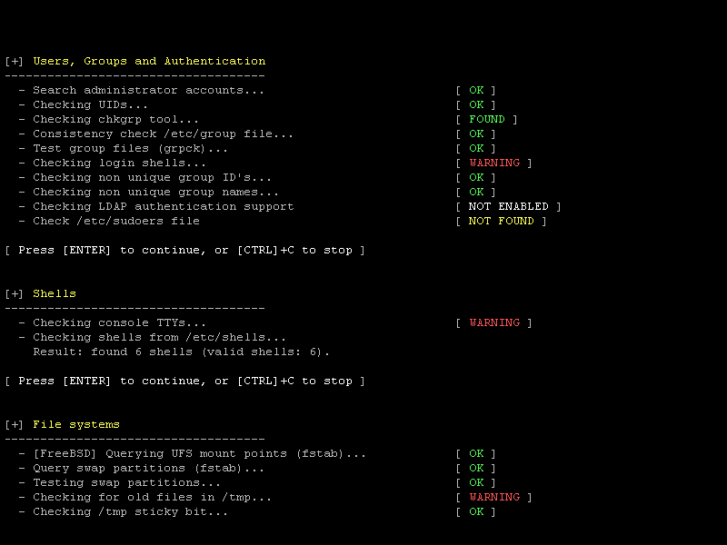

**P**rocurando uma ferramenta de uso simples e rápido que seja capaz de realizar uma auditoria em sistemas Unix like? Talvez o *Lynis* seja exatamente o que você procura.

<!--more-->

**O** Lynis é uma ferramenta para (especialistas) Unix com foco em *segurança* e *auditoria*, porque não dizer *hardening*, de sistemas. Ele escaneia o sistema e vários softwares disponíveis no mesmo com o fim de detectar vulnerabilidades. Além de informações relacionadas a segurança, ele também buscará diversas informações sobre o sistema, pacotes instalados e erros de configuração diversos.

**E**ste software ainda é útil e utilizado por outros softwares para ajudar em auditorias automatizadas, gerenciamento de patches de sistemas e escaneamento por vulnerabilidades e malwares. O público alvo do mesmo é composto por especialistas em segurança, pentesters, auditores de sistemas, administradores de redes/sistemas, etc.

**D**entre suas verificações estão a avaliação dos métodos de autenticação disponíveis, certificados SSL expirados, softwares desatualizados, contas de usuários sem senhas, permissões incorretas em arquivos, erros de configuração, auditoria de firewall, etc.



**Instalação:**

**N**o Arch Linux, o pacote se encontra disponível no [AUR.](https://aur.archlinux.org/packages/lynis/), portanto o processo de instalação consiste nos seguintes passos:

**1.** Download do [Tarball](https://aur.archlinux.org/packages/ly/lynis/lynis.tar.gz) disponibilizado no AUR.
**2.** Descompactação do tarball:

```bash
 $ tar -xvzf lynis.tar.gz
```

**3.** Entrar no diretório lynis que foi criado e em seguida iniciar a compilação/criação do pacote em si:

```bash
 $ cd lynis
 $ makepkg
```

**4.** Instalação do pacote que foi criado (Apenas este passo com usuário root ou utilizando sudo):

```bash
 # pacman -U lynis-1.3.3-1-any.pkg.tar.xz
```

**C**aso você utilize o yaourt ou algum outro gerenciador de pacotes do Arch Linux que possua acesso direto aos pacotes do AUR, pode utilizá-los ao invés de utilizar os passos acima:

```bash
 $ yaourt -S lynis
```

**H**appy Hacking!
