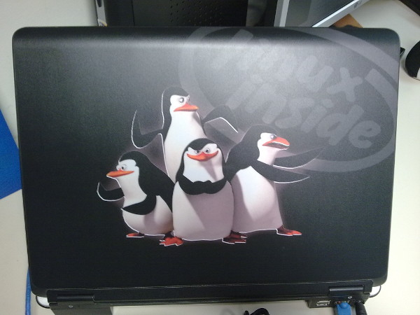

**É** isso mesmo. Uma pequena mudança estética em meu notebook e não vou twittar sobre isso. Porque a revolta? ¬¬

<!--more-->

**D**igamos que, após quase 2 meses utilizando o twitter, me dei por vencido e aceitei o fato de que realmente não encontrei utilidades reais para aquilo.

**Q**uem disse que eu quero saber o que cada pessoa está fazendo a cada minuto? Dando uma olhada básica neste momento em minha página do twitter verei coisas como:

* "Cena desagradável logo cedo: a mãe troca a fralda da criança no meio do restaurante em pleno café-da-manhã"
* "É um absurdo o que a federação paulista de futebol faz com o SPFC"
* "De volta à realidade. Nunca mais quero ver sol na minha vida"

**N**ão sei quanto a vocês, mas este tipo de coisa não acrescenta nada em minha vida. Apenas me toma tempo desnecessário do trabalho ou lazer.

**A** mudança na estética de meu notebook foi através de um [lapjack](https://www.lapjacks.com/) da toshiba. Para quem não sabe, lapjacks são uma espécie de adesivo para notebook. A qualidade é excelente e fica realmente muito bem feito. Além disso, ele ainda lhe permite tirar e colar novamente em um novo notebook, caso você deseje. No site, você pode escolher a foto que desejar e fazer upload para eles na hora da compra ou, caso prefira, pode escolher uma das várias imagens que eles já disponibilizam. Além disso, você especifica qual o modelo de seu toshiba para garantir que o adesivo terá as medidas exatas para o mesmo.

**A**mbas as imagens postadas aqui são do meu toshiba com o seu novo "estilo". Sim, são os pinguins do filme Madagascar! :p

**E** como disse no título: Não vou twittar isto! Estou aproveitando este post para me despedir oficialmente do twitter. Uma vez que meu período de experiência com o mesmo não me trouxe resultado algum, estou abrindo mão do "serviço".

**A**braços
