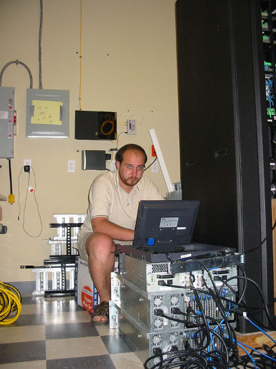

**É** isso aí...

**E** você pensava que o cara da informática, escravo dos escravos, não tinha direito a nada a não ser trabalhar, eim?!

<!--more-->

**T**ambém temos o nosso dia.

**P**arabéns a todos os Administradores de Redes e Sistemas. Hoje, última sexta-feira de julho é o [SysAdminDay](https://www.sysadminday.com/).

**V**ocê que é um usuário comum e que vive reclamando do pessoal de TI de sua empresa, aproveite este dia para lhes parabenizar pelo trabalho prestado seja durante o dia, noite e, porque não, madrugada.

**É** isso aí...E você pensava que o cara da informática, escravo dos escravos, não tinha direito a nada a não ser trabalhar, eim?!Também temos o nosso dia.Parabéns a todos os Administradores de Redes e Sistemas. Hoje, última sexta-feira de julho é o [SysAdminDay](https://www.sysadminday.com/).

**V**ocê que é um usuário comum e que vive reclamando do pessoal de TI de sua empresa, aproveite este dia para lhes parabenizar pelo trabalho prestado seja durante o dia, noite e, porque não, madrugada.

**N**o link do SysAdminDay existem maiores informações, fotos, vídeos dentre outras coisas interessantes em relação ao nosso trabalho.

**A**braços!
