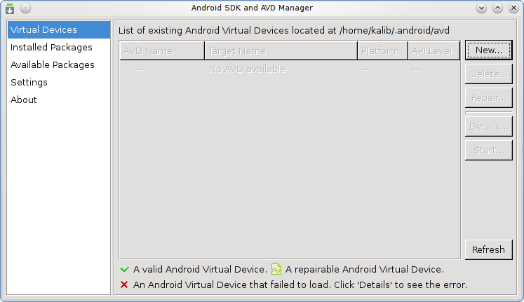
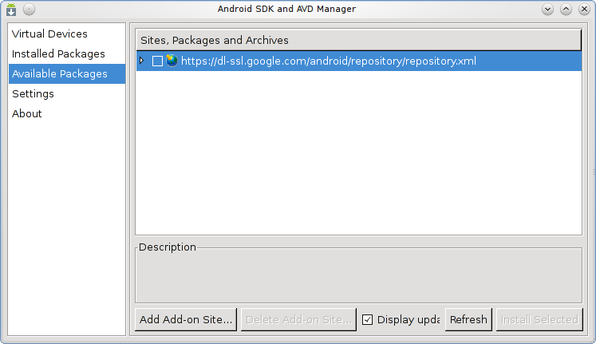
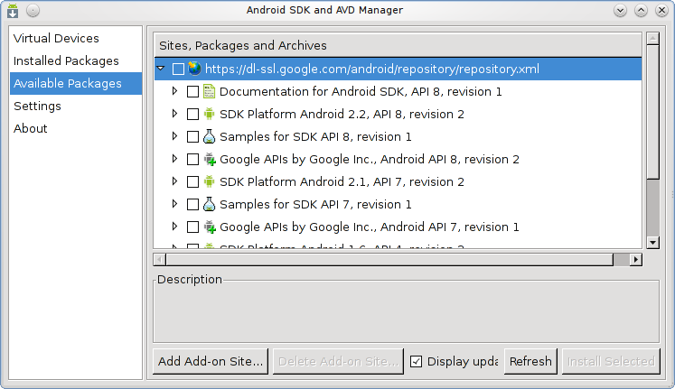
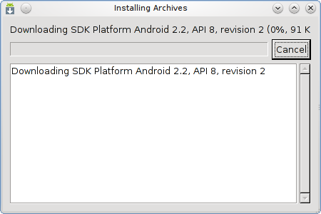
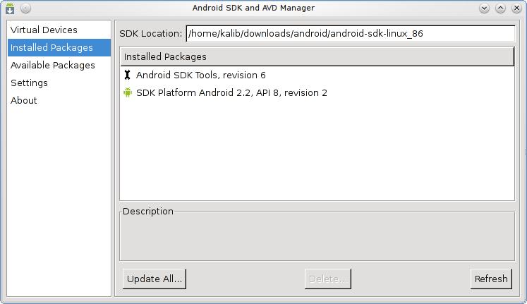
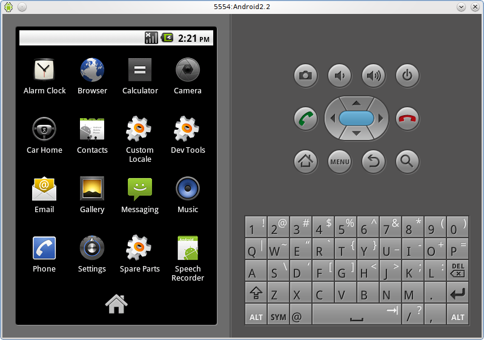
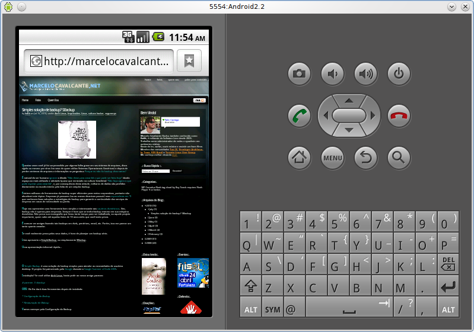
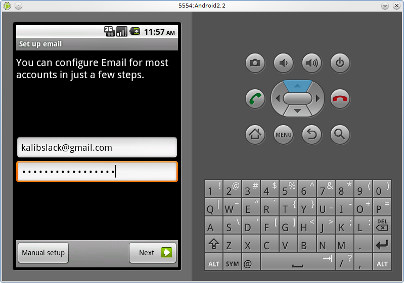
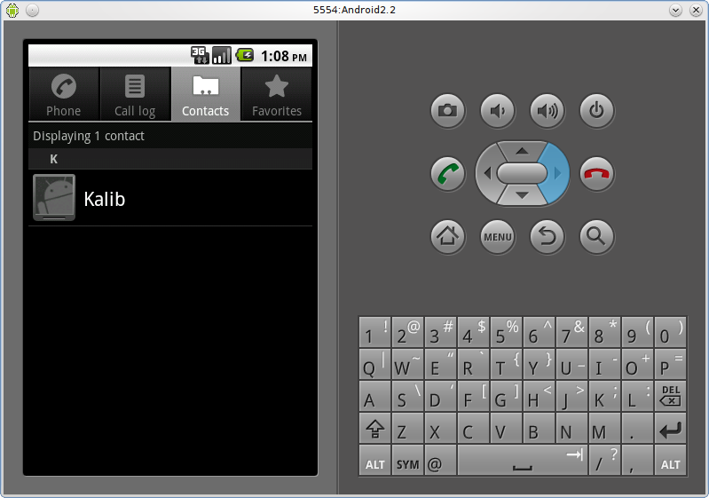

**S**e você é da área de tecnologia, com certeza já ouviu falar deste tal [Android](https://www.android.com/) que vem ganhando cada vez mais notoriedade e mercado no mundo dos smartphones. Não ouviu falar? Sugiro que repense suas escolhas acadêmicas e/ou profissionais. Talvez não tenha feito a escolha certa. Atualize-se.

<!--more-->

**O** fato é que o Android, como todos já sabemos, é um dos mais "populares" sistemas operacionais atuais para smartphones. Usei a palavra populares entre aspas pelo fato de ele ainda não ser muito utilizado, porém com certeza é muito citado. Desenvolvido inicialmente pela gigante [Google](https://www.google.com), passando a ser mantido posteriormente pela [Open Handset Alliance](https://www.openhandsetalliance.com/), o Android é um sistema operacional baseado no kernel Linux, permite que qualquer programador desenvolva uma aplicação em java, por exemplo, e controle o dispositivo através de bibliotecas desenvolvidas pela Google.

**A**penas recentemente o Android vem ganhando realmente mercado em smartphones e aparelhos genéricos, os famosos xing-lings ou MPx da vida.

**E** você? Pensava em testar este tal Android mas não pretendia comprar um smartphone para tal? O Google pensou em você e desenvolveu um emulador SDK para que você possa rodar o Android em sua máquina.

**A**qui estarei descrevendo o procedimento para instalação no Linux, porém não possui muita diferença e o processo pode ser facilmente adaptado no caso de usuários do OS X ou Windows.

**A**ntes de mais nada preciso informar que ele possui como requisito básico o [Java](https://www.java.com/pt_BR/). Se você não possui java instalado em sua máquina, esta é a hora de o instalar.

**P**ara começar, precisamos baixar o emulador SDK disponibilizado pelo google no link: [https://developer.android.com/sdk/index.html](https://developer.android.com/sdk/index.html)

**N**o meu caso, estarei trabalhando em cima da versão para Linux.

**O** arquivo baixado está compactado com a extensão .tgz e pode ser descompactado com o comando a seguir:

_[kalib@tuxcaverna android]$ tar -xvzf android-sdk_r06-linux_86.tgz_

**E**le irá descompactar a pasta android-sdk-linux_86. Entre no diretório e repare que existe um sub-diretório chamado tools dentro dele. Você precisará rodar o executável  android que se encontra lá.

_[kalib@tuxcaverna tools]$ ./android_

**A** tela a seguir lhe será apresentada.

**A**gora precisamos instalar o Android em si, portanto vamos começar vendo a lista de aplicativos disponíveis para instalação.

**R**epare que na lateral esquerda existem 5 abas. Vamos trabalhar por enquanto na aba _Available Packages_. Ao clicar nela, a seguinte tela lhe será apresentada:

**C**lique na seta que se encontra ao lado da opção _https://dl-ssl.google.com/android/repository/repository.xml_

**L**he será exibida uma lista de aplicativos disponíveis para instalação, conforme imagem:

**N**o meu caso, vou selecionar apenas a versão 2.2 do Android. Mas, sinta-se livre para selecionar e instalar outras que estejam disponibilizadas.

**U**ma vez que eu tenha selecionado a box do SDK Platform Android 2.2, API 8, revision 2, basta clicar em _Install Selected_.

**E**le me apresenta uma janela de confirmação. Basta clicar em _Accept_ e em seguida em _Install_.

**S**erá iniciado o download da(s) aplicação(ões) selecionada(s), conforme imagem abaixo.

**A**o concluir o download, a tela ficará aguardando que você clique em **Close**, como na imagem a seguir:

**A**pós isto, podemos ir para a aba _Installed Packages_. Lá veremos a lista do que instalamos. No meu caso, apenas o SDK Platform Android 2.2, API 8, revision 2, como na imagem a seguir:

**A**gora vamos criar o dispositivo virtual. Clique na primeira aba, _Virtual Devices_, e em seguida clique no botão _New..._

**L**he será apresentada uma tela pedindo as seguintes informações:

Name: (Nome que deseja dar para este dispositivo virtual)

Target: (Você deve apontar para a API desejada. No meu caso, apontei para o Android 2.2 que instalei)

SD Card: (Aqui você define o tamanho que deseja para o arquivo que será o dispositivo virtual)

Skin: (Nesta opção você poderá definir a resolução que deseja utilizar ou tamaho de tela)

Hardware: (Opções para abstração ou comunicação com o seu hardware)

**P**ode preencher de forma parecida com o que eu fiz na imagem a seguir:

**F**eito isto, clicamos em _Create AVD_.

**B**ingo, seu dispositivo foi criado e está pronto para uso.

**B**asta clicar em cima dele e em seguida pressionar o botão _Start..._

**E** o resultado? Nosso Android dando o seu primeiro boot.

**V**ejamos o menu de principal...

**Q**ue tal testar o browser? Sim, pode testar. Ele já está conectado na internet, caso, obviamente, a sua máquina (hospedeira) esteja conectada. Eles já se comunicam por bridge.

**N**ão é que funciona mesmo?!

**A**braços!
