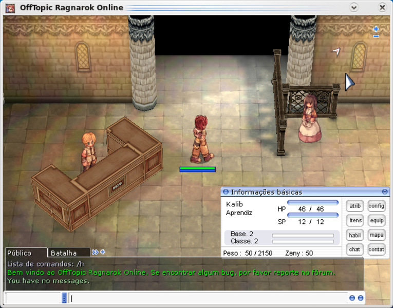

Para os que curtem jogos de rpg online e em especial os que curtem o famoso Ragnarok, um dos mais jogados nos dias atuais, esta notícia será muito boa.

<!--more-->

As perguntas sobre como rodar o ragnarok no Linux já estão bastante expostas na internet, recebendo várias respostas, sendo muitas delas bastante complexas ou insuficientes usando-se de gambiarras e mais gambiarras.

Graças ao server [Off Topic Ragnarok Online](https://www.offtopicro.com/) e ao nosso amigo wine podemos agora desfrutar sem problemas deste game multiplayer.

Inspirado no pessoal do [ubuntugames](https://ubuntugames.org/), estou preparando o pacote para o Arch Linux e nos próximos dias devo estar disponibilizando o mesmo para utilização geral.

Como podem ver no screenshot abaixo, o jogo já está rodando numa boa.

**A**braços
