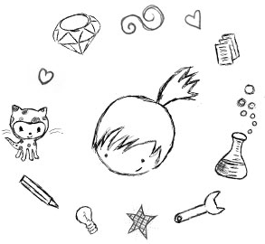

**E** se sua namorada/esposa/irmã/mãe/vizinha/filha da vizinha/... pudesse finalmente entender que tanto código é esse que você digita no computador?

<!--more-->

**T**alvez esta seja a sua oportunidade.. ou melhor, a dela!

## Rails Girls

<iframe src="https://player.vimeo.com/video/17752439" width="400" height="300" frameborder="0" webkitAllowFullScreen mozallowfullscreen allowFullScreen></iframe>

**O** vídeo acima é da primeira edição, ocorrida na Finlândia, em 2010.

**O** Rails Girls é um evento mundial, o qual acontece em datas diferentes em diversas cidades pelo mundo, inclusive **Fortaleza**.

**S**eguindo a descrição oficial do evento...

> *Nosso objetivo é dar ferramentas e uma comunidade para que as mulheres entendam tecnologia e desenvolvam suas próprias ideias. Fazemos isto fornecendo uma grande experiência em construção de coisas e tornando a tecnologia mais acessível.*
>
> *Aprenda a desenho, prototipação, programação básica e seja apresentada ao mundo da tecnologia. O Rails Girls nasceu na Finlândia, mas hoje em dia é uma comunidade global de voluntários, sem fins lucrativos.*

**M**ais uma vez Fortaleza será a sede de um Rails Girls no Brasil.

**V**enha participar desse curso, totalmente gratuito, com dois dias intensivos onde poderá aprender muito sobre o mundo do desenvolvimento de software utilizando Ruby on Rails e ver que computador não é "coisa de menino".

**E** o melhor, você não precisa saber nada sobre programação! Basta ter vontade de aprender coisas novas.

**Q**uando? **16-17 de Agosto, 2013**

**V**enha aprender como desenvolver aplicativos web com a ajuda de excelentes coaches.

**V**ocê precisa de um laptop, curiosidade e imaginação.

**M**aiores informações, programação e inscrições podem ser feitas [através deste link](https://railsgirls.com/fortaleza).

**A**braços!
