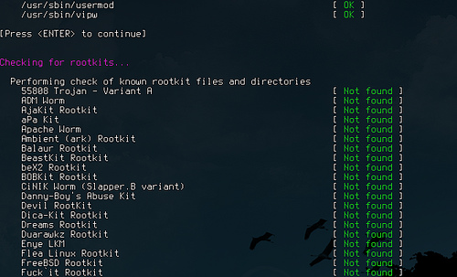
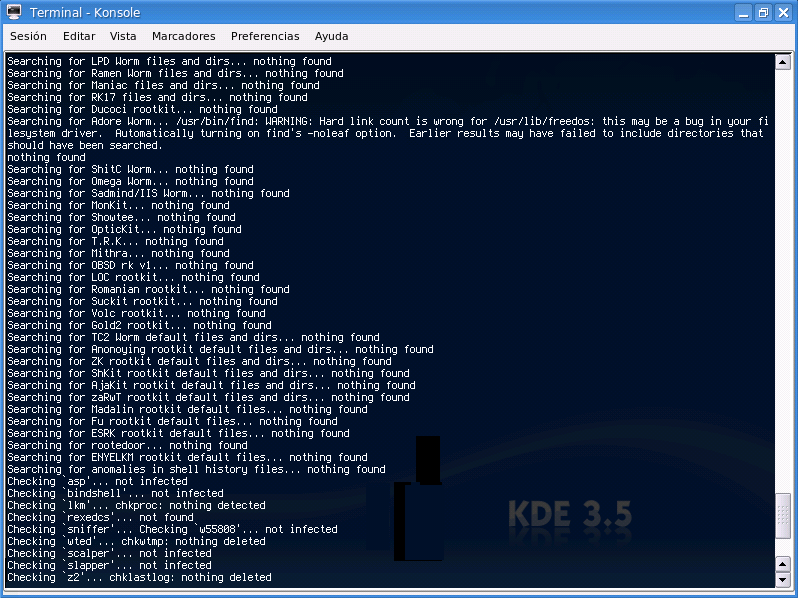

**V**ocê sabe o que é rootkit?

**N**unca vi, nem comi, eu só ouço falar!

<!--more-->

## Introdução

**É** um vírus? É um trojan? É um spyware? Não, é um rootkit mesmo.

**A** verdade é que ainda não existe um consenso em relação ao que o rootkit é de fato. Muitos dizem que é um tipo de vírus, alguns dizem que é um trojan, como você chamaria? Eu prefiro chamar de malware, que, ao pé da letra, seria um termo utilizado para algum aplicativo contendo código malicioso. o.O Acho que seria um meio termo aceitável para que possamos utilizar como base.

**M**as esse bicho morde? É de comer?

**B**om, em tese um Rootkit é um tipo de malware, como expliquei acima, cuja principal intenção é se camuflar, impedindo que seu código seja encontrado por qualquer antivírus.

**T**eoricamente, é exatamente isto que ele tenta fazer. Passar despercebido. De fato a grande maioria dos antivírus não são capazes de rastrear Rootkits justamente por conta do seu comportamento. É aí que surgiram ferramentas especializadas neste tipo de busca. Alguns antivírus, os mais caros, já agregam excelentes ferramentas para buscar rootkits. Mas, como eles conseguem se camuflar tão bem?

## Rootkits

**E**stas aplicações, rootkits, têm a capacidade de interceptar as solicitações feitas ao sistema operacional, podendo alterar o seu resultado.

**I**magine que você está utilizando sua máquina e seu sistema operacional solicita a leitura ou abertura de um determinado arquivo, podendo ser a seu mando ou mesmo do antivírus, por exemplo, o rootkit intercepta os dados que são requisitados e faz uma filtragem dessa informação, deixando passar apenas o que ele deseja, ou seja, código não infectado. E o que acontece? O antivírus ou qualquer outra ferramenta ficam impossibilitadas de encontrar o arquivo malicioso ou o código, dependendo do caso.

**N**ão é incomum encontrar o Rootkit como não apenas uma aplicação, mas um conjunto de aplicações ou, como também chamamos, toolkit.

**R**esumidamente poderíamos dizer que é um programa com código malicioso que busca se esconder de softwares de segurança e do usuário utilizando diversas técnicas avançadas de programação para tal.

**G**eralmente escondem suas chaves nos registros do sistema operacional e escondem seus processos no gerenciador de tarefas, o que torna uma missão quase impossível para um usuário identificar por conta própria. Outra prática comum de quem escreve rootkits é fazer com que eles se escondam em drivers de hardware, que são arquivos de sistema fundamentais para que o sistema operacional funcione corretamente com seus dispositivos.

**O** nome RootKit é por conta da função para a qual o mesmo é desenvolvido. Primeiramente ele é um kit de funcionalidades e códigos maliciosos cujo objetivo é se infiltrar nos sistemas de forma silenciosa e despercebida, geralmente liberando um  *backdoor para que o invasor possa posteriormente acessar o sistema infectado com privilégios de super usuário ou usuário administrador (root).

**P**ara quem nunca ouviu falar em backdoors, a explicação pode ter parecido um tanto quanto confusa, portanto aqui vai a nota de rodapé: Backdoor é, assim como na tradução ao pé da letra, uma porta dos fundos. Uma falha de segurança intencional que possibilita a invasão do seu sistema de forma que o invasor possa ter este acesso e controle com um mínimo de trabalho.

**S**em mais papo furado, vamos conhecer algumas ferramentas que buscam rootkits em seu Linux.

## Ferramentas

### RKHUNTER

**A** primeira ferramenta que vou apresentar se chama rkhunter, que é a minha favorita.

**S**e, assim como eu, você for usuário do [Arch Linux](https://archlinux.org), poderá encontrar o rkhunter no [AUR](https://aur.archlinux.org) através [deste link](https://aur.archlinux.org/packages.php?ID=25940).

**A** instalação é simples e segue o padrão de qualquer instalação a partir do AUR, conforme passos abaixo:

**1-** Descompacte o arquivo:

> [kalib@tuxcaverna downloads]$ tar -xvzf rkhunter.tar.gz

**2-** Acesse o diretório criado:

> [kalib@tuxcaverna downloads]$ cd rkhunter/

**3-** Execute o PKGBUILD para criação do pacote em si:

> [kalib@tuxcaverna rkhunter]$ makepkg

**4-** Com o pacote criado, basta instalar:

> [kalib@tuxcaverna rkhunter]$ sudo pacman -U rkhunter-1.3.8-1-any.pkg.tar.xz

**F**eito.

**S**eu rkhunter está pronto para ser utilizado, mas como toda e qualquer aplicação de varredura, como antivírus, por exemplo, é sempre recomendado atualizar sua base de dados antes de iniciar a busca, portanto digite o seguinte para atualizar a base com as propriedades dos arquivos existentes:

> # rkhunter --propupd

**E**m seguida é a hora de atualizar a base de dados do rkhunter em si:

> # rkhunter --update

**A**gora, vamos vasculhar o sistema:

> # rkhunter -c

**V**ocê terá uma listagem das checagens parecida com esta:

**P**erceba que é tudo apresentado de forma simples e objetiva.

**N**o final da checagem ele gera um arquivo onde ele armazena todas as informações que ele registrou bem como lhe aponta uma descrição dos resultados da busca.

### TIGER

**E**sta será a nossa segunda ferramenta.

**O** Tiger é uma ferramenta de segurança que não pensa tanto na aparência, portanto não espere uma tela tão amigável e colorida quanto a do rkhunter. ;]

**A** instalação da mesma no Arch Linux também se dá através do pacote do AUR que pode ser encontra [neste link](https://aur.archlinux.org/packages.php?ID=1573).

**A** instalação segue o mesmo procedimento que utilizamos no rkhunter, conforme abaixo:

> [kalib@tuxcaverna downloads]$ tar -xvzf tiger.tar.gz

> [kalib@tuxcaverna downloads]$ cd tiger/

> [kalib@tuxcaverna tiger]$ makepkg

> [kalib@tuxcaverna tiger]$ sudo pacman -U tiger-3.2.3-2-x86_64.pkg.tar.xz

**F**inalizado. Para executar, basta rodar:

> # tiger

**E**le iniciará a busca e lhe trará uma interface.

**A**ssim como o rkhunter, no ato de finalização ele irá gerar um arquivo com o relatório da checagem. Ele lhe informará o caminho do arquivo, mas provavelmente será em /var/log/tiger/.

### CHKROOTKIT

**A**gora vamos para a terceira e última ferramenta deste post.

**P**ara usuário Arch, desta vez a instalação é ainda mais simples do que as duas anteriores, visto que o pacote já se encontra nos repositórios do pacman.

> [kalib@tuxcaverna ~]$ sudo pacman -S chkrootkit

**I**nstalado!

**A**ssim como o Tiger, o chkroot também possui uma interface simples sem cores ou enfeites, conforme pode ser visto abaixo:

**A**pesar de não ser colorida e enfeitada, é uma interface bem simples e de fácil entendimento, concordam?

**C**laro, não existem apenas estas ferramentas para busca de rootkits e códigos maliciosos, mas levaria muito tempo para escrever sobre todos ou ao menos a maioria.

**N**o mais, acho que já é um bom começo para um entendimento básico sobre o que é esse tal Rootkit e o que esse bicho faz.

**C**om estas ferramentas as chances de algum rootkit passar despercebido em seu ambiente Linux já são bem limitadas.

**A**braços!
